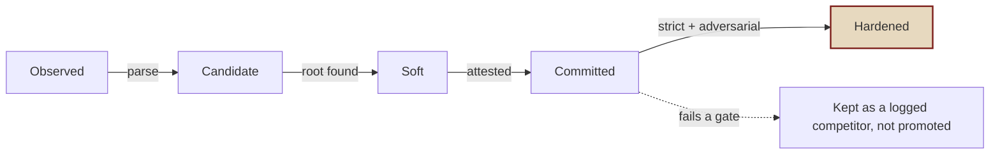
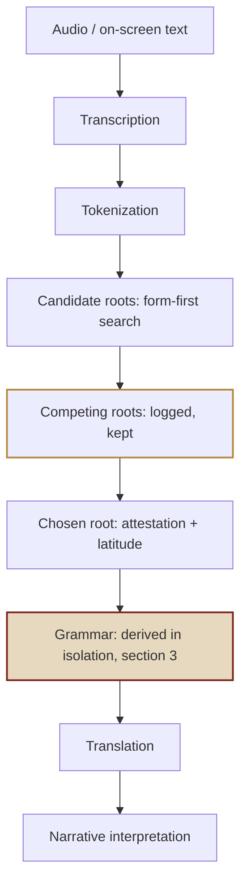

# The Vaal Tongue: A Reconstruction

*A reverse-engineering of multiple constructed-language ("Vaal") texts from Path of Exile / Path of Exile 2, read as a Mesoamerican-sourced constructed language built on attested Maya and Nahuatl roots.*

---

## 1. Overview

This document consolidates the full reconstruction of multiple written Vaal texts: the **Atziri Chant** (sung in Utzaal on the eve of the Cataclysm; §4), the **Cuachic Vault Litany** (the call-and-response of Blood Priestess Zelina and Blood Priest Zolin in PoE2 0.5.0; §5), the **Commander's Temple barks** (Elite Commander, in Atziri's Temple at Lira Vaal; §6), **The Drill Sergeant & the Vaal Regiment** (Drill Sergeant, in Atziri's Temple at Lira Vaal; §7), and **Stray captures** (Kamasan Smith, in Atziri's Temple at Lira Vaal; §8). The linguistic framework and a Vaal-internal analysis of the language's own syntax and grammar come first (§2, §3). Each text is then given as a Vaal original with an English translation, followed by a single combined lexicon of every token (§9), an appendix of recorded alternates and open questions (§10), the supporting lore and figures (§11, §12), the working method (§13), status (§14), a complete morpheme index (§15), contributor acknowledgments (§16), the statistical analysis (§17), and citations (§18). The syntax is derived in isolation and blind-confirmed (§3, §17.8); the phonological correspondence rules are collected in §2.6 and hardened orthographically in §17.9 (a phonetic phonology from audio is out of scope, §2.6).

The first three are **offerings flowing upward to Atziri**, the worshippers give themselves (blood, flesh, spirit, heart, their dead, their "new children") and the queen receives and consumes. Directionality is uniform across all of them.

**Corpus basis.** Everything here rests on the Vaal material available in *Path of Exile 2* as of patch 0.5.0 and the *Path of Exile 1* Vaal content (the Temple of Atzoatl and related lore, datamined through patch 3.27). The readings, rules, and confidence figures describe that corpus only; text or audio added by later patches has not been incorporated, and the reconstruction is versioned so it can be re-tested against them as they arrive (§14).

**Statistical standing (full detail in §17).** The reconstruction has been stress-tested against a null model of phonotactically Vaal-like nonsense. The 2026-08/09 audit and recovery rescore are a **STOPGAP**: they retier archived files; they are not a full re-run. True remediation is a fresh blind battery under `analysis/EXPERIMENT_RERUN_PROTOCOL.md` (recovery Gate 1, same-language Gate 2, de-duplicated null, syntax gloss-blind and analyst-level). The published all-noise rejection of about 2 x 10^-15 (and the enlarged-base 3 x 10^-18), including the sigma column, is **withdrawn as a headline**, not as a reason to retire the experiment. Those binomials counted any decoder `C` as recovery of the project's reading and compared a selected lexicon to an unselected 4.6% floor; 23 of 62 does not rebuild from the CSVs (21 any-C of 61). After the stopgap rescore, **17 of 78 section-9 rows are hardened (21.8%, 95% CI 14.1-32.2%)** per token, or **24.6% [16.0, 36.0]** counted over 69 distinct roots (14 of 61 = 23.0% [14.2, 34.9] / 14 of 52 = 26.9% [16.8, 40.3] on the battery frame). Conditioning on selection, the like-for-like tests in the same files give **p about 0.005 to 0.06 (marginal)**; a recovery-scored de-duplicated replacement is pending re-run. Cite `AUDIT_REVIEW_2026-08-18.md`. Model-based PPV and sentence-level probability percentages are withdrawn as translation confidence / stopgap pending re-run. The honest unit of confidence is the individual token. L is a tag on H/C/S, never a lone tier. Dual-base tables and the provisional Battery E third base are in §17.5-17.7.

**What this reconstruction is, and is not.** This is a fan reconstruction, rigorous in method but still speculative, not an authoritative or official account of the Vaal language. The statistics establish one thing only: that the corpus is very unlikely to be pure noise, that it carries structure the tested random model does not produce. They do not establish that the developers intended any particular meaning, that a given gloss is the correct translation, or that the recovered grammar reflects a designed system rather than a pattern the method imposed. No living speakers exist and no design documents are public, so idiom, connotation, wordplay, and intended register are largely unrecoverable and are likely to remain so. Every reading here is offered as the best-supported hypothesis under a stated method, and confidence is given as a range rather than a single number precisely because certainty is not available. The committed lexicon is probable; the sentences are less certain than their words; the whole is a serious but provisional effort, not a settled decipherment.

---

## 2. Linguistic framework

### 2.1 The standard

Every reading rests on an **attested dictionary root** with workable phonology. No invented grammar; no "squinting until it fits." Where a root cannot be verified, the token is flagged and its candidates are preserved as alternates rather than promoted to a committed reading.

### 2.2 The source palette: three source languages plus loans

The conlang is not built from one language but three, plus Romance (Spanish) loans:

| Layer | Role | Evidence |
|---|---|---|
| **Yucatec Maya** | Core, most content roots, the article *le*, presentatives, blood/spirit/flesh vocabulary | *ik'*, *ba'*, *le*, *kuxtal*, *kíimil*, *iitz*, *il* |
| **Classical Nahuatl** | Layer, divinity, place-names, negation, several adjectives | *teōtl*, *-tlān*, *aocmo*, *cualli*, *nochi*, *yancuic*, *yocoya* |
| **Highland Maya (K'iche')** | Thin seam, surfaces only where the other two cannot account for a sound | *jare* (the /r/) |
| **Romance (Spanish)** | Loans, abstract/martial concepts | *ascensión* + *-ada*; *jefe* → *xefe*; *otra* → *u'tra*; *échelo*; *daca*; *fulgor* → *fukuur* (soft) |

**The "alien" letters were the clues.** Three sounds do not belong to the Yucatec-plus-Nahuatl core, and each turned out to mark a different source:

- **/g/** in *Gyan'uks* → Nahuatl *yancuic* "new." Nahuatl has no native /g/; the written *g* is silent (Text 2 audio), an orthographic flag for the Nahuatl source, not a sound.[15]
- **/r/** in *jare* → Highland Maya. Yucatec shifted proto-Mayan \*r to /j/ and Nahuatl never had /r/, but **K'iche' keeps it**, its core definite articles are *we / le / ri* ("this / that / the"). An /r/ in this text points squarely at K'iche'an.[17]
- **/f/** in *fukuur* → Spanish. No Mayan or Nahuatl word carries /f/ (in Yucatec, *d f g j r v* occur only in loans), so the /f/ marks a Romance loan, most likely *fulgor* "blaze, lightning-flash" (see Text 3, §6, and §10.4).[9,15]
- **/d/** in *daka* → Spanish, by the same logic, and checked against all three source languages, not just two. A voiced stop /d/ is loan-only in Yucatec Maya, Classical Nahuatl, **and K'iche'**; none has it natively. K'iche' is the test that matters, since it was K'iche' that supplied the /r/ in *jare*, but even there the only non-plain stop is the implosive /ɓ/ (written *b'*, a *b*-sound, not *d*), and the one genuinely odd consonant, a dialectal [ð], is an intervocalic allophone of /l/, not a word-initial /d/ stop. So a /d/-initial root cannot be native to the palette; in a line already carrying Spanish loans (*xefe*, *u'tra*), it points to *daca* "give it here" (see §10.4).[9,15,17,18]

### 2.3 The phoneme inventories of the source languages

The diagnostic key in §2.4 rests on the actual phoneme inventories of the three source languages, set out here from primary descriptive and peer-reviewed sources rather than assumed[50]. (These tables were added, and the key below corrected, after reader AdministratorQotra flagged that the working framework had misstated the Nahuatl consonant system; see §16.)

**Classical Nahuatl.** A small inventory: no voiced obstruents, no ejectives, no native /r/, no uvulars.

| | Bilabial | Alveolar | Postalveolar | Lateral | Velar | Labiovelar | Glottal |
|---|---|---|---|---|---|---|---|
| Stop | p | t | | | k | kʷ *(cu)* | ʔ *(saltillo)* |
| Affricate | | t͡s *(tz)* | t͡ʃ *(ch)* | t͡ɬ *(tl)* | | | |
| Fricative | | s *(z, c)* | ʃ *(x)* | | | | (h) |
| Nasal | m | n | | | | | |
| Sonorant | | l | j *(y)* | | | w | |

Vowels: four qualities /i e a o/, each short or long. There is **no phonemic /u/** (the *o* vowel spans [o]-[u]) and **no tone**. The saltillo /ʔ ~ h/ is one plain glottal phoneme, postvocalic only, not part of any ejective series. /kʷ/ and /t͡ɬ/ are the strongest Nahuatl tells.

**Yucatec Maya.** The core layer: a full glottalized series and an implosive, plus tone, but no uvulars and no native /r/.

| | Bilabial | Alveolar | Postalveolar | Velar | Glottal |
|---|---|---|---|---|---|
| Plain stop | p | t | | k | ʔ |
| Ejective | p' | t' | | k' | |
| Implosive | ɓ *(b)* | | | | |
| Plain affricate | | t͡s *(tz)* | t͡ʃ *(ch)* | | |
| Ejective affricate | | t͡s' *(tz')* | t͡ʃ' *(ch')* | | |
| Fricative | | s | ʃ *(x)* | | h *(j)* |
| Nasal | m | n | | | |
| Sonorant | | l, *(r loan)* | j *(y)* | w | |

Vowels: five qualities /a e i o u/, each in four shapes, short, long low-tone, long high-tone, and glottalized (rearticulated). **Tone sits only on long vowels** (the acute marks in *kíimil*, *náach*). No uvulars; /r/ is loan-only (Proto-Mayan \*r became /j/).

**K'iche' (Highland Maya).** The seam: shares the glottalized series and implosive, but adds uvular /q q'/ and a native tap /r/, lacks tone, and has no ejective /p'/.

| | Bilabial | Alveolar | Postalveolar | Velar | Uvular | Glottal |
|---|---|---|---|---|---|---|
| Plain stop | p | t | | k | q | ʔ |
| Glottalized | ɓ *(b')* | t' | | k' | q' | |
| Plain affricate | | t͡s *(tz)* | t͡ʃ *(ch)* | | | |
| Ejective affricate | | t͡s' *(tz')* | t͡ʃ' *(ch')* | | | |
| Fricative | | s | ʃ *(x)* | x ~ χ *(j)* | | |
| Nasal | m | n | | | | |
| Sonorant | | l, r *(tap)* | j *(y)* | w | | |

Vowels: five qualities /a e i o u/ with a length contrast (historically ten vowels; six in some dialects, the reduced short set written *ä* /ə/). **No tone.** Here *j* is the velar/uvular fricative /x ~ χ/, not the Yucatec /h/.

**What each layer's sounds mark.** The sorting the reconstruction depends on:

| Feature | Yucatec | Nahuatl | K'iche' | Tells |
|---|---|---|---|---|
| Ejective /p'/ | yes | no | **no** | /p'/ = Yucatec, not K'iche' |
| Ejective /t' k' t͡s' t͡ʃ'/ | yes | no | yes | Maya, not Nahuatl |
| Implosive /ɓ/ | yes *(b)* | no | yes *(b')* | Maya, not Nahuatl |
| Saltillo /ʔ ~ h/ | yes | yes | yes | shared, not diagnostic |
| Uvular /q q'/ | no | no | **yes** | K'iche' |
| Native /r/ | no | no | **yes** | K'iche' |
| /kʷ/, /t͡ɬ/ | no | **yes** | no | Nahuatl |
| Lexical tone | **yes** | no | no | Yucatec |
| Phonemic /u/ | yes | **no** | yes | Nahuatl lacks /u/ |

Two consequences for parsing follow directly. Because Nahuatl has no /u/, a corpus /u/ inside a Nahuatl-sourced root is a stylization of /o/ (or of the /kʷ/ in *cu-*), as in *yuquia* ← *yocoya* "to create" (confirmed in the Text 2 audio, where the *u* is heard as /o/). And because the plain glottal stop is shared by all three, only the ejectives, the implosive, the uvulars, the tap /r/, /kʷ/, /t͡ɬ/, and tone actually carry layer information.

### 2.4 A diagnostic key for unfamiliar sounds

The lesson of /r/ is that an "alien" sound is not automatically a loan: /r/ looked foreign but was K'iche', inside the palette, just a different layer. So a not-yet-listed sound splits into two predictive classes. These are heuristics for parsing future tokens, to be tested against new text rather than treated as law (the spelling is the game's stylization, not IPA).

**Two kinds of "alien" letter.** One distinction governs every row below. A letter can be alien in two different ways. It can be a **true loan phoneme**: a sound actually pronounced that none of the three palette languages has (/d/, /f/, /v/, /z/, and the like). Such a sound marks a genuine Spanish loanword and points *outside* the palette. Or it can be an **orthographic flag**: a written letter that is not pronounced as it looks (*g*, and to a degree a plain ⟨b⟩). This is the game's stylized spelling of a native root and points *back into* the palette, not out of it. The clearest case is the *g* of *Gyan'uks*, written but silent in the audio, spelling the Nahuatl *ya-* of *yancuic*. The rule of thumb: a spoken loan sound is evidence of a loan; a written flag is not.

**Points to a specific layer *inside* the palette:**

| Sound (spelling) | Points to | Why |
|---|---|---|
| ejective /t' k' ts' ch'/ and implosive /ɓ/ (*b, b'*) | **Maya** (Yucatec or K'iche') | Nahuatl has no ejective series; its one glottal segment, the saltillo /ʔ ~ h/, is a plain glottal stop, not a glottalized consonant, so a bare glottal stop (*a'tul*, *U'te*) is not itself a Maya tell, only the ejectives and the implosive are (correction flagged by reader AdministratorQotra; see §16) |
| bilabial ejective /p'/ | **Yucatec**, not K'iche' | Yucatec has the bilabial ejective /p'/; K'iche' does not, its only bilabial glottalic is the implosive /ɓ/ |
| uvular /q ~ q'/ | **K'iche'**, not Yucatec | the uvular series is K'iche'-only; Yucatec and Nahuatl have no uvulars |
| /tɬ/ (*tl*), /kʷ/ (*cu, uc*) | **Nahuatl** | neither Maya language has them, cf. *tlayeb*, *atla*, the *cua-* of *Cuachic* |
| /r/ (tap), uvular /q/ ~ /q'/ | **K'iche' / Highland Maya** | Yucatec lost \*r→j and has no uvulars; Nahuatl has neither. /r/ cracked *jare*; a true *q* (≠ *k*) would be the next such tell, as yet unseen |
| lexical tone / acute-marked vowels (*í, á*) | **Yucatec** (soft) | tone is Yucatec, not Nahuatl or (mostly) K'iche', cf. *kíimil*, *náach* |

**Points *outside* the palette (loan, in practice Spanish):**

| Sound (spelling) | Call | Caveat |
|---|---|---|
| /d/, /f/ | Spanish loan | established (*daka*, *fukuur*); /f/ (and /v/) *could* be a Nahuatl /w/→[v~f] allophone, so rule out a *w*-word first |
| /v/, /z/, /ʒ/, /dʒ/, /θ/, /ɲ/ (*ñ*), trilled /rr/ | loan, almost certainly Spanish | none is native to any of the three |
| /g/ | **ambiguous → often Nahuatl** | not native anywhere, but recurrently a stylized spelling of Nahuatl. In *Gyan'uks* it spells *yancuic* and is silent in the audio (the onset being /j/); and, the cleaner, reusable rule, **word-initial *Gua- / Gue-* = Nahuatl *cua- / cui-* /kʷ/** (the Spanish treatment of /kʷ/, as in *Cuauhtémoc* → *Guatemoc*), so a *G-* before a back vowel flags a hidden Nahuatl /kʷ/ root: *Guatelitzi* ← *cuauh-* "tree" (§10.8), exactly as *Guatemala* ← *Cuauhtēmallān*. Read the rest of the word before deciding |
| plain voiced [b] (non-implosive) | weak flag | *⟨b⟩* normally spells the native implosive /ɓ/; only a clearly plain, voiced [b] in loan context points out |

So the reliable "look outside immediately" set is narrow: **/d/, /f/, /v/, /z/, /ʒ/, /dʒ/, /θ/, /ñ/, and a trilled /rr/.** Everything else either belongs to one of the three layers or (like /g/ and ⟨b⟩) is ambiguous enough to check first.

---

### 2.5 Semantic fields the search targets (lore anchors, in brief)

The corpus is Vaal liturgy and military command centred on sacrifice offered up to the queen **Atziri**, so the dictionary passes deliberately probe the semantic fields the lore foregrounds rather than searching blind: **blood, heart, and essence**; **flesh**; **spirit and breath**; **fire and burning**; **death and the dead**; **offering and sacrifice**; **water and purity**; and **immortality / the undying**. These are not imposed on the tokens; they bound where a plausible reading is looked for once a root's phonology fits, which is why so many committed glosses cluster in those fields. Proper names skew Nahuatl (Atziri, Cuachic, Atzoatl, Ketzuli). The full narrative basis, Atziri and the Beast *pochiti*, Utzaal and Lira Vaal, the Cuachic blood-priests, the tomes *Eztli Pilli* and *Guatelitzi*, is in §11-§12.

### 2.6 Stylization and correspondence rules (working rules; hardened orthographically in §17.9)

Where §2.4 identifies which source a sound belongs to, this subsection collects the other half: the recurring ways a source form is reshaped into its Vaal surface form. These rules were read off the token analyses (§9, §10), not derived from audio, so they are catalogued here as working correspondences, not as a hardened phonology. Their reliability is already bounded from one side: the strict-versus-loose latitude test in §17 (and `TIGHTENED_LATITUDE.md`) measures how much the committed readings depend on the more permissive of these operations, and most committed readings do depend on them, since the strict-latitude pass more than halves the reconstructable set. These are the initial working hypotheses, not left unexamined: §17.9 hardens them at the orthographic level, sorting the strict-safe correspondences from the permissive ones, which is the one dimension the corpus can test without audio.

Two rules are corroborated by in-game audio and are the most secure:

- **Written *u* is realized /o/.** Nahuatl-sourced tokens show it (*yuquia* left from *yocoya*, the *u* of *U'Te* heard as /o/, *ukto* from *ocotl*), consistent with Nahuatl having no /u/. Audio-confirmed on Text 2.
- **Word-initial *g* is silent.** In *Gyan'uks* the *g* is not pronounced; the onset is /j/, the *ya-* of *yancuic*. Audio-confirmed.

The remainder are orthographic or morphological stylizations inferred from the written forms:

| Rule | Example | Note |
|---|---|---|
| Nahuatl absolutive *-tl* reduces and reorders to *-to* | *ukto* from *ocotl*; *tlapec* from *tlapechtli* | cluster simplification; forbidden under the strict latitude (§17) |
| Verb root takes a terminal *-a* | *Ela* from *el* "burn"; *Xatlene* from *xotla* | regular on the burn-root |
| Reverential *-tzin* reduces to *-tzi / -tli* | *Atziri* from *atl* + *-tzin*; *Guatelitzi* | name-forming |
| Word-initial *Gua- / Gue-* spells Nahuatl *cua- / cui-* /kʷ/ | *Guatelitzi* from *cuauh-* | Spanish colonial orthography (as *Cuauhtemoc* to *Guatemoc*); also §2.4 |
| Terminal-vowel padding on closed roots | *Ma'oxe*, *puxe*, *buxa* from *búuk* | adds an open final syllable |
| Non-morphemic coda *-uks / -ks / -s* | *Otsuks*, *Gyan'uks*, *Donuks* | a closing romanization tail, carries no meaning (§10.9) |
| Soft non-morphemic tail *-che / -zeh* | *upulche*, *quxzeh* | appended to a committed root, left unparsed |
| Ejective written plain, and *q* for ejective /k'/ | *k'áak'* to *kahk*; the *q* of *quxzeh* = /k'/ | the corpus is inconsistent in marking ejectives |
| Loan-only /d f r g/ mark a non-core source | *daka*, *fukuur* (Spanish); *jare*, *koriek* (K'iche' /r/) | the source-identification side is in §2.4 |

Every rule above is a candidate for the treatment the lexicon and syntax received: state it, then test it. That test is the open phonology work, and it needs systematic audio, which the present corpus and sources do not provide, so these rules are the honest current state, collected in one place, and explicitly not yet carrying confidence intervals of their own. **Scope note.** A phonetic phonology, the actual sounds behind the spellings, requires trained transcription of the in-game audio, which is a specialist skill outside the maintainer's expertise, so it is not being pursued. Anyone who wishes to take it up is welcome to. If a specific audio detail is caught by ear it will be added to the corpus (as the /o/ and silent-/g/ points already were); otherwise the line is drawn here, and the orthographic hardening in §17.9 is the ceiling this project sets for phonology.

## 3. Vaal-internal syntax and grammar

This section analyses Vaal as a language in its own right: its clause structure, word order, and morphology as they actually appear in the corpus, independent of the source palette. It is the syntactic counterpart to the lexical work in the sections that follow, and it is kept deliberately separate from them in method (see §3.1).

The findings here are the analyst's first reading. They are then tested by a blind multi-agent confirmation pass (documented in `SYNTAX_CONFIRMATION_PROTOCOL.md` and `SYNTAX_EXPERIMENT_LOG.md`) and quantified with confidence intervals in §17. Where the corpus does not settle a question, it is left open rather than forced (§3.7).

### 3.1 Method: analysis in isolation

Every grammatical claim in this section is derived from Vaal's own internal distribution: which element appears in which position, adjacent to what, and how consistently across the corpus. The rule that governs the lexical work has a direct analogue here.

- **Distribution is the only evidence.** A word-order or morpheme-placement claim must rest on the positions the Vaal strings actually show, counted across the corpus, not on the grammar of any palette language. "Yucatec is verb-initial, therefore Vaal is" is forbidden in exactly the way gloss-led root search is forbidden (§2, rule 2a): it reverse-engineers the answer from the source rather than reading it off the data.
- **Glosses label, they do not license.** A token's committed meaning (from §9) may be used to say what a clause is doing (a command, a question, a presentation), because that is needed to group like with like. It may never be used to import the source language's rule for how that clause is built.
- **Palette comparison is a closing step, never a premise.** Once a Vaal-internal pattern is established, it may be noted in passing whether it happens to match or diverge from Maya or Nahuatl. That observation is commentary; it is never the source of a grammatical conclusion, and no conclusion in this section depends on it.

### 3.2 The syntactic corpus

The analysable material is the set of connected Vaal utterances in Texts 1 through 4 (§4 to §7) and the one full stray line in Text 5 (§8). The boss ability-cries in Text 5 (Ahuatotli, Mektul) are one- and two-word skill-names rather than clauses and carry little syntactic information; they are noted but not weighted. In total roughly two dozen clauses are available. This is a small corpus, and the confidence statement in §17 is scaled to it; the value here is that the corpus is closed and every clause is examined.

### 3.3 Clause types are set by a clause-initial element

The most robust pattern in the corpus is that the first element of a clause fixes its type. Five openers recur, each with a consistent following shape.

- **Presentative: A'te / U'Te / Yatle (and the reduced u'te) + a noun.** This is the single most frequent clause type: *A'te 'Ibil*, *A'te ik'el*, *A'te líimek*, *A'te yuquia*, *A'te fukuur*, *U'Te kuxkal*, *u'te ik'el*, *u'te puyao*. The opener is clause-initial and is followed by a noun or noun phrase; the clause carries no verb. It presents or points to something.
- **Interrogative: Máax + the rest.** *Máax tlayeb mucane?*, *Máax ka ti a'tul?*. The question word is clause-initial in every attested question.
- **Imperative: Xi + a verb.** *Xi daka puxe*, *Xi u'te cha'tsoke*. *Xi* sits immediately before the verb it commands and is clause-initial.
- **Privative: 'Ayok / Aiokmo + the rest.** *'Ayok ta' en*, *'Ayok kifba Atziri...*, *Aiokmo til xu'te*, *Aiokmo tul jare elba*. The negator opens the clause and scopes over what follows.
- **Vocative + predicate: (Atziri, Atziri,) + a nominal predicate.** The Text 1 chant frame is a doubled vocative followed by a verbless predicate: *ek te mucane Vaal*, *ma kilya Zerphi*, *ikba'yucane Vaal*, *ascenada akal*. The predicate is nominal or adjectival and there is no copula between subject and predicate (see §3.4).

That the clause type is announced first, before the content, is itself a Vaal-internal structural fact and one of the clearest signals in the corpus.

### 3.4 Word order within the phrase

- **Dependents precede their noun.** Attributive modifiers, articles, and possessive markers all stand before the noun, with no counterexample in the corpus. Modifier before noun: *tlayeb kutsen*, *tlayeb kifba*, *tlayeb ukto*, *tlayeb mucane*, and *niáach i'chian* ("far" before "house"). Article before noun: *le mucane*, *le'itzil*, *le le Vaal*. Possessive proclitic before noun: *u mujuk'*, *Ik'eche*. The Vaal noun phrase is consistently head-final for its dependents. One caveat, surfaced by the blind confirmation (§17.8): *tlayeb* "dark" may in some lines be a fronted locative ("in the dark") rather than a pure attributive. Either way it stands before the noun, so the prenominal generalisation holds; only the adjective-versus-adverbial status of *tlayeb* is left open (§3.7).
- **Possessed precedes possessor.** In *u mujuk' le mucane* ("the strength of the mighty") the possessed noun, marked with the proclitic *u*, comes first and the possessor phrase *le mucane* follows. The genitive is head-initial.
- **Verb precedes object.** In the one unambiguous marker-verb-object string, *Xi daka puxe*, the verb *daka* precedes its object *puxe*. Predicate-first order also appears in *Ela tlayeb ukto* (the burning predicate before its noun phrase).
- **Equational clauses have no copula.** Subject and nominal predicate are simply juxtaposed: *Atziri le'itzil* ("Atziri, the essence"), *Atziri le'itzil* and the whole Text 1 frame *Atziri ... ascenada akal*. Nothing links them; the juxtaposition is the predication.

### 3.5 Morphological shape

The corpus shows a consistent split by position.

- **Grammatical operators are proclitic (they attach or stand before their host):** the presentatives *A'te / U'Te*, the imperative *Xi*, the modal or optative *ma* (*ma kilya*), the privative *'Ayok*, the article *le*, and the possessives *u-* and *a-*. Clause-type and determiner marking is front-loaded.
- **Lexical morphology is suffixing (built on the right edge of the root):** the honorific or plural *-ane* (*ikba'yucane*, *mucane*), the reflexive *-ba'* (*ik'bala*, *elba*, *kifba*), the abstractive *-el* (*ik'el*), the second-person *-ech* (*Ik'eche*). Nominal derivation stacks to the right of the root.

The picture is a language that marks clause type and reference at the front of the clause and the noun phrase, and derives its nouns by suffixation.

### 3.6 A first grammatical sketch

Read only from the corpus, Vaal presents as follows: a clause opens with a function word that names its type (presentative, interrogative, imperative, privative) or, in the chant register, a vocative; nominal predication needs no copula; noun phrases place every dependent (article, possessive, modifier) before the head; genitives place the possessed before the possessor; and where a verb governs an object, the verb comes first. Morphologically, operators cliticise to the front and lexical affixes suffix to the rear. These are the templates the confirmation pass (§17) is asked to reproduce blind.

### 3.7 Open questions

Held open, because the corpus does not yet settle them:

- The two particles *ka* and *ti* in *Máax ka ti a'tul*, standing between the question word and the verb; their function (aspect, relational, interrogative reinforcement) is undetermined.
- The doubling in *le le Vaal*: a reduplicated article, two stacked determiners, or a scribal repetition.
- The suffix string in *jare'yantul* (*jare'* + *yan* + *tul*): the segmentation is proposed but the role of the medial *-yan-* is open.
- The particle *ta'* in *'Ayok ta' en*, between the privative and the pronoun.
- Whether the presentative alternation *A'te / U'Te / Yatle* is purely phonological variation or encodes a deictic contrast (near versus far); the distribution does not yet disambiguate.
- Whether *tlayeb* "dark" is a true attributive adjective or a fronted locative phrase in lines like *tlayeb kutsen* and *Ela tlayeb ukto*; both readings keep it before the noun, so word order is unaffected, but its category is unsettled (raised in the confirmation pass, §17.8).

### 3.8 Comparison with the source palette (closing note)

Everything above was derived without reference to any source language, as §3.1 requires. Only now, with the grammar fixed from Vaal's own distribution, is it compared with the palette. This comparison is commentary: it feeds none of the confidence figures in §17.8 and is not evidence for any rule in §3. Typological features like prenominal articles or a missing copula are common across the world's languages, so a match is suggestive at most, never diagnostic.

Read against the palette, the independently derived grammar lines up with the same layering the lexicon shows (§9, §17): a Yucatec-Mayan core, a lighter Nahuatl presence, and Spanish only as loanwords.

The Mayan match is the closest. The clause-initial marking of type, the prenominal article and possessive, the possessed-before-possessor genitive built on a possessive proclitic, the verbless equational clause, and the split between front-standing operators and suffixing derivation are all characteristic of Yucatec Maya and K'iche'. The interrogative standing first (Vaal *Máax*) and attributive modifiers standing before their noun also fit the Mayan profile. This is the typological company the Yucatec-core lexicon would predict, reached here from the syntax alone.

Nahuatl matches on some points (a prenominal possessive, no copula) but diverges on the one that matters most: Nahuatl is heavily prefixing and polysynthetic, packing subject and object agreement onto the verb, and Vaal shows none of that. Vaal's morphology is light, with proclitic operators and suffixing derivation, a Mayan shape rather than a Nahuatl one. The Nahuatl layer the lexicon places in divinity and place-names does not, on this corpus, extend to the grammar.

Spanish diverges plainly: it places attributive adjectives after the noun and requires a copula (*ser* / *estar*), both the opposite of what Vaal does. Consistent with the lexical finding, Spanish contributes words (*xefe*, *u'tra*, *ascenada*), not structure.

Two of the open questions in §3.7 gain candidate leads from the palette, offered as leads and not resolutions. The doubled article in *le le Vaal* resembles the Yucatec discontinuous article *le ... o'* that brackets its noun; a bracketing determiner is one thing the doubling could reflect. The particles *ka* and *ti* have common Yucatec functions (a subordinator *ka'*, a relational *ti'*) that would suit their slot between the question word and the verb. Both stay open in §3.7; the palette only narrows where to look next, which is the role §3.1 allows it.

The caveat stands: this is a post-hoc match on a small corpus, and typological convergence is weak evidence on its own. Its value is as a consistency check, that the grammar derived blind points to the same source stratification the lexicon does, not as independent proof of either.

---

## 4. Text 1: The Atziri Chant[4]

*Sung by Atziri's followers in Utzaal on the eve of the Cataclysm. An exhortation and offering TO Atziri: the blood flows up to her; she is the recipient.*

### The chant

| # | Vaal | English |
|---|---|---|
| 1 | Atziri, Atziri, ek te mucane Vaal! | Atziri, Atziri, star of the mighty Vaal! |
| 2 | Teoyuxtlane ascensionada! Teoyuxtlane Yutsal! | Divine, ascended; divine Utzaal! |
| 3 | Atziri, Atziri, ma kilya Zerphi! | Atziri, Atziri, undying as Zerphi! |
| 4 | Ti itsok anab nochira! Kextal xi kujkuali ik'bala! | To you, the blood of all your servants; transform us, make our spirit worthy! |
| 5 | Atziri, Atziri, ikba'yucane Vaal! | Atziri, Atziri, undying breath of the Vaal! |
| 6 | A'te 'Ibil tlayeb kutsen! A'te ik'el tlayeb kifba! | Here, our flesh laid bare in the dark, the offering; here, our hidden self in the dark, the heart! |
| 7 | Atziri, Atziri, ascenada akal! | Atziri, Atziri, risen into the eternal waters! |
| 8 | Aiokmo til xu'te! Aiokmo tul jare elba! | No more burning to ash, no ending; no more dwindling to embers, no going out! |

### Line notes

- **Lines 3 & 5** both render *undying* (*kilya*, then *ikba'yucane*). The repetition is deliberate: an immortality motif, fitting a queen who sought eternal life.
- **Dramatic irony runs throughout.** "Eternal waters" (*akal*) is the still pond of the nightmare realm she ends up trapped in. "No more burning… no going out" is sung on the very night the Cataclysm burns Utzaal to nothing. "Undying as Zerphi," though Zerphi did, in the end, die; he is undying only in legend.
- **"Utzaal" kept here (*Yutsal*).** *Yutsal* is the Yucatec common noun *y-* (3rd-person possessive) + *uts* "good" + *-al*, "its goodness, the good place" (attested in Cordemex as *yutsal*, "todo es bueno")[51]. Capitalized in the chant, it is the proper-name use, the city *Utzaal* (itself *utz* "good" + *-aal*), so the translation keeps *Utzaal*. Contrast the lowercase *yutsal* in §5, which is translated as the common noun.
- **Source-validated against the game files.** The chant exists verbatim in the datamined `NPCTextAudio` table as `VaalSermon_01`-`08`, in order, with zero drift. The internal name *VaalSermon* confirms the register, and the data fixes the canonical spelling *A'te 'Ibil* (an earlier draft wrote *Íbil*).

---

## 5. Text 2: The Cuachic Vault Litany[2,3]

*Call by Blood Priestess Zelina; response by Blood Priest Zolin. The sealed-away Vaal survivors offering THEMSELVES up to Atziri, the same upward direction as the chant above, preserved as liturgy from the height of her power. In the game files each boss carries eight chant lines tagged ChantA-ChantH; the two columns below are those two pools, aligned by their shared A-H index.*

### The litany

| Pair | Speaker | Vaal | English |
|---|---|---|---|
| 1 | Zelina (call) | Kuxte' kíimil'! | Life and death! |
| 1 | Zolin (response) | Tlaxye' le Vaal! | The people of the Vaal! |
| 2 | Zelina (call) | Ma'oxe ik'el! | The countless spirits! |
| 2 | Zolin (response) | Atziri le'itzil! | Atziri, the essence! |
| 3 | Zelina (call) | Xatlene kujkuali! | Kindle the worthy! |
| 3 | Zolin (response) | Gyan'uks ko'janti! | Your new children, come, devour! |
| 4 | Zelina (call) | A'te 'Ibil! | Behold the flesh! |
| 4 | Zolin (response) | A'te ik'el! | Behold the spirit! |
| 5 | Zelina (call) | Yaxe chikula'! | The first sign! |
| 5 | Zolin (response) | Tzokan'te ik'el! | The last spirit! |
| 6 | Zelina (call) | A'te líimek! | Behold those in the earth! |
| 6 | Zolin (response) | Yatle yutsal! | There stands the good place! |
| 7 | Zelina (call) | Tlayeb kutsen! | In the dark, the offering! |
| 7 | Zolin (response) | Tlayeb kifba! | In the dark, the heart! |
| 8 | Zelina (call) | U'Te kuxkal! | Behold the living! |
| 8 | Zolin (response) | A'te yuquia! | Behold the made! |

### Line notes

- **Pair 2** is the multitude and the one: *Ma'oxe ik'el* "the countless spirits" (numberless faithful offered up) answered by *Atziri le'itzil* "Atziri, the essence": the queen who is the essence they all feed.
- **Pair 3** *Gyan'uks ko'janti* "your new children, come, devour" is metaphorical: the latter-day vault Vaal as Atziri's "new children," offered for her to consume. Not literal children.
- **Pair 6** *A'te líimek* / *Yatle yutsal* sets the buried dead against what still stands: those in the earth, and the good place still rising. Here *yutsal* is **lowercase**, so the translation uses the common noun, Yucatec *y-uts-al* "the good place, its goodness" (root *uts* "good," §9)[51], rather than the proper name. The good place that stands is almost certainly **Utzaal**, the capitalized *Yutsal* of the chant (§4) being that same *uts* root lexicalized as the city's name, but the lowercase form keeps the reading descriptive: "there stands the good place."
- **Source-validated against the game files.** All sixteen lines match poe2db's extracted audio subtitles exactly, with zero transcription drift. Zelina's call pool is tagged *BloodPriestess_ChantA-H* (*Kuxte' kíimil'* … *U'Te kuxkal*); Zolin's response pool *BloodPriest_ChantA-H* (*Tlaxye' le Vaal* … *A'te yuquia*). This independently confirms the *Ma'oxe* reading: it appears verbatim as *Ma'oxe ik'el*. Both bosses sit at *Metadata/Monsters/VaalMonsters/Living/BloodPriests/*: "Living" Vaal, i.e. present-day descendants, which fits their being recruited as hideout vendors once subdued.

---

## 6. Text 3: Quemalani, the Elite Commander[1]

*The Vaal voice-lines of the **Commander** boss in the Commander's Chamber of **Atziri's Temple at Lira Vaal** (PoE2's Fate of the Vaal). The encounter shows up under variant names, **Quemalani, the Elite Commander** (live chat feed) and **Xolotl, the Royal Commander** (the poe2db datamine page; internal asset **BlackjawPastLiving**), but it is one and the same boss and voice pool, and the particular label is not significant. The Commander is **fire-based**: it breathes fire, which squares with its blaze imagery: the Vaal line *A'te fukuur!* "Behold the blaze!" and the English bark "Flaming Glory!" (This temple is **not** the Temple of Atzoatl; that was the PoE1 Incursion temple, raided ~20 years earlier by the Exile/"Godslayer"; the PoE2 temple reuses its room-names and grid, and the Vaal mistake the player for that earlier "demon of Atzoatl.")*

**These are separate barks, not one speech.** The lines below are independent voice-line phrases the Commander fires at different points in the fight: in the chat feed they appear interleaved with one another and with English barks ("Flaming Glory!", "No further!"), not as a continuous oration. Each is rendered on its own; the token readings stand, but there is no connective narrative tying them into a single address.

**Orthography note.** Two spelling conventions are clear from the in-game audio: **j = /h/** (so *ja* = *ha'* "water"; *mujuk'* = /muhuk'/) and **x = /ʃ/** ("sh"). This also explains *xefe*: it is the **archaic Spanish spelling of *jefe*** (old Spanish *x* = /ʃ/). The "alien" letters stay source-clues: **/g/** → Nahuatl (*yancuic*), **/r/** → K'iche' (Highland Maya), and **/f/** & **/d/** → Spanish (both are loan-only across Maya, Nahuatl, and K'iche'); see *fukuur* and *daka* in §10.4. Two further pronunciations are now confirmed from the Text 2 audio, and both match the inventories of the source languages (§2.3). The **/g/ in *Gyan'uks* is silent**: the onset is heard as /j/, the *ya-* of Nahuatl *yancuic* "new." That fits Nahuatl exactly, since its inventory has /j/ but no voiced stops and so cannot carry a true /g/, the written *g* being an empty orthographic flag rather than a sound. And the ***u* in *U'Te* and *yuquia* is pronounced /o/**: for Nahuatl *yuquia* ← *yocoya* this is the expected reflex, since Nahuatl has no /u/ and its *o* spans [o]-[u] (§2.3); for the Maya presentative *U'Te* the /o/ is the vowel itself, Yucatec having both /o/ and /u/, so here the romanized *u* simply stands for an actual /o/.

### The barks (independent voice-lines)

| Group | Vaal | English |
|---|---|---|
| Short cry | Eche lu\* nochbe\*! | Pour it out, all that we are! |
| Short cry | Kí' inib\*! | Sweet, my flesh! |
| Bark 1 | 'Ayok ta' en, u mujuk' le mucane, niáach i'chian. | Nothing more for me now; the strength of the mighty is in me, deep within her house. |
| Bark 1 | A'te waja yatle u'tra buxa\*! | Behold the offering; there stands another! |
| Bark 1 | A'te fukuur\*! | Behold the blaze! |
| Bark 2 | Xi daka\* puxe\*… | Bring the draught… |
| Bark 2 | 'Ayok kifba Atziri kilya sakilja. | The heart beats no more; for Atziri, the undying, the white drink. |
| Bark 2 | Ik'eche sakilja atla donuks\*. | You are the breath within it, the sacred water, our draught. |
| Bark 2 | Donuks\*… ko'soxsal\*. | Drink… raw and fresh! |
| Bark 2 | Donuks\*… ko'mujuk! | Drink… and take strength! |
| Bark 3 | Xi u'te cha'tsoke, a'te itsok xefe yotlapek le le Vaal te'moxti\* qexcan… | See, the end comes round again; behold the blood. Commander of the Vaal altar, where all are remade… |
| Bark 3 | Na' puyao\*. | the reddened offering. |
| Bark 3 | Ich tlapec u'te puyao\*, a'te itsok pu uch' ta'nuk! | On the altar, watch it redden; behold the blood; drink deep, great one! |

*Tokens marked \* are soft or open parses, not admitted to the committed lexicon (§9); each is analysed in §10.*

*Register note: the speaker is a military high leader, not a priest. The lines read as a commander's orders and declarations; he leads the sacrifice rather than presiding over it. "We drink" is a war-band's blood-draught before battle (he drinks first, then commands his men); "my flesh, and gladly" is a leader offering his own body first.*

### Line notes

- **xefe = Spanish *jefe* "chief, commander"**: a Romance loan beside *ascensión*, and a self-naming one: the line names the speaker's own office. The Romance seam is a confirmed pattern, not a one-off.
- **The blood-draught is sourced ritual.** *uch'* is Yucatec *uk'* "to drink" (*ba'ax taak a uk'ul?* "what do you want to drink?"). *sakilja* is *sak ha'* "white water," an attested Maya **ceremonial** drink, and inscriptions record *sak juy ch'ich'* "white stirred blood," a beverage built on the blood metaphor. So *sakilja + itsok + uch'* is one coherent, sourced image: the sacred white draught that is blood, drunk at the altar.

*(Text 3's tokens are folded into the combined lexicon, §9; its soft parses and open items into the appendix, §10.4 and §10.7.)*

---

## 7. Text 4: The Drill Sergeant & the Vaal Regiment[1]

*Captured live from in-game global chat (not yet in the datamined pool). A **call-and-response drill** between a **Drill Sergeant** and the **Vaal Regiment**, the military cousin of the Cuachic Vault litany (§5): a fixed call met by a fixed war-cry. The sergeant's name randomizes across instances (**Tizoc**, **Cotan**, **Axilo**), the same variant-name device seen with the Commander (Quemalani, Xolotl); all are Nahuatl-style officer names. Only the green NPC lines are Vaal; the player-character's English banter and "Error:" UI lines are excluded. The fuller catechism below, with its second response *Atziri!*, was filled in from additional information provided by *Substantial_Bat_8440*; an earlier capture had only the opening and the variant calls.*

### The drill

*A call-and-response catechism. The sergeant calls; the regiment answers with one of two shouts, the war-cry U'te mucane! "Behold, the mighty!" or the queen's name, Atziri! The sergeant's name varies per instance (Tizoc, Cotan, Axilo); the lines do not.*

| Speaker | Vaal | English |
|---|---|---|
| Sergeant | Otsuks\*! Tzokan'te u'te ik'el… | Company! Behold the last spirit… |
| Regiment | Atziri! | Atziri! |
| Sergeant | A'te Kuxkal tlayeb kutsen. Ela tlayeb ukto\*! Máax ka ti a'tul\*? | Behold the living, the offering in the dark. The dark torch burns! Who goes there? |
| Regiment | Atziri! | Atziri! |
| Sergeant | Otsuks\*! Máax ka ti a'tul\*? | Company! Who goes there? |
| Regiment | U'te mucane! | Behold, the mighty! |
| Sergeant | Máax ka ti cheyel\*? | Who are you to stand watch here? |
| Regiment | U'te mucane! | Behold, the mighty! |
| Sergeant | Máax tlayeb mucane? | Who is the mighty of the dark? |
| Regiment | Atziri! | Atziri! |

*Other one-off sergeant calls, captured outside the catechism sequence:*

| Vaal | English |
|---|---|
| Otsuks\*, quxzeh! | Company, bite! Be fierce! |
| Axba\*!? Kíibsa'\* ta' en! | What!? Kill, before me! |

*Tokens marked \* are soft or open parses, not admitted to the committed lexicon (§9); each is analysed in §10.*

### Line notes

- **A call-and-response catechism.** The sergeant calls; the regiment answers with either the war-cry *U'te mucane!* "Behold, the mighty!" or the queen's name *Atziri!* It is the military cousin of the Cuachic Vault litany (§5), a fixed liturgy in a drill register.
- **Otsuks** "Company! Fall in!": Nahuatl presentative *o* "behold!"[34] + Yucatec *tsuk* "cluster, company"[31][36]; the fixed opener, with only the *-s* coda unresolved.
- **The catechism runs on committed vocabulary.** *Tzokan'te u'te ik'el* "behold the last spirit" (cf. Text 2's *Tzokan'te ik'el* "the last spirit"); *A'te Kuxkal tlayeb kutsen* "behold the living, the offering in the dark" (the same frame as Text 3's *A'te 'Ibil tlayeb kutsen*); *Máax tlayeb mucane?* "who is the mighty of the dark?", answered *Atziri!* All of *Máax, ti, U'te / A'te, ik'el, Kuxkal, tlayeb, kutsen, mucane, Tzokan'te* are in §9.
- **Ela** = Maya *el / elel* "to burn, blaze" (the root of the committed *elba* "burn out"), with the regular *el → ela* stylization; now in §9. **ukto** reads as Nahuatl *ocotl / ocutl* "pine torch, resinous firebrand" (root *oco-/ocu-* "pine"): the torch that burns in the dark, which fits *Ela* "burns" far better than the earlier "drink" guesses. The colonial sources already spell the variant *ocutl* with /u/, and the Florentine Codex pairs it directly with the verb "to burn"[52]. The final *-tl* cluster reducing to *-to* is a stylization, so it stays soft (§10.7).
- The soft tokens (*a'tul* = Set A *a-* "you" + *taal* "come"; *cheyel* = Nah. *chiya* "to watch/wait" + *-el*; *Axba* = *ba'ax* "what" by metathesis; *quxzeh* = *k'ux* "bite/be fierce"; *Kíibsa'* = *kíim* "die" + causative; plus *ka* and *ta'*) are analysed token-by-token in §10.9; none was promoted to §9 until the closure pass (§10.11), which moved *quxzeh*'s root *k'ux* across.
- One further line, cut off at a screenshot edge, ends "*…ta' nuk!*"; *ta'nuk* "great one" is in §9, but the full line isn't legible and is left unrecorded.

---

## 8. Text 5: Stray captures

*A log of single Vaal lines caught in footage that do not yet form a text of their own. Each is parsed against the committed lexicon; any new root it establishes is folded into §9.*

### Line 1: The Kamasan Smith (Xomatl, Zantico)[37]

*A fire-and-forge boss in Atziri's Temple at Lira Vaal, encountered at the height of Vaal power, before Atziri's communion with the Beast and with no knowledge of the coming Cataclysm. He works at the forge (molten metal, heat, hammer-strikes) until the player enters the room, then speaks this line and attacks. The boss appears under randomized names, captured so far as *Xomatl* and *Zantico*, the same variant-name device seen with the Drill Sergeant (*Tizoc / Cotan / Axilo*) and the Commander (*Quemalani / Xolotl*); the two captures below are the same speaker.*

| Speaker | Vaal | English |
|---|---|---|
| Xomatl | Ti ek tala jare'yantul! | Into the dark you come; and so, your waning! |
| Zantico | Ti' ek'le upulché\*! | Into the dark, cast down! |

*Tokens marked \* are soft or open parses, not admitted to the committed lexicon (§9); each is analysed in §10.*

**Line notes**

- Every token is committed vocabulary: *Ti* "to / for," *ek* = *ek'* "dark, black" (the death-bat Smith takes the shadow sense of the root; the same root also means "star," Atziri as hailed in Text 1, kept here as the alternate), *tala* = *taal* "to come," *jare'* "and so," *yan* "there is / here stands," *tul* "decline, wane" (§9, the same Text 1 sense). Both Kamasan Smith lines open *Ti ek'* "into the dark," now glossed identically.
- It is a threat, not Vaal foreboding. The smith is not lamenting the empire's fall, he has no knowledge of the Cataclysm and stands at the height of Vaal power; he is promising the *intruder's* end. The player has come into the star's domain (Atziri's temple), and the smith answers, *jare' yan tul* "and so, your waning," turning from the forge to fight. The line reads literally "and so there is the waning"; the "your" is supplied from context, the doom is aimed at the one who has just come.
- *jare'* here is the **apostrophe form** the lexicon had flagged as undocumented (§10.2); this capture attests it in-game.
- The one soft point is syntax, not vocabulary: *jare'yantul* is written solid but reads as *jare' + yan + tul*. The words are committed; the clause-internal order is provisional.
- **Line 2 (Zantico).** *Ti' ek'le upulché* repeats the opener *Ti ek'* "into the dark" (*ek'* + the Yucatec determiner *le* "the"), then *upulché* = *u-* (3rd person) + *pul* "to throw, cast, hurl" + the *-ché* tail. The working gloss is "into the dark, cast down" (the wordlist gives *pul kaabal* literally for "cast down"). Because *u-* is third person the literal is "it casts / its casting," the object unexpressed, with the intruder the contextual target. The *-ché* tail is the soft point, readable as *che'* "wood, stave" but possibly lexicalized, so *upulché* is logged soft (§10.7); the new root *pul* "to throw, cast" is committed (§9).
- **A second variant name.** *Zantico* is the same boss as *Xomatl* under a randomized name, confirming the variant-name device once more; the two lines share the *Ti ek'* opener and the casting register. The "casting out" theme also links to the Commander's *Eche lu nochbe* (§10.4), but realized there with Spanish *echar* rather than Yucatec *pul*, the layered-loan behavior seen throughout.

---

### Line 2: Ahuatotli, the Blind[44]

*A Vaal boss (the Delve boss "Ahuatotli, the Blind"). The shouts are Nahuatl-flavoured ability-cries more than sentences, so most tokens stay soft, but each is given a candidate root below rather than left unparsed.*

| When | Vaal | Token-by-token (candidate roots, soft) |
|---|---|---|
| start | tatlat Atziri | *tatlat*: Nah. *tlatla* "to burn" (redup./stylised) or *tlahtoa* "to speak, proclaim"[10]; *Atziri* (committed) |
| start | Vaal a xomaplat | *Vaal* (committed); *a*: poss. Maya Set A *a-* "your"[7]; *xoma-*: cf. the name *Xomatl* (Text 5); *-plat*: poss. Nah. *tlapal-* "colour, strength"[10]; open |
| start | xictep cutlotl | *xi-*: Nah. imperative "do!"[10]; *-tep*: poss. Nah. *tepē-* "hill" / locative *-tepec*[10]; *cutlotl*: a Nah. *-tl* noun, poss. *cuitlatl* "residue"[10]; open |
| during | azcado | poss. Nah. *āzcatl* "ant"[10]; the *-do* /d/ would mark a Spanish overlay; open |
| during | huatat | poss. Nah. *cuauh-* "tree, eagle" (*hua-* ← *cua-*)[10] + redup. *-tat*; open |
| during | quiquate | poss. Nah. *qui-* (3sg object) + *cua* "to eat" (redup.) → "devours it"[10]; open |
| during | zahua moti | *zahua*: Nah. *zāhua* "to fast" or *zāhuatl* "pox, scab"[10]; *moti*: *mo-* reflexive + open |

### Line 3: Mektul[44]

*A Vaal boss. Unlike Ahuatotli's, several of Mektul's shouts carry recognisable Yucatec roots, fire, wind, gold, and a request-verb, though the full phrases stay soft.*

| When | Vaal | Token-by-token (candidate roots) |
|---|---|---|
| during | táak'iin | *táak'in* "gold, money" (Yucatec)[36], attested |
| during | kahk-tche | *kahk* = *k'áak'* "fire" + *tche* = *che'* "tree, wood"[7][36], both now committed in §9 → "fire-wood, firebrand"; closed |
| during | ka'tse-ik | *ka'* "two, again"[36] + *tse* (open) + *ik* = *ik'* "wind, spirit"[7]; soft |
| during | ipkaat | *-kaat* = *k'áat* "to ask, want"[36]; *ip-* open |
| during | koriek | the *r* marks the K'iche' seam (cf. *jare*, §10.2); re-cut past *kor-*: leading candidate *ko-* "strong, hard" + inchoative *-(i)rik* (cf. *kowirik* "to become strong")[47], a "harden / grow strong" cry; soft, see §10.11 |
| during | xecwa | *-wa*: poss. *waaj* "bread, offering"[7] or *wáa* "or, if"[36]; *xec-* open |

**Line notes (2 and 3).** These are boss combat-cries, mostly skill-names, so every token above is given a candidate root, but most stay soft rather than committed. The split runs clean along the corpus's seams: Ahuatotli's tokens are Nahuatl (the *xi-* imperative, *-tl* nouns, candidate roots *tlatla* "burn," *cua* "eat," *āzcatl* "ant"), while Mektul's are core Yucatec (*k'áak'* "fire," *che'* "wood," *ik'* "wind/spirit," *k'áat* "ask," and the attested *táak'in* "gold"), with one *r* (*koriek*) flagging the K'iche' seam. None is promoted to §9. Both speakers are gathered with the other figures in §12.

---

## 9. Combined lexicon

**Confidence key (revised after the 2026-09 recovery rescore, §17).** The tier reflects whether a recorded decode recovers *this row's* predeclared root, language class, and sense, then survives Gate 2. L is a tag, never a lone tier. Population: **78 rows**, matching `token_classification.csv`.

- **H** hardened (top tier): Gate 1 recovery pass (strict latitude, matching the declared reading, no unexplained residue) AND Gate 2 survival (no strong different-meaning competitor, including same-language homophones). Protocol in `HARDENING_PROTOCOL.md`.
- **C** committed but latitude-dependent or not yet both-gated: an attested root under the looser latitude, or a former L-only row now tagged C+L with gates pending.
- **S** soft / unresolved step. One section-9 row (*Xatlene*) is S+L; other softs live in §10.
- **L** lore-anchored, orthogonal: **H+L**, **C+L**, **S+L**, **C+L\***.
- A star (*) flags a logged different-meaning competitor (Gate 2), not merely a cross-language one.

Current hardened set (17 of 78): *ascensionada, che', -en, Eztli Pilli, ich, k'áak', ki', kujkuali, máax, náach, Ti, u, waaj, xefe, Quecholli, Panquetzaliztli, Ixchel*. Superscripts in the **Source** column link to §18; counts and the withdrawn 10^-15 headline are in §17.

The five confidence stages, and how a token moves between them, are shown below; promotion is always earned by passing a test, never granted by default.

| Token | Layer | Source | Gloss | Conf. | Notes |
|---|---|---|---|---|---|
| Aiokmo | Nahuatl | Nah. *aocmo*[10] | no more, no longer | C | Text 1 form; cf. Text 3 *'Ayok*. |
| akal | Maya | Maya *akal* "pond"[7] | still / eternal waters | C | Demoted from H (2026-09): the strict decoder accepted Yucatec *akal* "to quarrel/scold," not pond. Gate 1 recovery fail. Shadow sense: the nightmare realm. |
| anab | Maya | Classic Maya *anaab*[7] | court-servant, attendant | C | Attested courtier title; replaced an earlier Taíno guess. |
| ascensionada / ascenada | Spanish | Rom. *ascensión* + *-ada*[21] | ascended, risen | H | First-identified Romance loan (others: *xefe*, *u'tra*, *échelo*, *fukuur*). |
| A'te / U'Te / Yatle | Maya | Maya *at / yan* presentative[7] | behold / here is / there stands | C+L* | Latitude-dependent; adversarial competitor: Nah. *ahtle* "nothing" (form-close, opposite sense; context favors the presentative). The offering gesture. The *u* of *U'Te* is pronounced /o/ (Text 2 audio). |
| atla | Nahuatl | Nah. *atl* "water" (+ *-tlan* "in/at")[10] | the water / upon the water | C |  |
| Atziri | Nahuatl | Nah. *ātl* "water" + rev. *-tzin*[10,13] | the queen (name) | C+L | Water / reflection / vanity motif. |
| 'Ayok | Nahuatl | Nah. *aocmo / ayoc*[10] | no more, no longer | C | Same root as *Aiokmo*. |
| cha'tsoke | Maya | Maya *ka'a* "again" + *ts'ook* "end"[7] | the ending once more | C |  |
| che' | Maya | Maya *che'* "tree, wood"[7][36] | tree, wood | H | In *kahk-tche* (Text 5, Mektul) = *k'áak' che'* "fire-wood, firebrand." |
| chikula' | Maya | Maya *chíikul*[7] | sign, omen | C+L | Former L-only row; L is a tag. Hardening pending (not in the 61-row strict CSV). |
| ek | Maya | Maya *ek'*[7] | star; also black / dark | C | Demoted from H (2026-09): the strict decoder accepted Yucatec *ek* "a large wasp," not star/dark. Gate 1 recovery fail. Same-language homophone. The Kamasan Smith (Text 5) still takes the "dark" sense as the project's reading; it is no longer certified H. |
| Ela | Maya | Maya *el / elel* "to burn"[7][36] | burns, it burns | C | Text 4 catechism; same root as *elba*; regular *el → ela* stylization. |
| elba | Maya | Maya *el* + *ba'* "self"[7] | burn out, extinguish | C |  |
| -en | Maya | Maya *-en / teen*[7] | me, I | H | In *ta' en* (Text 3, speech 1). |
| Eztli Pilli | Nahuatl | Nah. *eztli* "blood" + *pilli* "noble, prince"[10] | "the Blood Prince" (a forbidden Vaal tome) | H+L | Hardened (§17): *eztli* reconstructs strictly (5/5 blind strict decodes) and survives the adversarial pass. Standalone tome name[6]; full roots, no stylization; attested collocation (*cualli eztli* "good blood"). See §10.6. |
| Guatelitzi | onomastic | (name)[38] | the Architect of Flesh (a Vaal architect of the Temple of Atzoatl) | C+L | Standalone name, from Zelina's *"Tome of Guatelitzi"*; the Vaal flesh-and-immortality architect whose rooms culminate in the *Sanctum of Immortality* (*"Flesh rending for life unending"*). Nahuatl-flavoured; *-tzi* from reverential *-tzin*. See §10.8. |
| Gyan'uks | Nahuatl | Nah. *yancuic* "new"[10] | the new ones → "(your) new children" | C+L | The written *g* is silent (Text 2 audio): the onset is /j/, the *ya-* of *yancuic*, which fits Nahuatl (it has /j/, no /g/). See the orthography note in §5. |
| 'Ibil | Maya | Maya *il* "see" + *-bil*[7] | the seen → the flesh (laid bare) | C+L* | Canonical game form *'Ibil* (per *VaalSermon_06*); an earlier draft wrote *Íbil*. Gate 2 fall (2026-09): adversary's Yucatec *ib* "lima bean" is a same-language different meaning. |
| ich | Maya | Maya *ich(il)*[7] | in, within | H | "within the altar." |
| i'chian | Nahuatl | Nah. *ichan* "his/her home" (*chantli* "home" + *i-*)[10,22] | the dwelling, her house | C | *niáach ichan* "far within her house", literally Atziri's royal temple at Lira Vaal, where the Commander stands. The root *chantli* survives in modern Mexican/Central-American Spanish *chante* "house, home" (see §13). |
| ik'bala | Maya | Maya *ik'* + *ba'*[7] | spirit-self, soul | C |  |
| ikba'yucane | Maya | Maya *ik'* + *ba'* + *-ane* hon.[7] | the deathless-spirited ones | C |  |
| Ik'eche | Maya | Maya *ik'* "spirit/breath" + *-ech* "you" + *-e* voc.[7] | "O spirit / thou art breath" | C\* | Gate 2 fall (2026-09): adversary segmented *ik'* + *che'* "tree/wood," an alternate segmentation with a different meaning. |
| ik'el | Maya | Maya *ik'* + *-el*[7] | the spirit, the unseen | C+L |  |
| itsok / itzil | Maya | Maya *iitz* "sap, essence"[7] | blood, essence | C+L* | Latitude-dependent; **strong adversarial competitor: Nah. *itztli* "obsidian, sacrificial blade"** (thematically apt in a sacrifice corpus, clean form). Logged as a live co-reading in §10.12. *le'itzil* = "the essence." |
| Ixchel | onomastic | Yucatec *Ix-* (fem./agentive) + *Chel* "rainbow" (the goddess Ix Chel)[7][56] | the Godstealer (a Vaal citizen; later the Trialmaster) | H+L | Attested Maya theonym reused for a Vaal figure; a Yucatec (not Nahuatl) name. See §12.6. Hardened per HARDENING_PROTOCOL.md (Gate 1 pass: *Ix-* + *Chel* reconstructs strictly, no residue; Gate 2 pass: no cross-language competitor). |
| jare | K'iche' | K'iche' *are'* "he, she, it; it is, that is" (focus) / *ri* "the"[47] | connective: "thus, and so" | C | The /r/ marks Highland Maya; grammatical glue, not a content word. Now confirmed in a dedicated K'iche' dictionary[47] (Christenson lists *are'* as the focus pronoun and *ri* as the article), upgrading the earlier phonology-only note[17]. The apostrophe form *jare'* is attested in-game (Text 5). See §10.2. |
| k'áak' (kahk) | Maya | Maya *k'áak'* "fire"[7][36] | fire | H | Mektul's cry *kahk-tche* (Text 5); distinct from *ek'* "star, dark." |
| Kextal | Maya | Maya *k'ex* "substitution → transform"[7] | transformation, ritual renewal | C | Rendered "transform us." |
| ki' (Kí') | Maya | Maya *ki'*[7] | good, delicious, sweet | H | A blood-drinker's relish: "Sweet!" |
| kifba | Maya | Maya *k'i'ik'* "blood" + *ba'*[7] | the heart, lifeblood | C+L | Distinct from *itsok*'s *iitz*. |
| kíimil | Maya | Maya *kíimil*[7] | death, the dead | C+L | Former L-only row; L is a tag. Hardening pending (not in the 61-row strict CSV). |
| kilya | Nahuatl | Nah. *quil-* "green, verdant" + inchoative *-ya* "to come to be"[49]; in Text 1 fronted by optative *mā* (see *ma*) | evergreen, everlasting (contextual "undying") | C+L | Re-analysis. The earlier *ma'* "not" + *kíim* "death" parse fails: the surface holds no *kíim* (*kíim* ≠ *kil*) and it double-counted the separate word *ma*. Here *quil + -ya* segments exactly, both pieces attested (*quiltic* "green"[49]; the inchoative *-ya* of *hueyiya* "to grow"[46]), so the root and phonology are committed (C) and the step from "green / evergreen" to "undying" is the lore-anchored gloss (L). *mā kilya Zerphi* = "may you be evergreen, like Zerphi." Cf. *celiya* "to sprout, turn green again, revive"[49], the right sense but a /s/-onset near-miss. |
| ko'janti | Maya | Maya *ko'* "come" + *han-* "eat" + *-ti*[7] | come, devour | C+L | Addressed to Atziri. The *-ti* here is best read as the Yucatec relational *ti'* (contrast the Nah. inchoative *-ti* in *pochiti*, §10.5). |
| kujkuali | Nahuatl | Nah. *cualli*[10] | good, worthy | H+L |  |
| kutsen | Maya | Maya *kutz* "sacrificial bird"[7] | the offering | C+L* | Latitude-dependent; adversarial competitor: K'iche' *kotz'i'j* "flower, candle" (also an offered thing). |
| kux / kuxkal / kuxte' | Maya | Maya *kuxtal*[7] | life, the living | C+L | Former L-only row; L is a tag. Hardening pending (not in the 61-row strict CSV). |
| k'ux (quxzeh) | Maya | Maya *k'ux* "to bite, gnaw; rancor"[7][36] | bite!, be fierce | C | Demoted from H (2026-09): decoder matched *k'ux* "bite," but Gate 1 forbids unexplained residue and the entry's own note calls *-zeh* a non-morphemic tail. See §10.11. |
| le / le' | Maya | Yucatec article *le…o'*[7] | the | C+L | Former L-only row; L is a tag. Hardening pending (not in the 61-row strict CSV). |
| líimek | Maya | Maya *lu'um* "earth"[7] | those in the earth, the dead | C+L | Replaced an earlier Tagalog guess. |
| ma | Maya + Nahuatl | Nah. *mā* / Maya *ma'*[7,10] | optative "may"; negation "not" | C | Demoted from H (2026-09): one row bundles two incompatible hardened readings (Maya negation and Nahuatl optative). Decoder recovered the negation. Not re-etymologized. |
| máax | Maya | Yucatec *máax* "who?"[7] | who (interrogative) | H | Hardened (§17): reconstructs strictly (5/5 blind) and survives the adversarial pass. New in Text 4 (§7); ruled out a "crush" reading in §10.4. |
| Ma'oxe | Maya | Maya *ma'* "without" + *xok* "count"[7] | the countless / numberless spirits | C+L | "Without-count" → innumerable; Atziri's faithful. See §10.1. |
| mucane | Maya | Maya *muk'* "strength" + *-ane*[7] | the mighty, the enduring | C\* | Latitude-dependent; adversarial competitor: K'iche' *muq* "to bury, hide" (partly already noted as the shadow sense *muk* "bury"). |
| mujuk' | Maya | Maya *muk'* "strength, force"[7] | strength, might | C | Confirmed by *"u mujuk' le mucane"* = "the might of the mighty." |
| náach (niáach) | Maya | Maya *náach*[7] | far, distant | H | Hardened (§17): reconstructs strictly (5/5 blind) and survives the adversarial pass. |
| nochira | Nahuatl | Nah. *nochi / mochi*[10] | all, everything | C |  |
| Panquetzaliztli | Nahuatl | Nah. *pan(tli)* "banner" + *quetza* "raise" + *-liztli*[10][55] | "the raising of banners" (15th veintena; a Vaal mace) | H+L | Attested Aztec war-festival (Huitzilopochtli); fully Nahuatl, no stylization. See §12.5. Hardened per HARDENING_PROTOCOL.md (Gate 1 pass: exact attested compound, no residue; Gate 2 pass). |
| pochiti | Maya + Nahuatl | Maya *poch* "hungry, gluttonous"[8] + Nah. inchoative *-ti*[14] | the Hungering One (Atziri's name for the Beast) | C+L* | Latitude-dependent (cross-graft); adversarial competitor: Nawat *puchini* "it bursts/frays"; lore still favors *poch*. Standalone word[6]; *ch* = /tʃ/; a *pōchōtl* "ceiba" co-reading is logged in §10.5. |
| pul / puul | Maya | Maya *pul / puul* "to throw, cast, hurl"[36] | throw, cast, cast down | C | Demoted from H (2026-09): no row in `strict_committed_results_batch*.csv` or the adversarial CSVs. The published Gate-1 pass does not rebuild; pass dropped. Wordlist *puul* = *arrojar, echar, lanzar, tirar*; still an attested committed reading, gates undocumented. In *upulché* (Text 5) the *-ché* tail is soft, §10.7. |
| qexcan | Maya + Nahuatl | Maya *k'ex* "transform" + *-can* (Nah. locative "place of")[7,10] | place of transformation | C+L | The temple as crucible. A Maya root + Nahuatl suffix cross-graft. |
| Quecholli | Nahuatl | Nah. *quecholli* (roseate spoonbill; the 14th veintena)[10][54] | precious-feather bird / the weapon-month (a Vaal mace) | H+L | Attested Aztec month of weapon-making (Mixcoatl); fully Nahuatl. See §12.5. Hardened per HARDENING_PROTOCOL.md (Gate 1 pass: exact attested lexeme, no residue; Gate 2 pass). |
| sakilja | Maya | Maya *sak* "white, pure" + *ha'* "water"[7] | the sacred white draught | C+L | Cf. ceremonial *sak ha'*; blood-metaphor *sak juy ch'ich'* "white stirred blood." |
| ta'nuk | Maya | Maya *nuk / nojoch* "big, great"[7] | the great one | C\* | *nuk* committed; *ta'-* element soft. Gate 2 fall (2026-09): adversary's *ta'an* "lime, ash" is a same-language different meaning. |
| tala | Maya | Maya *taal* "to come"[7][36] | come, comes | C\* | Latitude-dependent; adversarial competitor: Nawat/Nah. *ta:l* "earth, land" (form-identical, different sense; context favors "come"). Free form of the verb (cf. bound *a'tul*, §10.9). Text 5. |
| te | Maya | Maya *ti' / te'*[7] | of / to (relational) | C\* | Latitude-dependent; adversarial competitor: Nah. *tetl* "stone" (content word vs the relational; syntax favors the relational). |
| Teoyuxtlane | Nahuatl | Nah. *teōtl* "god" + *Yux* (Yutsal) + *-tlān* "place" + voc. *-e*[10,13] | place of divine Utzaal | C |  |
| Ti | Maya | Maya *ti'*[7] | to / for you (dative) | H | Fixes Atziri as recipient. |
| til | Maya | Maya *til*[7] | to burn, kindle | C | Death-as-fire. |
| tlapec / yotlapek | Nahuatl | Nah. *tlapechtli* "platform, scaffold, altar-bed"[10] | the (sacrificial) altar-platform | C+L | *yo-* prefix unexplained (poss. Nah. *yōl-* "heart"?). |
| Tlaxye' | Nahuatl | Nah. *tlāl- / tlācah*[10] | land, people | C+L | Replaced an earlier Quechua guess. |
| tlayeb | Nahuatl | Nah. *tla-* + *tlayohua* "night"[10] | the (sacred) dark | C+L |  |
| tul | Maya | Maya *tul* "decline"[7] | wane, dwindle | C\* | Demoted from H (2026-09): strict decoder accepted K'iche' *tul* "reed, bullrush"; adversarial CSV has Yucatec *tuul* animate classifier (same-language, different meaning). Decay-as-fire is the project's reading, not a recovered decode. |
| Tzokan'te / tzok | Maya | Maya *ts'ook*[7] | end, the last | C+L | Former L-only row; L is a tag. Hardening pending (not in the 61-row strict CSV). |
| u | Maya | Maya *u-* (Set A 3rd person)[7] | his, her, its; the | H | *u mujuk'* "his/the might." |
| uch' / pu uch' | Maya | Maya *uk'* "to drink", **or** *puuch'* "to crush"[7] | drink / crush | C | Demoted from H (2026-09): dual incompatible readings cannot be H, and the strict decoder accepted K'iche' *uch'* "opossum." Ambiguous: *uk'* fits the draught theme; *puuch'* fits his "Crush!" barks. |
| u'tra | Spanish | Rom. Spanish *otra*[21] | another | C | One word (not *u* + *tra*); the /r/ flags the Romance loan. |
| Vaal | onomastic | (name)[5] | the people, the empire | C+L |  |
| waaj (waja) | Maya | Maya *waaj*[7] | bread; **altar-offering** | H+L | Food offered on Janal Pixán altars, i.e. an offering. |
| Xatlene | Nahuatl | Nah. *xōtla* "to kindle, blaze, glow"[10] | kindle! / the kindler | S+L | Text 2; *x* = /ʃ/, *-ne* epithet-former (cf. *mucane*, *yuquia*); root verified, one soft step (the *o→a* vowel). Former L-only; S because of that unresolved step. Hardening pending. |
| xefe | Spanish | Rom. Spanish *jefe* (archaic *xefe*)[21] | chief, commander | H | Romance loan; the in-game title is *Royal Commander*. |
| xi | Nahuatl | Nah. *xi-*[10] | imperative "do! / make!" | C | Demoted from H (2026-09): strict decoder accepted Yucatec *xi'* "go," not Nahuatl *xi-*. The published "do/make" free-verb gloss is independently doubtful (Classical Nahuatl *xi-* is an optative/imperative prefix). Not re-etymologized here. |
| xu'te | Maya | Maya *xul* "end" + *te'*[7] | the end | C |  |
| yax / Yaxe | Maya | Maya *yax*[7] | first, new, green | C+L | Former L-only row; L is a tag. Hardening pending (not in the 61-row strict CSV). |
| yuquia | Nahuatl | Nah. *yocoya* "create, devise"[10] | the made, the wrought | C+L | Cf. *Moyocoyatzin* "self-creator." Replaced an earlier Quechua guess. The *u* is pronounced /o/ (Text 2 audio), the expected Nahuatl reflex (no /u/; §2.3). |
| Yutsal / yutsal | Maya | Yucatec *y-* (3 poss) + *uts* "good" + *-al*; attested as *yutsal* "(its) goodness, all-good" (Cordemex)[51] | the good (place); Utzaal | C+L | Root *uts* "good" attested (Cordemex *uts* "cosa buena"; modern *uts* "bien," *utsil* "goodness")[51]. Lowercase *yutsal* is the common noun "the good, the good place" (translated as such in §5); capitalized *Yutsal* is the same root as the proper name of the city **Utzaal** (Doryani's seat, not the capital; kept in the §4 translation), so *Utzaal* = *utz* "good" + *-aal* "the good place." The *y-* (Set A, pre-vocalic) is Yucatec-specific, K'iche' would use *r-*, though *utz* "good" is also basic K'iche'. Clipped to *Yux* in *Teoyuxtlane*. |
| Zerphi | onomastic | (name)[5] | unaging Vaal noble | C |  |
---

## 10. Appendix: recorded alternates & open questions

Every candidate considered, kept for future reference.

### 10.1 Ma'oxe: *ma'* "without" + a second root

| Parse | Meaning | Status |
|---|---|---|
| **ma' + xok** "count" | **the countless / numberless spirits** | chosen, cleanest phonetics (the *x* lands exactly) and best theme |
| ma' + óol "spirit, will" | the spent / will-less spirit | alt, strongest single root (*óol* is everyday Yucatec), but needs an *l→x* drift |
| ma' + óoxol "heat" (?) | the cold spirit | caution: root *óoxol* unverified |
| máax + *-e'* | (would read "whose spirit?") | rejected: *máax* = "who?", not "crush" |
| ma'ax / *mix* "none" | "not even a spirit" | caution: the real "none" is *mix*; conflated |

### 10.2 jare: anomalous /r/ marks a non-Yucatec/Nahuatl source

| Parse | Meaning | Status |
|---|---|---|
| **K'iche' focus/demonstrative particle** (*are' / ri* family) | connective: "thus, and so" | chosen, explains the /r/ (K'iche' keeps it), fits the connective slot, no semantic stretch. The exact form *jare'* now appears in-game (Text 5, the Kamasan Smith), confirming the apostrophe form; the category, a K'iche' connective, remains the answer. |
| K'iche' *jarem / jarik* | decay, wearing-out | alt, phonologically fine, root unverified |
| Yucatec *jáal* + *l→r* | to the edge / limit | alt, real word, but the *l→r* swap is a stretch and leaves the /r/ unexplained |
| Nahuatl *xalli* (*x→j, l→r*) | dust, ash | caution: low, requires two corruptions |

**Xinkan / Aztecan check.** The /r/ is not Aztecan: Nahuatl and Nawat have no native /r/, and Nahuatl's demonstratives (*in / inin / inon*) carry none.[27] Xinka *does* have a tap /r/, but its attested demonstrative is the third-person *nah*, no *are'*-type form is on record.[26] So K'iche' *are' / ri* remains the one attested fit, and the /r/ still marks the Highland-Maya seam.

### 10.3 Other resolved holdouts

These weak or cross-family guesses were replaced with attested Maya/Nahuatl roots, keeping the whole text inside its geographic palette:

| Token | Rejected guess | Adopted root |
|---|---|---|
| anab | Taíno *naboría* | Classic Maya *anaab* "courtier" |
| Tlaxye' | Quechua *llaqta* | Nah. *tlācah* "people" |
| líimek | Tagalog *limot* | Maya *lu'um* "earth" |
| yuquia | Quechua *yuya* "memory" | Nah. *yocoya* "create" |

### 10.4 Text 3: proposed in-palette parses (soft, not committed)

**Why these sit here and not in §9.** Membership in the committed lexicon turns on the *whole token's* security, not on whether a dictionary holds the root, and most roots below are in fact attested. What keeps each token here is one unresolved step in its derivation: an irregular sound-change outside the established correspondences (the *a→u* of *buxa*, the *o→u* of *Eche lu* and *puxe*), a truncation (*inib*), a segmentation reasoned out rather than looked up (*Donuks*, after no Vaal name matched), imperfect phonetics (*fukuur*, *soxsal*), or two live candidates (*te'moxti*, *daka*, *pu*). "Strong" therefore means "verified root, best-available parse," not "settled." And unlike the committed tokens, which map by regular rule and are often cross-confirmed by recurrence or the game files, these appear once, in Text 3, with nothing yet to check them against. A cleaner phonological account or a second attestation would graduate any of them; *nochbe* (built only from the committed *nochi* + *ba'*) and *inib* (*in* + the committed *'Ibil*) are nearest the line.

A lore check found no Vaal name matching *Donuks* or *puyao* (checked against Kamasa, Kopec, Arakaali, Kishara, Xibaqua, Tetzlapokal, Ketzuli, Napuatzi, Doryani, Zolin/Zelina), so these are decomposed rather than looked up. Notably, three resolve toward *the drink*, reinforcing the rite as a communal draught.

| Token | Proposed parse | Reading | Strength |
|---|---|---|---|
| Donuks | Maya *to'on* "we/us" + *uk'* "to drink" | "we who drink / our draught" | strong, both roots solid; *-uks* coda matches *Gyan'uks*; the initial *t→d* now read as **post-vocalic voicing** after *atla* (proposed environment), consistent with the commander's Spanish-influenced dialect |
| puxe | Maya *pox* ("posh"), ceremonial corn/cane liquor (Highland Maya)[7] | the sacred drink | strong, fits the K'iche'/Highland seam and the drink theme |
| inib (Kí' inib) | Maya *in* "my" + *'Ibil* "flesh" | "my flesh" → *"Sweet, my flesh!"* | strong, both roots already verified; minor *-ibil→-ib* contraction |
| nochbe (Eche lu nochbe) | Nah. *nochi* "all" + Maya *ba'* "self" | "all of ourselves" | strong, both roots verified; better theme than *noh beh* "road" (now an alt) |
| buxa (u'tra buxa) | Maya *ba'ax* "what, what-thing" (interrogative; ends in *x* = /ʃ/)[7] | "another such thing / another one", the commander dismissing the intruder | strong, verified root, **preserves *x* = /ʃ/** (unlike *búuk*), terminal-vowel stylization matches *Ma'oxe / puxe*; soft point is the *a→u* vowel drift, now read as **conditioned**, the rounded /u/ of the preceding loan *u'tra* plausibly triggers the rounding (a proposed environment, not a free drift) |
| Eche lu (Eche lu nochbe) | Spanish *échelo* = *eche* (formal imper. of *echar* "throw, cast, pour out") + *lo* "it"[21] | "pour it out / cast it out, all of ourselves!" | strong, verified root; the *ch* /tʃ/ is **etymological** (Lat. *iactare* → *ch*), so it supplies the very sound *he'ela'* lacked; only drift is *o→u*; fits the Commander's Spanish-martial seam and imperative register. In-palette alt: Maya *-ech* "you" + *le* "the" → "to you, the all of ourselves", sound, but leans on a bound suffix used freely plus a larger *e→u* shift. Note that *he'ela' / he'la'* "here it is, tenga" is itself attested in living Yucatec (Belize)[30], so it is a genuine alternative, but at two syllables and lacking /tʃ/ it still fits *Eche lu* less closely than *échelo* |
| daka | Spanish *daca* "give it here" (RAE *Autoridades*: a defective imperative, contraction of *da acá*)[20] | "give / bring [the drink]", imperative, fitting *Xi … puxe* | source well-diagnosed, lexical choice soft, the /d/ is loan-only across the palette, so (like /f/) it marks a **Romance** loan, and the Commander's speech already carries *xefe*, *u'tra*; *daca* is the best Spanish fit, though not the only conceivable imperative. The Maya alternative *taak* "to want" needs an unattested *d→t* respelling and reads weaker, the bigger leap, not the smaller one. Cross-checked against the zone's other families (§13): Aztecan supplies the right *meaning*, *maca / maka* "to give," which would suit the *xi-* imperative, but its /m/ onset cannot yield the form *daka*; Xinka has a native /d/ yet no attested "give" verb resembling *daka*. So *daca* keeps the form, now with its "give!" sense independently echoed by Nahuan *maca*[27] |
| fukuur | **Romance loan, forced by form.** Read form-first, not from any assumed meaning: /f/ and /r/ are both loan-only in every palette language, Yucatec, Classical Nahuatl, K'iche', and now Nawat (Campbell: all *f*-words tagged Spanish, /r/ only in loans)[53], so a token carrying both cannot be assembled from native roots in any of them. The attested Spanish form matching the skeleton f-u-[k/g]-u-r is the *fulg-* family, *fulgor* "radiance" / *fulgurar* "to flash" (Lat. *fulgur*)[21] | "the radiance / flash!" (the sense is read off the form, not assumed) | **loan diagnosis firm** (two loan-only phonemes co-occurring, the only such token in the corpus); the exact lexeme within the *fulg-* family stays soft. Fire imagery from *neighbouring* tokens (*A'te fukuur!*; the English bark "Flaming Glory!") is used only as context, not as the search key. |
| soxsal (ko'soxsal) | Nah. *xoxoc-* "raw, fresh, green" (*xoxoctic/xoxouhqui*) | "the raw/fresh [blood]!" | moderate, real root; *xoxoc→soxsal* imperfect (alt: *sáasal* "light"; *sotz'* "bat") |
| puyao / Na' puyao | Nah. *poyahua* "to darken, redden" | "the reddened (offering)" | soft, common noun, not a name (*"u'te puyao"* ∥ *"a'te itsok"*) |
| te'moxti | *te'* "of" + Nah. *mochi* "all" **or** Maya *mux* "grind, crush" | "of all" / "of the grinding" | moderate, two viable candidates |
| pu (pu uch') | proclitic intensifier, or part of *puuch'* "crush" | "drink deep" / "crush" | soft |

**Rejected on verification:** *fukuur* ← Maya *púukul* "destruction" (root unattested + ad-hoc *p→f*, and no native source for the final /r/; both /f/ and /r/ are loan-only across the palette, so a Romance source is forced, not merely preferred). *puyao* ← Maya *puy* "slice" + *ha'* "water" (*puy* "cut" unattested, the real Yucatec cut-verbs are *xot, ch'ak, kup*).

### 10.5 pochiti: Atziri's name for the Beast

*Not from Texts 1-3: a standalone Vaal word Atziri speaks in her PoE2 encounter.[6] She has no other Vaal lines there; this is her one word for the Beast, the primordial entity she communed with, triggering the Cataclysm. Two attested roots fit, and the lore supports both at once.*

| Parse | Reading | Status |
|---|---|---|
| **Maya *poch* "gluttonous, hungry, craving"** + Nah. inchoative *-ti* (ligature *-i-*)[8,14] | **"the Hungering One / the Devourer"** | lead, root verified to RAE level (*poch* 'goloso, hambriento'; Yucatec *poch* "antojo, deseo"); phonology exact (*ch* = /tʃ/); fits the Beast that Atziri sustains with sacrifice |
| Nah. *pōchōtl* "ceiba / silk-cotton tree"[11,12] (UNAM GDN: "métaphor., protecteur"; the *āhuēhuētl + pōchōtl* shade = a ruler's authority; the Maya *axis mundi* world-tree linking Xibalba, earth, sky) | "the sheltering tree / Great Protector" | ○ co-reading, root verified, but it **needs an unattested *-ōtl → -iti* step** where *poch + -ti* segments cleanly; the lack of in-game support for a protector/"Mother" Beast (see note) is a secondary strike. Weaker than the *poch* reading on form first, and on lore second |

**Correction.** An earlier version read these two roots as a deliberate duality, devourer *and* nurturing "Mother", on the claim that an Aggorat cult venerated the Beast as "Mother." That claim is unsupported: Aggorat is simply a Vaal city of altars and zealots, with nothing tying the Beast to a "Mother" cult, and the "mother / brood / family" theme in present-day Act 3 belongs to a separate boss, the Queen of Filth, whose fight spawns "Younglings" and who calls the monsters her children, not to the Beast. So *poch* "the Hungering One" is the reading that wins on form, it segments as *poch* + *-ti* with no unattested step, and the lore (the devourer Atziri feeds) corroborates it; *pōchōtl* "ceiba / protector-tree" survives only as a phonological alternative that needs the unattested *-ōtl → -iti* drift and, separately, lacks thematic support. Because in-game lore can be revised in a later patch while a morphological fit cannot, the form argument is treated as the load-bearing one and the lore as corroboration.

**The *-iti* tail, worked out.** Because the meaning is fixed here ("the one that is hunger"), the suffix's job is given and only its source was open, and it resolves cleanly inside the palette. It is Nahuatl **-ti**, the denominal inchoative "to become / be X" (attested: *tlācati* "to be born," *teti* "to harden into stone," *cuauhti* "to stiffen like wood"), joined by the standard Nahuatl ligature **-i-** (the same *-ti-* seen in *tlal-ti-cpac*, *Tenoch-ti-tlan*). So *poch* + *-i-* + *-ti* = "(that which) is / becomes hunger", a Maya root inflected with Nahuatl morphology, exactly the cross-graft already on record in *qexcan* (Maya *k'ex* + Nah. *-can*). The one soft step is reading the resulting stative as a personified name, which is how the conlang builds epithets throughout (*Xatlene* "the kindler," *yuquia* "the made"). Note the surface *-ti* also ends *ko'janti*, but there it is better read as the Yucatec relational *ti'* "to / at", so the two are homophones, not one morpheme.

*(Now carried in the §9 lexicon; the two readings and their lore basis are kept here.)*

**Clarity it gives elsewhere.** *pochiti* completes a three-way minimal contrast of look-alike roots the orthography deliberately keeps apart: **poch** /potʃ/ "hunger" (*ch* = /tʃ/) vs **pox** /poʃ/ "the *posh* ceremonial drink" (*x* = /ʃ/, the soft reading of *puxe*) vs **puuch'** /puːtʃʼ/ "crush" (the *uch' / pu uch'* alternate). Three sounds, three meanings, all attested, independent confirmation that the conlang's *ch / x / ch'* spellings track real Maya phonemic distinctions, which retroactively supports the *x* = /ʃ/ rule used for *buxa*. The *pōchōtl* co-reading is itself corroborated by a living reflex: *pochote* (the ceiba) and colloquial *pochotón* "husky, thick-built" (see §13).

### 10.6 Eztli Pilli: a Vaal tome of forbidden blood-knowledge

*Like *pochiti*, a standalone Vaal name, not from Texts 1-3: the title of an in-game tome of forbidden, volatile knowledge, deemed too dangerous to use.[6] Pure Classical Nahuatl, and unusually un-stylised, two full roots with their absolutives intact.*

- **eztli** "blood"[10], well attested (Sahagún, *Florentine Codex*). The *z* is Nahuatl /s/, not the alien /z/, so it stays inside the palette.
- **pilli** "noble, lord; prince; child"[10], as in *Xōchipilli* "flower prince," *Piltzintecuhtli* "young prince."

So *Eztli Pilli* = **"Blood Noble / Blood Prince."** The pairing is not merely plausible but **attested as a collocation**: Classical Nahuatl *huey pilli, cualli eztli* "a great noble of good blood."[10] A forbidden grimoire of Vaal blood-magic titled "the Blood Prince" sits squarely in the corpus's blood-and-lineage register. Confidence: roots **C** (verified, the collocation itself attested), reading **C+L**.

This is the cleanest non-text token yet, both roots full and unaltered, and a second Vaal "tome" reference beside Zelina's *Tome of Guatelitzi* (§10.8); unlike that one, *Eztli Pilli* parses without residue. *(Now carried in the §9 lexicon.)*

### 10.7 Still open (kept open, not forced)

| Token | Note |
|---|---|
| ukto (Ela tlayeb ukto) | Soft, leading reading Nahuatl *ocotl / ocutl* "pine torch, resinous firebrand" (root *oco-/ocu-* "pine"; *ococuahuitl* "pine wood," *ocototon* "pine splinters")[52]: the light that burns in the dark, matching *Ela* "burns." The variant *ocutl* is attested with /u/ and paired with the burning verb in the Florentine Codex, so the corpus /u/ is the source vowel; the final *-tl* cluster reduces and reorders to *-to*, a stylization, so it stays soft. Displaces the earlier "drink" guesses (*uk'*, *octli*), which a burning torch rules out. Text 4 catechism. Living-Nawat corroboration, reached form-first (by following the *-uku-* shape, not the gloss): Campbell lists Pipil *uku-t* "pine, pine kindling, torch pine" (pl. *uhukut / ohokot*), from Proto-Nahua \*oko-, CN *ocotl*, an independent reflex of the same torch-pine root in the geographically apt Central American branch.[53] |
| ta' (ta' en) | Maya *ti'* "to/for" **or** *taak* "to want" (needs *k*→glottal); "no more for me" / "I want no more." A third Yucatec homophone, *ta'* "excrement"[30], is attested but contextually impossible in *ta' en* / *ta'nuk*, so it is excluded |
| upulché (Ti' ek'le upulché) | *u-* (3rd person) + *pul* "to throw, cast" (§9) + *-ché*; "into the dark, cast down" (cf. *pul kaabal* "cast down"). The root *pul* and the opener *Ti ek'* are committed; the *-ché* tail is soft, readable as *che'* "wood, stave" but possibly lexicalized, and with *u-* third person the literal is "it casts," the object unexpressed. Text 5, Zantico (the Kamasan Smith). |

### 10.8 Guatelitzi: identified as the Architect of Flesh

Zelina's enrage bark names a Vaal tome, *"Tome of Guatelitzi."* This was earlier logged as an unattested stem and reconstructed (below) as a *cuauh-* "tree" compound. **That reconstruction is now withdrawn: *Guatelitzi* is an attested in-game proper name.** *Guatelitzi, Architect of Flesh* is one of the Vaal Architects of the **Temple of Atzoatl** (PoE1 Incursion, v3.3.0; core v3.5.0).[38] His incursion-room line runs *Pools of Restoration*, *Sanctum of Vitality*, *Sanctum of Immortality* (room flavour: *"Flesh rending for life unending"*), and his signature item modifiers are all maximum Life, Energy Shield, and Life / Energy-Shield regeneration: an architect whose craft is flesh and unending life, an immortality experimenter. (Identification contributed by *Tenebris-Umbra*.)

This resolves the token cleanly and on theme. The PoE2 Vaal temple reuses Atzoatl's room-grid and lore, and the Vaal there take the player for the old "demon of Atzoatl" (§11). A Blood Priestess invoking the *"Tome of Guatelitzi"* is naming that flesh-and-immortality architect: a grimoire attributed to the Vaal who chased unending life through flesh fits Zelina's blood-magic register exactly, and it pairs with the other named Vaal tome, *Eztli Pilli* "the Blood Prince" (§10.6). So *Guatelitzi* is **onomastic**, a known character name, not a common-noun phrase to be parsed; it is now carried as a confirmed name in §9.

**The earlier etymological reconstruction (superseded, kept for the record).** Before the lore identification above, the name was reverse-engineered from its phonology; that analysis is preserved here as the secondary account it has become. Like the other Atzoatl architects (*Ahuana, Atmohua, Cholotl, Citaqualotl, Estazunti, Hayoxi, Jiquani, Matatl, Opiloti, Paquate*), *Guatelitzi* is Nahuatl-flavoured and ends in the reverential *-tzi(n)* seen elsewhere in the corpus (*Atziri*, *Napuatzi*), so the *Guate-* onset was read as a hidden Nahuatl /kʷaw/ root:

- **Guatemala from Nahuatl Cuauhtēmallān "place of many trees"**[25], *cuahui(tl)* "tree" + *tema* "to fill / abound" + *-tlan / -lan* "place of." The name is the Nahuatl calque of K'iche' *k'iche'* "many trees / forest," the macro-name the Highland Maya gave their own land. Spanish regularly renders Nahuatl /kʷaw/ as *gua- / cua-* (*Cuauhtémoc* → *Guatemoc*), so the *Guate-* of both *Guatemala* and *Guatelitzi* was taken to resolve to Nahuatl **cuauh- "tree."**
- **-tzi** = the Nahuatl reverential ***-tzin***, with the final *-n* routinely dropped in the corpus (cf. *Atziri*, *Napuatzi*).
- **-teli- / -tel-** (medial) was the soft, unresolved element. The cleanest fit mirrored the *Cuauhtē-* of *Cuauhtēmallān*: *cuauh-* "tree" + the *-tē-* of *tema* "to fill / abound," an "abounding-tree" stem, with *-li-* a connective before *-tzin*. Plausible, never nailed down.

That yielded *Guatelitzi* ≈ Nahuatl *cuauh-* "tree" + reverential *-tzin* → *"the revered tree / honoured forest,"* a reading that sat neatly on the ceiba theme already in play (*pōchōtl*, §10.5) and on the K'iche' "many trees" identity of the region the language is built from, a reasonable parse for what then looked like an unattested coinage. It is set aside now only because the referent is known: *Guatelitzi* is a person's name, not a descriptive phrase, so the "tree" gloss falls away even though the Nahuatl-flavoured phonology that suggested it still holds.

**Xinkan checked, then set aside.** Xinka, a language isolate of southeastern Guatemala, was tested as an alternative source while the token was still open; it supplies nothing (attested Xinka basic vocabulary shows no *guate*-like root: "water" *uy*, "fire" *ura*, "sun" *parri*, "black" *tz'uona*).[26] The question is moot now that the token is a known proper name, but the cross-check is kept for method.

### 10.9 Text 4: token analysis & root-search

*The text itself is §7; this section holds the token-by-token analysis and the root-search behind the soft readings.*

| Token | Parse | Reading | Confidence |
|---|---|---|---|
| Máax | Yucatec *máax* "who?"[7] | who | attested (now in §9) |
| ka | Yucatec dependent / subjunctive *ka(j)*[7] | "that / when (you)…" | ○ real particle; function here soft |
| ti | Maya *ti'* "to / at"[7] | to | committed (§9) |
| U'te | Maya presentative *(u) yan / at*[7] | "behold / here stand" | committed (§9, *A'te / U'Te / Yatle*) |
| mucane | Maya *muk'* "strength" + *-ane*[7] | "the mighty" | committed (§9) |
| en | Maya *-en* "me / I"[7] | me | committed (§9) |
| a'tul | **Set A 2nd-person *a-* "you / your"** (confirmed, *tuyo* "your" = *a*[36]) + *taal* "to come"[7][36]; soft point is the *taal → -tul* raising (aa→u). Alt: animate classifier *-túul* "one [being]" | "(that) you come" | ○ soft, the prefix is attested; the *taal→tul* drift is the open step |
| cheyel | **Nah. *chiya / chīa* "to watch, wait, lie in wait"[33] + Maya status *-el*** (*chīya* → *chey-*); the Yucatec watch/sentinel field was searched and set aside **on phonology**, *ch'úuk* "lie in wait, ambush," *cha'an* "behold, watch," *pa'at* "wait," *kanan* "guard"[36] (all apt in sense, none a path to *cheyel*); also set aside: *chéel* "rainbow," *che'eh* "laughter," *che'*+*-el* (a noun), *ch'i'ibal* "lineage" | "to keep watch / stand sentinel" | ○ soft-leading, attested sentinel verb, on-theme; the native field offering no closer form is what justifies the Nahuatl graft |
| Axba | Yuc. *ba'ax* "what" (confirmed[36]) by **metathesis *ba'ax → axba***, an exclamation "What!?", parallel to *buxa* from the same root (§10.4); *aax* "wart" and *ba'ate'el* "fight" are false friends | "What!?" | ○ soft, root attested; the metathesis is the open step |
| Kíibsa' | Maya *kíim* "die" + causative **-s**[28] + deictic *-a'* (Yuc. *kíims* "to kill") | "kill (it)!" | ○ soft, well-framed, but needs an *m→b* spelling |
| ta' | open token (*ti'* vs *taak*; here perhaps "to / at") | "to / before" | open, same item flagged in §10.7 |
| Otsuks | Yucatec *tsuk* "cluster, company" (Cordemex)[31] framed by the Nah. exclamatory/presentative **o** "oh! / behold!" (Molina: *he aquí*)[34], a Nahuatl-particle + Maya-root graft (cf. *qexcan*, *pochiti*); only the *-s* coda open | "Behold, the company! / Company, fall in!" | ○ soft, root **and** onset particle now attested; only the *-s* coda open |
| quxzeh | Maya ***k'ux* "to bite, gnaw; ache; rancor"**[33] (modern *k'uux* "morder; odiar; rencor"[36]), the corpus *q* marks ejective /k'/ (cf. *qexcan* ← *k'ex*), so the root is *k'ux*, not plain *kux* "life"; *-zeh* tail still not an attested suffix | "bite! / be fierce!" | ● root closed: *k'ux* "to bite" attested in Cordemex and the modern wordlist[7][36], now in §9; the *-zeh* coda is a non-morphemic tail (cf. *Otsuks -s*). See §10.11 |

**Root-search, Otsuks, -zeh (recurrence vs. attestation).** The new captures settle one question and leave another open. *Otsuks* now **recurs as a fixed opener**, the same form across Tizoc, Cotan, and Axilo, and again in *Otsuks, quxzeh!*, so by position and function it is unmistakably a lexicalised drill-command. The first survey of the *soldier / warrior / men* field found no phonological fit, Yucatec *holkan* "soldier," Nahuatl *yāōquīzqui* "soldier," *tiacāuh* "valiant man," K'iche' *achi* "man," *ajlab'al* "warrior" all sit far from */otsuks/*[29]; the Nahuatl **Otōntin** warrior society (the Otomi shock-troops who fought beside the *cuāchicqueh* behind *Cuachic*, §5, §11) is the closest in *kind*, but *otōntin → otsuks* has no regular sound path, so it was noted, not adopted.[29] The breakthrough is in the **core layer**: Yucatec **tsuk** "group, cluster, bunch", Cordemex glosses *tsuk* (*tzuc*) as *grupo de árboles pequeños, montecillo* ("a clump of small trees, a thicket"), beside "crest, tuft" and "animal's crop"; and, **now verified directly in the Cordemex text to hand** (the dictionary copy added to the project), it also appears under *much'* as a **numeral classifier for clusters/heaps**, *hun tsuk* "one cluster," *ka' tsuk* "two," *tsuk-en-tsuk* "in clusters."[31] A modern peninsular wordlist independently lists *tsúuk* beside *múuch'* for *montón* "heap"[36], so the root is attested across both colonial and present-day Yucatec. That classifier use is the clincher: a form whose grammatical job is to *count groups* extends to a body of men with no stretch at all, so *Otsuks!* reads as a unit-call, "Company! / Fall in!", native Yucatec, not a loan. What stays open now is only the coda. The *o-* onset, earlier set aside as a phantom affix, is in fact an **attested Nahuatl particle**: Molina (1571) records *o* as an exclamatory interjection ("del que está afligido y hace exclamación") and as the adverb *he aquí* "behold / here it is."[34] That makes *Otsuks* a Nahuatl-particle + Maya-root graft on the established *qexcan / pochiti* pattern, *o* "behold!" + *tsuk* "company", and its presentative sense rhymes with the Vaal presentative *U'te / A'te* already in the corpus, so *Otsuks!* reads naturally as "Behold, the company!" / "Company, fall in!" The lone open element is the *-s* coda, best taken as the same stylised romanization seen in *Donuks* and *Gyan'uks* (a closing *-s/-ks* with no morpheme behind it) rather than a Yucatec affix. So *Otsuks* moves from "no attested root" to **attested root, unresolved morphology**, a soft reading, no longer rootless but not yet committed. Its recurrence as a fixed opener also kills the "-uks suffix" idea independently: the coda carries no meaning, it just closes a fixed command; a non-lexical drill-cadence (cf. English "Hut!") is now only a fallback. (*-uks* stays a romanization artifact, *Donuks* ← *uk'* "drink", *Gyan'uks* ← the *-cuic* of *yancuic* "new", not a morpheme.) *-zeh* likewise stays unidentified: Yucatec's causative is **-s / -kun(s)**, not *-zeh*, and Nahuatl has no *-zeh* (agentive *-keh / -queh*, reverential *-tzin*),[28] so the root carries the sense, now read as Yucatec **k'ux "bite, gnaw, sting; rancor"** rather than *kux* "life," since the corpus's *q* marks the ejective /k'/ (cf. *qexcan* ← *k'ex*), giving *"Otsuks, quxzeh!"* the sharper drill sense "Company, bite! / be fierce!"[33][35], while the *-zeh* tail is left open. (A neat Spanish reflexive *-se*, as in *cuídese*, would fit *kux* "live" → "keep yourselves alive," but it cannot ride the better-supported *k'ux* root, so it is logged as a competing reading, not adopted.) Neither *Otsuks* nor the soft tokens above are admitted to §9 until a cleaner root or a parallel attestation appears.

*Dictionary pass on the three soft tokens (full Cordemex [31,32] plus the reachable colonial and modern dictionaries):* **cheyel** has no Yucatec headword that fits the *Máax ka ti __?* "who are you to __?" frame: the native watch/sentinel verbs, *ch'úuk* "lie in wait," *cha'an* "behold," *pa'at* "wait," *kanan* "guard"[36], fit the sense but offer no path to the *form* "cheyel," and the noun candidates (*chéel* "rainbow," *che'eh* "laughter") fit neither. With the Yucatec field exhausted, the frame is best filled by **Nahuatl *chiya* "to watch / wait / lie in wait"** + Maya *-el*[33], a sentinel verb suited to a sentry challenge, a soft-leading cross-graft (the mirror of *pochiti*), not committed. **a'tul**'s *a- + taal* "to come" reading remains the best sentry-challenge fit, with the animate classifier *-túul* noted only as a weaker alternative. **Axba** is most likely onomastic, a sergeant-style exclamation or name rather than a common-noun lookup; the only near-match, *haxba* "to twist oneself" (< *hax* "to drill/twist"), is a false friend. All three are held open, not forced.

### 10.10 My Little Word Land cross-reference pass

A scan of the My Little Word Land Nahuatl word-list[46] (an informal source, used here for corroboration only, not promotion) against the corpus. Every root below is independently attested in the primary Nahuatl record[10], so the list adds living-Nahuatl support but nothing is committed on its strength alone. No token was promoted to §9 as a result.

| Vaal token / name | Corpus status | Matching list entry | What it supports |
|---|---|---|---|
| Atzoatl | §12.2 | *atzoatl* "dirty water" | the *ā(tl)* + *tzoatl* reading, direct |
| Atziri | committed (§4, §9) | *atzintli* "water [H.]" | the reverential *-tzin* (*ātl* + *-tzin*) |
| Xatlene | §9 committed | *xotlatoc* "it is burning" (*xōtla*) | *xōtla* "to kindle, burn" |
| Eztli Pilli | §10.6 | *piltzintli* "child," *nopilhuan* "my children" | the *-pilli* "noble, child" tail |
| Kuetzakala | §12.3 | *cali* "house" (*calli*) | the *-kala* ~ *calli* "house" tail |
| Ahuatotli, *quiquate* | Text 5, soft | *cua* "I eat," *quicuahtoc* "he is biting him" | *qui-* (3sg obj) + *cua* "eat" |
| Ahuatotli, *tatlat* | Text 5, soft | *tlatla* "burn" (*tlatlatizque*), *tlahtoa* "speak" (*onitlahto*) | both candidate roots; the reading stays ambiguous |
| Ahuatotli, *xictep* | Text 5, soft | *xi-* imperatives, *tepetl* "hill" | the *xi-* "do!" + *tepe-* parse |

The list also confirms the broader Nahuatl frame (*atl* "water," *calli* "house," *coatl* "snake," *tletl* "fire," *miqui* "to die," *tlamanalli* "offering"), consistent with the corpus's Nahuatl layer but adding no new committed token.

**Soft-token sweep.** Running every still-open token against the full list[46] for any root that would close it. The honest result: none closes. Two Ahuatotli tokens gain partial Nahuatl support; the rest find no match, and the Maya softs are out of scope for a Nahuatl source.

| Soft token | Layer | List result | Outcome |
|---|---|---|---|
| Ahuatotli *huatat* | Nahuatl | *cuauh-* "tree, eagle" present (*cuahuitl*, *cuauhtli*) | partial; the reduplicated *-tat* is unexplained, stays soft |
| Ahuatotli *cutlotl* | Nahuatl | *cuitla-* present (*icuitlapan* "behind it") | partial; the fit is loose, stays soft |
| Ahuatotli *xomaplat* | Nahuatl | only *tlapal-* "help, colour" embedded (*tlapalehuia*, *imiazcatlapalhuan*); no *xoma-* | no closure, stays open |
| Ahuatotli *zahua moti* | Nahuatl | no match | stays open |
| Ahuatotli *azcado* | Nahuatl | no *azcatl* "ant" headword in this list | unchanged; the ant reading rests on other Nahuatl sources, not this one |
| Xibaqua *-aqua* | soft | no native *aqua*; the exact form match is Latin *aqua* "water"[59] (Spanish *agua* ruled out by regular *qu* > *gu*); a cross-graft onto the Maya root, and out-of-palette | logged soft, "water" (§12.1) |
| Mektul *ipkaat*, *ka'tse*, *koriek*, *xecwa* | Yucatec / K'iche' | out of scope | Maya tokens; to be checked against Cordemex, not a Nahuatl list |
| Long-standing Maya softs (*cheyel*, *a'tul*, *Axba*, *quxzeh*, *Otsuks*, *ta'*, *fukuur*, *Ma'oxe*) | Yucatec | out of scope | Maya; remain on the Cordemex track |

**Net effect:** no promotion, no closure. Being a Nahuatl pool, the list can only speak to the Nahuatl-side softs (the Ahuatotli set), and there it corroborates two roots without proving either. The Maya-side softs, which are the bulk of the open list, still need the Cordemex and modern-wordlist track.

### 10.11 Dictionary closure pass

A targeted pass over the still-soft tokens, Cordemex first[31][32], then the modern peninsular wordlist[36] where Cordemex gave nothing. Two tokens close; the rest are held, each with its reason.

| Token | Cordemex | Modern wordlist | Outcome |
|---|---|---|---|
| kahk-tche (Mektul) | *k'áak'* "fire," *che'* "tree, wood" | *fuego / lumbre* = *k'áak'*; *árbol / madera* = *che'* | **closed**: *k'áak' che'* "fire-wood, firebrand"; both roots now in §9 |
| quxzeh (Text 4) | *k'ux* "to bite, gnaw; rancor" | *morder* = *k'uux* | **closed at root**: *k'ux* "bite" now in §9; *-zeh* a non-morphemic coda (cf. *Otsuks -s*) |
| xecwa (Mektul) | *xek* only in *hekeb xek* "saddle"; no verb fit | *cortar* = *xoot*; *atacar* = *k'óoch*; no *xec-* | open: *-wa* poss. *waaj* "offering"; *xec-* unresolved |
| ipkaat (Mektul) | no clean *ip-* root | *k'áat* "ask, want" confirmed; no *ip-* | partial: *-kaat* = *k'áat* "ask, want"; *ip-* (poss. *in* "I") unresolved |
| ka'tse-ik (Mektul) | *tse'ek* "sermon, to punish" (poor fit) | *tse* only in *tséel* "side" | partial: *ka'* "two" + *ik'* "wind/spirit" hold; *tse* unresolved |
| ukto (Text 4) | Nah. *ocotl / ocutl* "pine torch" (root *oco-/ocu-*) | *antorcha* (torch), the thing that burns | soft: leading reading *ocotl* "torch," burns in the dark; *-tl* → *-to* stylization[52] |
| ta' (Text 3) | *ti'* "to/for"; *taak'* "want" | *para* = *tia'al*; *querer* = *k'áat, óot* | open: two readings logged, neither decisive |
| koriek (Mektul) | not Yucatec (the *r* marks K'iche') | Christenson[47]: re-cut *ko-* "strong, hard" + inchoative (cf. *kowirik*); also *kor-* "loosen," *k'or-* "knock" | soft: leading reading "harden / grow strong"; form not exact, held open |
| cheyel, Axba, a'tul (Text 4) | exhausted earlier in §10.9 | no new fit | open: held as before (Nah. graft / metathesis / *a- + taal*) |

**Result:** two closures (*kahk-tche*, *quxzeh*) and three new committed roots in §9 (*che'*, *k'áak'*, *k'ux*). The rest resist the Yucatec record: most are partial (one attested root plus an unresolved fragment), and *koriek* needs the K'iche' track, which these two dictionaries cannot supply.

**K'iche' follow-up (Christenson[47]).** The two K'iche'-seam items were then run against a dedicated K'iche' dictionary, the project's first (Christenson, compiled from field work in Momostenango and Totonicapán). *jare* is confirmed and upgraded off the phonology-only note[17]: Christenson lists *are'* as the focus pronoun "he, she, it; it is, that is" and *ri* as the article "the," precisely the *are'/ri* family already proposed, so *jare* now rests on a real K'iche' source. *koriek* stays open, but a second pass that does not assume the segmentation *kor-* improves the candidate. The *r* is consistent with K'iche' (which keeps the tap *r* that Yucatec lost and Nahuatl never had). Re-cut as *ko- + -(i)rik*, it lands on the strength field: *ko* "hard, strong, firm" with the inchoative *-(i)rik* "to become X," whose attested realisation is *kowirik* "to become strong, to become hard, to fortify" (also "to freeze")[47]. A boss shouting *koriek!* as a harden-or-strengthen cry fits an attack pool far better than "loosen," so *ko-* "strong" + inchoative is logged as the leading reading, held soft: the dictionary's surface form is *kowirik* (medial *-w-*), and *koriek* would need that *-w-* lost and a *-rik* to *-riek* vowel glide, neither yet shown. The earlier *kor-* "to loosen" (*korobaj*, *koronik*) and a third candidate *k'or-* "to knock, tap" (*k'ork'a'*, *k'orok'ot*) are kept as weaker alternatives, the latter doubly so since its ejective /k'/ should surface in the corpus as *q-* (*qoriek*), not the plain *k-* seen here. The K'iche' sourcing gap is now filled for *jare*; *koriek* is a soft K'iche' token with a candidate parse, the gloss open while the dictionary facts (*ko*, *kowirik*, *kor-*, *k'or-*) stay fixed.

### 10.12 Adversarial competitors (logged from the hardening pass, §17)

The adversarial pass (a blind decoder given only the surface form, hunting the best root in a *different* source language) surfaced genuine cross-language competitors for seven committed tokens. None overturns the committed reading, which still wins on context and neighboring tokens, but each shows the committed reading is not uniquely forced by form alone, so it is logged here and flagged with a star in §9.

- **itsok / itzil** committed Maya *iitz* "essence, blood" vs **Nahuatl *itztli* "obsidian, sacrificial blade."** This is the strongest of the set: obsidian-as-sacrificial-blade is thematically as apt as "blood/essence" in this corpus, the form fit is clean, and Nahuatl is a core palette language. Treated as a live co-reading, not dismissed.
- **tala** Maya *taal* "to come" vs Nawat/Nah. *ta:l* "earth, land" (form-identical, different sense).
- **pochiti** Maya *poch* "hungry" vs Nawat *puchini* "it bursts, frays."
- **kutsen** Maya *kutz* "sacrificial bird" vs K'iche' *kotz'i'j* "flower, candle" (both plausible as an offered thing).
- **A'te / U'Te** Maya presentative *at/yan* "behold" vs Nah. *ahtle* "nothing" (form-close, opposite sense).
- **te** Maya relational *ti'/te'* vs Nah. *tetl* "stone."
- **mucane** Maya *muk'* "strength" vs K'iche' *muq* "bury" (already carried as the shadow sense).

Four other apparent competitors (*ma*, *qexcan*, *sakilja*, *Yutsal*) were set aside as cognates: the "competing" K'iche'/Maya form is the *same* root in a sister language (e.g. Maya *sak* = K'iche' *saq* "white"), which is corroboration, not competition. Full method and the survival tally are in `ADVERSARIAL_RESULTS.md`; the summary is in §17.

## 11. Lore anchors

- **Atziri**, the vain Vaal queen who sought immortality and eternal beauty ("grace made eternal"), demanding human sacrifice *to* her as "an act of divinity… to transform the world." Her communion with the Beast triggered the Cataclysm that destroyed the Vaal overnight; she lingers afterward in a nightmare realm.
- **The Beast (*pochiti*)**, the primordial entity Atziri communed with; her attempt to merge with it triggered the Cataclysm. In her PoE2 encounter she speaks no Vaal except this single word for it: *pochiti*, best read as "the Hungering One" (Maya *poch* "gluttonous, hungry"), the devourer she feeds. (A Nahuatl *pōchōtl* "ceiba / protector-tree" reading is phonologically possible but has **no** in-game support; see §10.5.)
- **Utzaal (Yutsal)**, Doryani's seat of power and research stronghold (where he pursued immortality, corruption, and time), reachable in PoE2 by travelling to the moments before the Cataclysm. **Not** the capital.
- **Capital / royal seat**, **Lira Vaal**, Atziri's royal temple, was the Vaal capital for much of the empire's history; after its temple burned, **Azala Vaal** (now buried below Sarn) was named the new capital. Atziri's seat is Lira Vaal, where her Temple, and its Commander, appear in PoE2 0.5.0. Utzaal was Doryani's separate domain.
- **Zerphi**, a noble whose autopsy revealed a twenty-year-old's body at age 168, prompting Atziri to set Doryani researching his longevity. "Undying" in legend, though he died.
- **Cuachic Vault**, a PoE2 0.5.0 interlude area holding surviving Vaal. Its bosses are the sibling Blood Priestess **Zelina** (who sings the litany's call) and Blood Priest **Zolin** (the response). Doryani's pass-phrase, "the time of the sparrow has come," is rejected on sight: Zolin emerges with "What nonsense do you speak?" and Zelina with "What do you ramble about?", and they attack rather than parley.
- **Cuachic = the Shorn Ones.** *Cuachic* is attested Classical Nahuatl. The *cuāchicqueh* ("shorn ones") were the most prestigious Aztec warrior society: heads shaved but for a braid over the left ear, faces painted half blue and half red, sworn never to step backward in battle on pain of death. So the Blood Priests are an elite Vaal warrior-priest order, which is why they fight to the death rather than heed a passphrase, and why Zolin's barks run to "We stand the test of time," "No sacrifice is too great," and "Cuachic maneuvere!" It plants a second attested Nahuatl military term beside the *xefe* ("commander") register of Text 3.
- **The sibling blood-pact (from the English barks).** Zolin sustains himself by draining Zelina, "We live for one another," "Loyal transfusion," "Pact… of blood", and each rages at the other's fall ("I will avenge you, sister!"; "No! Zolin! You will suffer for this!"). Zelina brands the player a "foul Outlander." Her enrage line names a Vaal tome, the **"Tome of Guatelitzi"**, now identified as *Guatelitzi, Architect of Flesh*, the Vaal flesh-and-immortality architect of the Temple of Atzoatl (§10.8).
- **Eztli Pilli**, an in-game Vaal tome of forbidden, volatile knowledge, "too dangerous to use." Its title is Classical Nahuatl *eztli* "blood" + *pilli* "noble, prince" = "the Blood Prince" (see §10.6), a fitting name for a grimoire of Vaal blood-magic, and a second Vaal *tome* alongside the *Tome of Guatelitzi*.
- **The invader / "Demon of Atzoatl"**, the **Temple of Atzoatl** was the PoE1 Incursion temple, repeatedly raided by the Exile ("Godslayer") ~20 years before PoE2 to kill its architects. In PoE2 the Vaal mistake the player for that demon. The Commander's *u'tra buxa*, now read as *u'tra ba'ax* "another such thing / another one" (see §10.4), most likely points at this returning intruder, though the temple he defends is Atziri's at Lira Vaal, not Atzoatl.
- **Naming consistency**, the surrounding Vaal proper names (Cuachic, Ketzuli, Napuatzi, Atzoatl) are uniformly Nahuatl-flavored, consistent with the Nahuatl layer identified above.

---

## 12. Vaal and Vaal-related figures

The same attested-root method, applied to the proper names of Vaal and Vaal-adjacent figures. The useful result is the sorting: a few names carry live Maya or Nahuatl roots, a few are opaque to the palette, and a few are clearly borrowed from outside it. Forcing Nahuatl onto every Vaal name would be a mistake; this section shows where it fits and where it does not.

### 12.1 Xibaqua, the first Vaal

**Lore.** *Xibaqua* was a historical Vaal figure whose remains were held to be the **progenitor of all Vaal**, "born from the flesh of ancient Vaal gods." The origin myth runs: *"Xibaqua's treachery was met with divine fury. One by one, the gods reclaimed their flesh, until all that remained was a droplet of pure light: the first Vaal."*[39]

**Root, *Xib-*.** Two attested Maya readings, both on theme, are logged rather than chosen:
- Yucatec *xiib* "male, man"[36], i.e. "the man / the first man", a plain fit for a progenitor.
- K'iche' *xib'* "fear," the root of **Xibalba**, the Maya underworld ("place of fear")[17], fitting a being drawn from the gods' flesh, and resonant with the Vaal fear-cosmology (cf. *Yugul*, who held fear the "bedrock of the cosmos," §12.3). It also lands on the **K'iche' seam** already opened by *jare* (§10.2), the one place Highland Maya surfaces.

**Tail, *-aqua*.** A closer look sharpens this. It reads as "water," but the cleanest match is not native. Classical Nahuatl has no bare *aqua*: its water root is *ā(tl)* (the *atl* of *Atziri*, *Atzoatl*), which needs a following element the tail does not supply, and the nearest verb, *āquia* "to insert, submerge, drive in, transplant" (Molina)[59], is /a-ki-a/, a near-miss on /a-kwa/ that a strict reading cannot bridge. K'iche' offers nothing (its *aq* is "pig," *aqan* "leg, altitude"; water is *ja'*), and Yucatec has *akal* "pond" and *aka'an* "pooled water" but no *aqua*. The exact form match is **Latin *aqua* "water"** (/akwa/)[59]; the Spanish reflex is ruled out, since Latin *qu* regularly became Spanish *gu* (*aqua* to *agua*) and the Vaal tail keeps the /k/, not /g/. So if *-aqua* is a water-word it is the Latin form, not the Spanish, making *Xibaqua* "fear-water" or "the well of fear," resonant with the Vaal water-and-blood cosmology and with Xibaqua as the progenitor "droplet." This stays **soft, not committed**: it is a cross-graft (a Maya root plus a Latin element) and Latin sits outside the Mesoamerican palette, its only other appearance being the *Omnitect* (§12.4). **Status:** *Xib-* attested (two Maya readings kept); *-aqua* soft, best read as Latin *aqua* "water," with the cross-graft caveat.

### 12.2 Atzoatl, the temple

**Lore.** The **Temple of Atzoatl**, a Vaal treasure-temple of many pursuits (immortality, corruption, weather-control, sacrifice), built late in Atziri's reign and made her final seat; the present-day Vaal take the player for its "demon" (§11).[40]

**Root.** Nahuatl, built on *ātl* "water"[10] (the root behind *Atziri*, *ātl* + reverential *-tzin*, a form the same list independently carries as *atzintli* "water [H.]") compounded with *tzoatl* "dirty water, slops." *Tzoatl* is itself an attested Nahuatl word: Molina 1571 glosses it "lauazas, o lauaduras" (dishwater, washings), recorded in the Wired Humanities dictionary[10]. *Atzoatl* therefore reads as "dirty / fouled water," apt for a temple given over to corruption and blood-sacrifice (§11). This **resolves the medial *-tzo-*** left open before: it is not a weak *tzotl* "grime" guess but the attested compound *a(tl)* + *tzoatl*. The same gloss is listed directly in a community Nahuatl word-list, which renders *atzoatl* as "dirty water"[46]; that list is an informal primary source, recorded here only because Molina independently confirms it via [10]. **Status:** *ātl* + *tzoatl* "dirty water" attested; medial resolved. Consistent with the Nahuatl place-name layer (*-tlān* in *Teoyuxtlane*, the *cua-* of *Cuachic*).

### 12.3 Vaal gods

The palette test, name by name. Only two carry live Nahuatl roots; the rest are opaque or out-of-palette, and are marked as such rather than forced.

| Figure | Lore | Name analysis | Verdict |
|---|---|---|---|
| Kuetzakala | a Vaal-related divine name; reported (PoE2, via Doryani) as a "goddess of the siege," not independently verified here | Nahuatl *quetzal(li)* "quetzal-plume; precious"[10] (root of *Quetzalcoatl*) + *-kala* poss. *calli* "house, structure"[10] | Nahuatl root attested; tail soft |
| Yaomac | ancient Vaal god, three serpent heads, shepherd of Vaal souls[41] | Nahuatl *yāō(tl)* "war, enemy" + *-mac* "in the hands of" (locative of *māitl* "hand")[10] → "in the hands of war" | clean Nahuatl parse |
| Kamasa | a Vaal god; the Kamasan Smith (Text 5) is "of Kamasa"[42] | poss. K'iche' *Camazotz*, the Popol Vuh death-bat (*kame* "death" + *sotz'* "bat")[45] | Maya / K'iche' lead, soft at the derivation |
| Kopec | a Vaal god, little known, with a temple[42] | no transparent root; a *-pec* ~ Nahuatl *-tepec* "place of" link drops the *te-* and stays weak; the "sun god / Xipe Totec" tie is thematic only | opaque (weak guess logged) |
| Yugul | "Reflection of Terror," a fear-scholar who ascended to godhood[41] | reading the medial */g/* as a stylised consonant (the corpus's /g/ convention, §2.4): Yucatec *yuk* "to shake, agitate, set trembling" (*agitar, menear*[36]), the bodily sign of terror, tail *-ul / -kul* open; an alternative folds the medial into Maya *k'u* "god, sacred" (Cordemex *maban k'u* "atheist," *k'u na* "temple"[31]; modern *k'uh*[36]), *yu(k)* + *k'u(l)* "the divine one," fitting an ascended god. The earlier "fear" gloss is set aside (Yucatec "fear" = *sahkil*[36]) | ○ soft (was opaque): root candidate(s) attested, segmentation open |
| Apep | a serpent-deity of Vaal chaos / poison (items *Apep's Supremacy*, *Apep's Slumber*) | **Egyptian** *Apep / Apophis*, the chaos-serpent[45] | borrowed from outside the palette |
| Ralakesh | "Master of a Million Faces," a Vaal god of subjugation who controlled his subjects' minds and governed humanity through its animal instincts; mind-domination is his attested core (not wholly unique, Kitava likewise corrupts minds)[41] | Sanskrit *Rākṣasa*, the shape-shifting illusion-demons, fitting the "million faces"[45] | outside the palette |
| Arakaali | "Spinner of Shadows," an ancient (pre-Vaal) spider goddess | a blend of Greek *Arachne* "spider" and Hindu *Kālī* (death, time)[45] | outside the palette |

The sorting is the point, and a fresh comparative pass, cross-checked here against the dictionaries, sharpened it. *Yaomac* now parses cleanly, *yāō-* "war" + *-mac* "in the hands of," and *Kuetzakala* sits firmly on *quetzal-*. *Kamasa* gains a real Maya lead in *Camazotz*, the Popol Vuh death-bat, which also ties it to the Xibalba theme behind *Xibaqua* (§12.1). *Kopec* stays opaque (its *-pec* drops the *te-* of *-tepec*, and the link stays weak). *Yugul* now carries a soft reading: with the medial */g/* read as a stylised consonant (§2.4), it resolves to Yucatec *yuk* "to shake, set trembling"[36], the bodily sign of terror, with the tail *-ul / -kul* open, or alternatively folds the medial into Maya *k'u* "god"[31][36] for an ascended-god reading; the earlier "fear" gloss is set aside, since Yucatec "fear" is *sahkil*[36]. The three outliers pin down to specific foreign sources, Egyptian *Apophis*, Sanskrit *Rākṣasa*, and a Greek *Arachne* plus Hindu *Kālī* blend, the same caution the */d/* and */r/* tests enforce (§2.4).

### 12.4 The Architects of Atzoatl

The Architects of Atzoatl were the Vaal master-builders and specialists, each governing one domain of the Temple of Atzoatl[43]. Their names are uniformly Nahuatl-styled, the *-tl / -tli / -atl* absolutive endings dominate, with a handful of Maya-rooted exceptions; only *Guatelitzi* (Flesh, §10.8) has been carried to a committed reading. The roles below are the in-game, lore-attested functions; conjectural readings of the lore are omitted. The name-root column uses the same standard as the rest of the corpus: an attested root with a workable phonology is marked ○ soft, a name with no isolable root is marked opaque, and a fully worked name is marked ●. Per-architect wiki pages branch from the *Incursion room* roster hub[43]; the lore was compiled by the community in a single reference post[48].

| Architect | Domain | Role (lore-attested) | Name roots |
|---|---|---|---|
| Ahuana | Ceremonies | Oversaw the Vaal's mass human sacrifices; in Incursion, sacrifices unique items to create others. | ○ poss. Nahuatl *ahua-* (*ahuatl* "oak, thorn")[46]; *-na* tail open; soft-to-opaque |
| Guatelitzi | Flesh | Directed life-force transferral and the study of immortality; also produced powerful prosthetics. | ● Nahuatl *cuauh-* "tree, eagle" (*Gua-* = /kʷ/) + reverential *-tzin* (§10.8)[38] |
| Atmohua | Iron | Crafted the Vaal's armours. | *at(l)-* "water"? + *-mohua* open; opaque |
| Cholotl | War | A military commander; gathered the most war-driven Vaal. | ○ *-tl* absolutive + *choloa* "to flee, leap"[10] candidate |
| Ticaba | Arena | Held gladiator bouts and ritual combat. | opaque |
| Azcapa | Guild | A jeweller who made gold trinkets and baubles for Atziri. | ○ Nahuatl *āzcatl* "ant"[10] + locative *-pa(n)* "at" (cf. *Azcapotzalco*) |
| Estazunti | Vault | Stored and catalogued the gifts sent to Atziri. | opaque (only a *-tzin*-like tail) |
| Juatalotli | Hoard | Gathered and preserved Vaal relics and culture. | ○ *Jua-*/*Gua-* onset = Nahuatl /kʷ/ (§2.4) + *-otli* absolutive; root open |
| Puhuarte | Forge | A smith; his fire-craft is later weaponised by the Omnitect. | opaque |
| Zantipi | Concealment | Built strongboxes and hidden passages. | opaque |
| Hayoxi | Destruction | Made explosives. | ○ Yucatec *haay* "to raze, level"[31] (a Maya root in a Nahuatl-styled set); *-oxi* open |
| Matatl | Fortifications | Master trap-builder and architect. | ○ Nahuatl *matlatl* "net, snare"[10] (*-tl* absolutive), apt for traps |
| Xopec | Power | Studied electricity. | opaque (*-pec* parallels *Kopec*; the *-tepec* link stays weak, §12.3) |
| Paquate | Corruption | Master of concentrating corruption; "Paquate's Mechanism" is a reusable corruption device (a corruption altar that replicates a Vaal Orb), housed within Jiquani's Machinarium/Sanctum rather than driving it. | *paqui* "to be glad"[46] candidate + *-te* open; opaque-leaning |
| Zalatl | Thaumaturgy | Oversaw virtue-gem work; a student of Doryani. | ○ *-tl* absolutive; root (*zal-* / *tzalan*?) open |
| Citaqualotl | Swarm | Created metallic insect monsters. | ○ *-tl* absolutive + *cua/qua* "to eat" (*cualo* "be eaten")[10] candidate |
| Jiquani | Industry | Built soul-core constructs at the Utzaal machinarium; his constructs helped excavate the Cuachic Vault. | opaque (/g/-class *Ji-* onset) |
| Opiloti | Strife | Researched Timeless Monoliths ("Obelisks Beyond Time"). | opaque (*-ti* tail) |
| Tacati | Toxins | Worked plant- and snake-based poisons; venerates the serpent Apep. | opaque (*-ti* tail; *tlāca-*? open) |
| Topotante | Storms | Built "spires" that altered the weather. | opaque |
| Zilquapa | Breach | Studied or worshipped the Breach (Cult of the Purple Flame). | opaque (poss. *-qua-* /kʷ/ + locative *-pa*) |
| Quipolatl | Nexus | Proposed and designed the Temple of Atzoatl. | ○ *-atl* absolutive (shared with *Atzoatl*); *poloa* "to lose, destroy"[10] candidate |
| Tzamoto | Torments | Imprisoned and tortured those who disobeyed Atziri. | ○ *tzacua* "to close, imprison"[10] candidate, apt for torment; *-moto* tail (cf. *Uromoti*) |
| Uromoti | Expansion | Ran exploration and city-planning; built the Cuachic Vault shelter with Jiquani; drew maps of fictional lands. | opaque (*-moti* tail, cf. *Tzamoto*) |
| Xipocado | Royal Architect | Rebuilt Lira Vaal; mini-boss of *Fate of the Vaal*; spied on Doryani. | ○ Nahuatl *Xīpe* (Totec, "the Flayed One")[10] candidate; *-cado* open |

Four further figures sit beside the temple roster:

| Figure | Domain | Role (lore-attested) | Name roots |
|---|---|---|---|
| Vaal Omnitect | Construct atop Atzoatl | A construct in the temple's top chamber. | not Mesoamerican: Latin *omni-* "all" + *-tect* (from *architect*), "all-builder" |
| Ketzuli | Time / High Priest of the Sun | Oversaw the solar-powered time machine at Utzaal; later turned Undying. | ○ Nahuatl *quetzal(li)* "quetzal-plume, precious"[10] (cf. *Kuetzakala*, §12.3); tail open |
| Mahuxotl | Banished Architect | Known only from his unique shield (*Mahuxotl's Machination*): the architect who tried to fuse every dark Vaal secret at once. | ○ Nahuatl *māhua* "to spread, thicken"[10] + *xolotl* "monster, deformity; servant"[10] (contracted *-xotl*; cf. the Commander *Xolotl*, §6), a "spreading aberration"; derivation soft |
| Ahuatotli, the Blind | Vaal Outpost Delve boss | Dressed as an architect, inhabits "The Grand Architect's Temple," speaks short Vaal lines (Text 5). | ○ Nahuatl *ahua-* "oak, thorn"[46] + *tototl* "bird"[10] (§8) |

### 12.5 Vaal weapon-names: the veintena maces

Two Vaal war-maces are named, in fully attested Classical Nahuatl, after the twenty-day month-festivals (*veintenas*) of the Aztec calendar, and both carry an inscription attributed to **Doryani of the Vaal**. This is deliberate, un-stylised use of real Nahuatl, and specifically of the war-and-weapon festivals.

- **Quecholli** (PoE2 unique mace)[54]. *Quecholli* is the 14th veintena, the festival of **Mixcoatl** given over to weapon-making and the hunt; the word is a bird-name (the roseate spoonbill / a precious red-feather bird). A Vaal weapon named after the weapon-making month is exact.
- **Panquetzaliztli** (PoE1 mace, the fated form of *Quecholli*)[55]. *Panquetzaliztli* is the 15th veintena, "**the raising of banners**," the festival of the war-god **Huitzilopochtli**: *pan(tli)* "banner, flag" + *quetza* "to raise, erect" + *-liztli* (action-noun). The *quetza* root is the one already in the corpus behind *Ketzuli* and *Kuetzakala* (and *Quetzalcoatl*).

Both are onomastic and fully Nahuatl-attested with no stylization, so they are carried in §9 as **hardened** name-tokens (H+L): each passes Gate 1 (the surface is the attested lexeme, no residue) and Gate 2 (no cross-language competitor), per `HARDENING_PROTOCOL.md`. Their value is corroborative: two independent, un-stylised Nahuatl data-points confirming the developers reach for real Classical Nahuatl, not merely Nahuatl-shaped invention. (These two names, with *Ixchel* below, were hardened after the null-model battery; the null-tested 62-token figures of §17 stay the headline while these are reported alongside as an enlarged base in §17.7, with a full re-run of the battery on the enlarged corpus as the versioning trigger, §14.)

### 12.6 Ixchel, the Godstealer

**Ixchel** is named on the wiki as a former **Vaal citizen**, rescued during the Empire's collapse by the Order of the Djinn and set to steal the three-headed god *Yaomac* (whence the title **"Godstealer"**); he later became the **Trialmaster** of the Trials of Chaos[56]. The name is the attested Maya goddess **Ix Chel**: Yucatec *Ix-* (the feminine / agentive prefix) + *Chel* "rainbow," the moon, weaving, and midwifery goddess. A real Maya theonym reused for a Vaal figure, and a Yucatec name (not Nahuatl), sitting with the thin Maya-name presence already noted (*Kamasa* via *Camazotz*, *Xibaqua* via *xib'*). "Godstealer" is the English epithet, not Vaal. Carried in §9 as a **hardened** onomastic name (H+L): *Ix-* + *Chel* reconstructs strictly (Gate 1) with no cross-language competitor (Gate 2), per `HARDENING_PROTOCOL.md`; the *Ix-* prefix is itself an attested Yucatec morpheme.

### 12.7 Later Vaal artisans (the strongbox architects)

Two further Vaal **Architect** bosses appear on unique strongboxes, distinct from the Atzoatl sixteen; both are Nahuatl-styled and parse to attested roots but not as whole names:

- **Ixtolatl, Artisan of Sacrifice**[57] (boss of *Gifts of the Sacrificed*). *ix(tli)* "eye, face" + the *-tl / -atl* absolutive; the medial is open. Soft.
- **Mahuatzi, Artisan of Desire**[57] (boss of *Gifts of the Red Queen*, i.e. Atziri). *māhua* "to spread, thicken; to quarrel, infect" (attested in the *tomāhua / chamāhua* family)[10] plus the reverential *-tzin* to *-tzi* (committed, as *Atziri*, *Guatelitzi*). Root and reverential attested, exact sense open. Soft.

With **Mahuxotl** (above) and the already-carried **Xolotl** (the Commander, §6), the *māhua-* and *xolotl* roots recur across the later architect names.

### 12.8 The Vaal Temple trio (K'aj Y'ara'az, K'aj Q'ura, K'aj A'alai)

The three bosses of the **Vaal Temple** map[58] are the oldest Vaal-named content examined here (PoE1 1.1.0, 2014), variants of the Atziri trio, tagged "unique demons." They visibly **break the Nahuatl naming pattern**: no *-tl / -tzin* absolutives, but ejectives (*K'*, *Q'*), glottal stops, and a tap */r/*, which is Maya-shaped, and specifically the K'iche' / Highland seam (Yucatec lost */r/* and has no uvular *q*). A dedicated form-first pass against Cordemex (Yucatec)[7] and Christenson (K'iche')[47] gives a mixed, honest result:

- Shared prefix **K'aj-**: a candidate in K'iche' / Yucatec *kaj* "sky" (plain *k*, not the ejective the spelling shows), or Yucatec *k'aj* "bitter; to remember"; weak and ambiguous.
- **A'alai**: lands on an attested Maya root, Yucatec *a'al* "to say, command" (also "child"; "heavy") or K'iche' *alaj* "small; to give birth"; plausible.
- **Q'ura** and **Y'ara'az**: no clean attestation; *q'ur* appears only inside *muqur* "owl" and *quruqutik*, and K'iche' *ara* forms are Spanish loans (*arado*, *bara*). These two do not resolve.

The verdict is partial, consistent with pre-conlang phonaesthetic naming that happens to fall in Maya phonotactic space: one plausible root (*A'alai*), a possible *K'aj* "sky," and two elements (*Q'ura*, *Y'ara'az*) with no isolable source. They are logged **open**, not committed, and flagged as the clearest test of whether the 2014 content carries a real Maya layer. If sourced at all, the ejectives and */r/* say it would be Highland Maya, the same seam *jare* opened.

## 13. Method notes

- **Geographic-palette principle.** Prefer attested Maya/Nahuatl roots over cross-family guesses (Quechua, Polynesian, Taíno, Tagalog); reject any root that needs invented grammar. Applied late to swap out the four guesses in §10.3 and to reject unverifiable items (*máax* "crush," *óoxol* "heat," *ma'ax* "not even").
- **Candidate source pools beyond the core three.**[19][24] When a token resists the Yucatec / Nahuatl / K'iche' palette, two adjacent pools are worth testing before defaulting to a loan. **Xinkan (Xinca)** is a small, now-extinct non-Mayan family of southeastern Guatemala with no demonstrated affiliation but heavy Mayan-loan contact; it abuts the Highland-Maya seam, so it is a natural next stop for a stubborn root, with one caveat: some Xinkan languages carry voiced stops (*b, d*) and ejectives, so a Xinkan source would blur the clean /d/ = Spanish reading of §2.4 and must be weighed against it, not used to wave it away. The wider **Aztecan (Nahuan)** branch of Uto-Aztecan runs, loosely, from the western U.S. down into Central America (the Mesoamerican-languages literature stretches the span from roughly Oregon to Panama); beyond Classical Nahuatl this includes **Pipil / Nawat** of El Salvador, geographically apt for a Vaal language drawn from Central-American sources. Both are recorded as places to look, not committed layers, anything drawn from them must still clear the attested-root test.

- **Result of the Xinkan / Nahuan cross-check.** Run against attested Xinka vocabulary,[26] the committed lexicon turns up no cleaner fit: Xinka core words (*uy* "water," *ura* "fire," *parri* "sun," *tz'uona* "black," *mowa* "white") match no Vaal token, so nothing committed needs revising. Two points are recorded honestly rather than acted on: (a) the zone's other families were run against both anomalies and neither moved, for *jare*, Aztecan has no native /r/ at all and its demonstratives (*inin / inon*, *in*) show none,[27] while Xinka has a tap /r/ but only a third-person *nah* demonstrative,[26] so K'iche' *are' / ri* stays the fit; for *daka*, Aztecan *maca / maka* "to give" matches the imperative slot's sense but not the /d/ onset, and Xinka's native /d/ comes with no attested *daka*-like "give" verb, so Spanish *daca* keeps the form; (b) the living Nahuan branch **Pipil / Nawat** of El Salvador corroborates a Nahuatl stratum this far south but supplies the same roots as Classical Nahuatl, confirming geography without displacing a reading. The one open token the zone's languages *did* resolve is *Guatelitzi* (§10.8), via the Nahuatl tree-root behind *Guatemala*.
- **Living modern reflexes as corroboration.** Several of these roots survive in modern Latin-American Spanish, giving a second, independent attestation channel, especially useful as a fallback or tiebreaker when the classical dictionaries are thin. *poch* "gluttonous, hungry" is carried into Mexican Spanish and listed by the RAE (→ *pochiti*); Nahuatl *chantli* "home" lives on as *chante* "house" (→ *i'chian*); Nahuatl *pōchōtl* "ceiba" survives as *pochote*, and colloquial *pochotón* "husky, thick-built" preserves the tree's "big, sturdy" sense (→ the *pochiti* co-reading). The channel is not limited to Spanish: within living **Maya** itself, *poch* "eager, craving" is still everyday Yucatec, a Belize Yucatec community word-list records *poch* "anxious, eager" (*poch de comer* "craving to eat"), a native-speaker witness that the *poch* "Hungering One" reading rests on a word the core layer never lost.[30] When nothing in the classical sources settles a token, a surviving regional reflex can confirm both the root and its semantic range.[8,22]
- **Uniform directionality.** All three texts are offerings flowing up to Atziri, she receives and consumes; the worshippers give themselves.
- **"Alien" letters as evidence.** The /g/ and /r/ that do not fit the Yucatec-plus-Nahuatl core each revealed an additional source (Nahuatl *yancuic*; K'iche'); the /f/ revealed the Romance seam.
- **Cross-graft morphology.** The conlang freely puts Nahuatl affixes on Maya roots (*qexcan* = Maya *k'ex* + Nah. *-can*; *pochiti* = Maya *poch* + Nah. inchoative *-ti*), a structural signature worth using when parsing new tokens.

The end-to-end path from raw signal to interpretation, form-first at every step, is:

---

## 14. Status

**All five texts are documented, and the reconstruction now rests on a measured statistical footing (§17).** Texts 1 and 2 are closed and source-validated against the game files; Texts 3, 4, and 5 are documented, with their unresolved tokens tracked in §10 rather than forced into the committed lexicon. The combined lexicon (§9) has **78 rows**, each with an H/C/S/O status (L is a tag). 17 are hardened after recovery scoring. The full morpheme index (§15) inventories roughly 147 elements. Text 3, **Quemalani, the Elite Commander** (§6), contributes a five-line corpus with committed content tokens (folded into §9) and several flagged soft tokens (§10.4). Text 4, the **Drill Sergeant and Vaal Regiment** drill (§7), adds a fixed call-and-response built on committed roots (*Otsuks! ... U'te mucane!*), with its soft tokens (*a'tul*, *cheyel*, *Axba*, *quxzeh*, *Kíibsa'*) tracked in §10.9 and none promoted to §9.

**Statistical standing (full detail in §17).** The 2026-08/09 audit and recovery rescore are a **STOPGAP**. They correct how archived CSVs are scored; they are not the last word. True remediation is a full re-run of Batteries A-E under `analysis/EXPERIMENT_RERUN_PROTOCOL.md`. The 2 x 10^-15 / 3 x 10^-18 headlines are withdrawn as headlines (`AUDIT_REVIEW_2026-08-18.md`), not as a reason to close the experimental program. Rebuildable any-C in the strict CSV is 21/61, not 23/62; *pul* has no artifact. After scoring for the declared root/lang/sense, **17 of 78 rows are hardened (21.8% [14.1, 32.2])** per token, **17 of 69 distinct roots (24.6% [16.0, 36.0])**; on the 61-row battery, 14/61 = 23.0% [14.2, 34.9] and 14/52 = 26.9% [16.8, 40.3]. Selection-matched tests give **p about 0.005 to 0.06 (marginal)**; recovery-scored de-duplicated p is pending re-run. Model-based PPV and sentence-level percentages are withdrawn as translation confidence / stopgap pending re-run. Dual-base tables and the provisional Battery E third base are in §17.5-17.7. Tiers: **H** hardened, **C** committed, **C\*** competitor, **S** soft, **L** a tag only. Protocol: `HARDENING_PROTOCOL.md`. Proof: `analysis/RESCORE_OUTPUT.md`, `analysis/NULL_HONESTY_OUTPUT.md`.

**Texts 1 and 2 are source-validated against the game files.** Text 1 is the datamined `VaalSermon_01` to `08`; Text 2's sixteen lines match both Cuachic Vault bosses' chant pools exactly, with zero drift, and the speaker roles are fixed: **Zelina** (Priestess) sings the call, **Zolin** (Priest) the response. *Ma'oxe* is confirmed verbatim.

**Text 5, the stray-capture log (§8), now holds three entries.** The Kamasan Smith's *Ti ek tala jare'yantul!* parses fully on committed roots and added *tala* "to come" to the lexicon. **Ahuatotli, the Blind** (Nahuatl combat-cries) and **Mektul** (Yucatec combat-cries) contribute mostly skill-names, each given a candidate root but held soft in §10, none promoted to §9. All three speakers are gathered with the other figures in §12.

**The Xinkan and Nahuan cross-check is complete (§13).** Run against attested Xinka and Pipil/Nawat vocabulary, the committed lexicon turned up no cleaner fit, so no committed reading was revised; the living Nawat branch corroborates a Nahuatl stratum this far south without displacing a reading.

**Open items are narrow, and now include the logged adversarial competitors.** Still open: the exact K'iche' lemma behind *jare'* (its apostrophe form now attested in Text 5); the unadopted *Ma'oxe* alternates; *fukuur*'s phonetic fit (*fulgor* adopted but soft); *ta'* (*ti'* vs *taak*); and *ukto* in the Text 4 catechism, whose leading reading is now Nahuatl *ocotl* "pine torch" but stays soft (§10.7). Eleven tokens carry a logged different-meaning competitor (**C\***, including same-language homophones); the strongest original cross-language case remains *itsok* vs Nahuatl *itztli* "obsidian". These are live co-readings, not settled glosses. *Guatelitzi* has left the open list (an attested in-game name, *Guatelitzi, Architect of Flesh* of the Temple of Atzoatl, now in §9, §10.8), and two former holdouts have rule-abiding leading candidates in §10.4: *buxa* ← *ba'ax* "what / what-thing" (keeps *x* = /ʃ/ intact) and *Eche lu* ← Spanish *échelo* "pour/cast it out" (supplies the *ch* /tʃ/ that *he'ela'* could not).

**Project status: texts stable; inferential layer is a STOPGAP pending re-run.** With all five known texts documented, the lexicon retiered (78 section-9 rows, 17 hardened after recovery scoring), and the syntax derived and checked, the reconstruction has reached the limit of what the current corpus can support **on the texts**. The 10^-15 headline is withdrawn as a headline. The audit-plus-rescore is not "the experiments were invalid, so we are done." Batteries A-E remain the historical record; the stopgap is how those files must be read; true remediation is the re-run in `EXPERIMENT_RERUN_PROTOCOL.md`. Remaining analytical debt is listed in `PROJECT_MEMORY.md`. The natural next inputs are that re-run, then more Vaal text. New material would enlarge the sample, supply minimal pairs for open tokens, and test the §3 grammar against unseen clauses. Until both land, the document is best read as stable on the texts, stopgap-corrected on the inferential layer, and open on validation. The tooling (`HARDENING_PROTOCOL.md`, `score.py`, `score_adversarial.py`, `rescore_gate1.py`) is in place so new tokens can be scored without reopening the F1/N3 holes.

**Corpus versioning (for future patches).** Each revision of this document is tied to the game patches it covers (currently *Path of Exile 2* 0.5.0 and *Path of Exile 1* through 3.27, §1). When a patch adds Vaal text, audio, or lore, the procedure is fixed: snapshot the current version first, so the pre-patch logic is preserved; fold the new material into the corpus and re-run the tests under `EXPERIMENT_RERUN_PROTOCOL.md` (the null-model battery, the strict-latitude and adversarial gates, the gloss-blind syntax pass); and let the results stand wherever they fall, rewriting rules or the lexicon wholesale if the enlarged corpus demands it, on the same verifiable-data-first basis as the current work. A reading a new patch overturns is not deleted but moved to the §10 appendix with the patch that overturned it, so the record shows why each change was made. The hardened core (§17) is the most stable and should be the last to move; the soft and open parses (the starred tokens, §10) are where new data will land first. The same re-run is the versioning trigger for the provisional Battery E third base (§17.7).

---

## 15. Morpheme index

This index inverts the **entire** reconstruction, not the committed lexicon alone: every root and affix we have analysed anywhere in the document, with its source layer, gloss, a status mark, and the tokens it appears in. It is both a lookup and a consistency check, the *Appears in* column shows each element doing the same job across different words and figures.

**Status** records the confidence tier of the token(s) each element heads, on the §2b hardening taxonomy rather than the former committed/soft/candidate scale. The tiers, written out in full here for readability (§9 uses the same tiers in their short H / C / C\* form): **Hardened**; **Committed** (latitude-dependent); **Committed (Competitor)**, committed but with a logged different-meaning competitor (including same-language homophones); **Soft** candidate (§10); and **Lore**, an attested root whose support is a proper name or narrative rather than a section-9 derivation. L in §9 is a tag on H/C/S, never a lone tier; this index still uses Lore for name-only roots that are not section-9 rows. Where an element heads several committed tokens at different tiers, all are listed, most-settled first (for example the relational *te' / ti'* is Hardened / Committed / Committed (Competitor) / Lore). A Hardened or Committed root and a Lore root are not equal evidence, and the column keeps them apart. Entries are grouped by source layer, then alphabetical. Rejected alternates (logged in §10 and §12) and unanalysable proper names (*Vaal*, *Zerphi*, and the opaque architects) carry no isolable morpheme and so are not listed; names sourced from outside the Mesoamerican palette are noted separately at the foot of the section.

Totals: 147 elements. By the best tier each element reaches: 22 Hardened, 53 Committed, 12 Committed (Competitor), 23 Soft, 37 Lore (equivalently, 87 head a committed token, 23 a soft one, and 37 rest on a name or lore anchor). Recounted after the 2026-09 rescore. The six Battery-E morphemes (*quechōl-*, *pan(tli)*, *quetza*, *-liztli*, *ix-*, *chel*) still head hardened onomastic names (§12.5-12.6).

**Maya (Yucatec and Classic Maya)**

| Element | Source | Gloss | Status | Appears in |
|---|---|---|---|---|
| *a-* | Maya | you, your (Set A 2nd person) | Soft | a'tul |
| *akal* | Maya | pond; still water | Committed | akal |
| *anaab* | Classic Maya | court-servant, attendant | Committed | anab |
| *-ane* | Maya | honorific; agentive plural | Committed / Committed (Competitor) | ikba'yucane, mucane |
| *at / yan* | Maya | presentative: behold, here is | Committed (Competitor) | A'te / U'Te / Yatle |
| *ba'* | Maya | self, reflexive | Committed | elba, ik'bala, ikba'yucane, kifba, nochbe |
| *ba'ax* | Maya | what (interrogative) | Soft | buxa, Axba |
| *-bil* | Maya | passive, participle | Committed (Competitor) | 'Ibil |
| *che'* | Maya | tree, wood | Hardened | che', kahk-tche |
| *chel* | Yucatec | rainbow (the goddess *Ix Chel*) | Hardened | Ixchel |
| *chíikul* | Maya | sign, omen | Committed | chikula' |
| *-e* (voc.) | Maya / Nah. | vocative | Committed | Ik'eche, Teoyuxtlane |
| *-ech* | Maya | you (2nd person) | Committed | Ik'eche |
| *ek'* | Maya | star; black, dark | Committed | ek |
| *el / elel* | Maya | to burn | Committed | Ela, elba |
| *-el* | Maya | abstractive, intransitive | Committed | ik'el, cheyel |
| *-en / teen* | Maya | me, I (1st person) | Hardened | -en |
| *ha'* | Maya | water | Committed | sakilja |
| *haay* | Yucatec | to raze, level | Lore | Hayoxi |
| *han-* | Maya | to eat | Committed | ko'janti |
| *ich / ichil* | Maya | in, within; eye, face | Hardened | ich |
| *iitz* | Maya | sap, essence; resin | Committed (Competitor) | itsok / itzil |
| *ik'* | Maya | wind, breath, spirit; dark | Committed | ik'bala, ikba'yucane, Ik'eche, ik'el, ka'tse-ik |
| *il* | Maya | to see | Committed (Competitor) | 'Ibil, inib |
| *in* | Maya | my, I | Soft | inib |
| *ix-* | Yucatec | feminine / agentive prefix | Hardened | Ixchel |
| *ka(j)* | Yucatec | dependent, subjunctive: that, when | Soft | ka |
| *ka'* | Maya | two | Lore | ka'tse-ik |
| *ka'a* | Maya | again | Committed | cha'tsoke |
| *k'áak'* | Maya | fire | Hardened | k'áak', kahk-tche |
| *k'áat* | Maya | to ask, want | Lore | ipkaat |
| *k'ex* | Maya | substitution, exchange; transform | Committed | Kextal, qexcan |
| *k'i'ik'* | Maya | blood | Committed | kifba |
| *ki'* | Maya | good, delicious, sweet | Hardened | ki' |
| *kíim / kíimil* | Maya | death, to die | Committed | kíimil, Kíibsa' |
| *ko'* | Maya | come (hortative) | Committed | ko'janti |
| *k'u* | Maya | god, sacred | Lore | Yugul |
| *kutz* | Maya | turkey, sacrificial bird | Committed (Competitor) | kutsen |
| *kuxtal / kux* | Maya | life, to live | Committed | kux / kuxkal / kuxte' |
| *k'ux* | Maya | to bite, gnaw; rancor | Committed | k'ux (quxzeh) |
| *le...o'* | Yucatec | the (article) | Committed | le / le' |
| *lu'um* | Maya | earth, ground | Committed | líimek |
| *ma'* | Maya | not, without (negation) | Committed / Lore | ma, Ma'oxe |
| *máax* | Yucatec | who? (interrogative) | Hardened | máax |
| *mux* | Maya | to grind, crush | Lore | te'moxti |
| *muk'* | Maya | strength, force | Committed / Committed (Competitor) | mucane, mujuk' |
| *náach* | Maya | far, distant | Hardened | náach |
| *nuk / nojoch* | Maya | big, great | Committed (Competitor) | ta'nuk |
| *óol* | Yucatec | spirit, will | Lore | Ma'oxe (alt) |
| *poch* | Maya | hungry, gluttonous, craving | Committed (Competitor) | pochiti |
| *pox* | Highland Maya | posh, ceremonial corn/cane liquor | Soft | puxe |
| *pul / puul* | Maya | to throw, cast, hurl | Committed | upulché |
| *puuch'* | Maya | to crush | Committed | uch' / pu uch' |
| *sak* | Maya | white, pure | Committed | sakilja |
| *taak / taak'* | Maya | to want | Soft | ta' |
| *taal* | Maya | to come | Committed (Competitor) | tala, a'tul |
| *te' / ti'* | Maya | relational: to, for, at (also *te'* tree) | Hardened / Committed / Committed (Competitor) / Lore | te, Ti, ko'janti, xu'te, ta' |
| *til* | Maya | to burn, kindle | Committed | til |
| *to'on* | Maya | we, us | Soft | Donuks |
| *ts'ook* | Maya | end, to finish | Committed / Lore | cha'tsoke, Tzokan'te / tzok |
| *tsuk* | Yucatec | group, cluster, company | Soft | Otsuks |
| *tul* | Maya | to decline, wane | Committed (Competitor) | tul |
| *u-* | Maya | Set A 3rd person: his, her, its | Hardened | u |
| *uk'* | Maya | to drink | Committed | uch' / pu uch', Donuks |
| *uts* | Yucatec | good | Committed | Yutsal / yutsal, Teoyuxtlane |
| *waaj* | Maya | bread; altar-offering | Hardened | waaj, xecwa |
| *xiib* | Yucatec | male, man | Lore | Xibaqua |
| *xok* | Maya | to count, read | Lore | Ma'oxe |
| *xul* | Maya | end, limit | Committed | xu'te |
| *yax* | Maya | first, new, green | Committed | yax / Yaxe |
| *yuk* | Yucatec | to shake, set trembling | Lore | Yugul |
| *-s* | Maya | causative | Soft | Kíibsa' |
| *-a'* | Maya | deictic, terminal | Soft | Kíibsa' |

**K'iche' (Highland Maya)**

| Element | Source | Gloss | Status | Appears in |
|---|---|---|---|---|
| *are'* | K'iche' | focus: it is, that is | Committed | jare |
| *kame* | K'iche' | death (in *Camazotz*) | Lore | Kamasa |
| *ko-* | K'iche' | hard, strong, firm | Soft | koriek |
| *kor-* | K'iche' | to loosen | Lore | koriek (alt) |
| *k'or-* | K'iche' | to knock, tap | Lore | koriek (alt) |
| *ri* | K'iche' | the (article) | Committed | jare |
| *-(i)rik* | K'iche' | inchoative: to become X | Soft | koriek |
| *sotz'* | K'iche' | bat (in *Camazotz*) | Lore | Kamasa |
| *xib'* | K'iche' | fear (root of *Xibalba*) | Lore | Xibaqua |

**Nahuatl**

| Element | Source | Gloss | Status | Appears in |
|---|---|---|---|---|
| *ahua- / ahuatl* | Nah. | oak; thorn | Lore | Ahuana, Ahuatotli |
| *aocmo / ayoc* | Nah. | no more, no longer | Committed | Aiokmo, 'Ayok |
| *atl / ātl* | Nah. | water | Committed | atla, Atziri, Atzoatl |
| *āzcatl* | Nah. | ant | Lore | Azcapa, azcado |
| *calli* | Nah. | house, structure | Lore | Kuetzakala |
| *-can* | Nah. | locative: place of | Committed | qexcan |
| *chantli* | Nah. | home, dwelling | Committed | i'chian |
| *chiya / chīa* | Nah. | to watch, wait, lie in wait | Soft | cheyel |
| *choloa* | Nah. | to flee, leap | Lore | Cholotl |
| *cua / qua* | Nah. | to eat | Lore | quiquate, Citaqualotl |
| *cualli* | Nah. | good, worthy | Hardened | kujkuali |
| *cuauh-* | Nah. | tree, eagle | Lore | huatat, Guatelitzi (superseded) |
| *cuitla-* | Nah. | rear; behind | Lore | cutlotl |
| *eztli* | Nah. | blood | Hardened | Eztli Pilli |
| *i-* | Nah. | his, her (3rd-person possessive) | Committed | i'chian |
| *-liztli* | Nah. | action/result nominalizer | Hardened | Panquetzaliztli |
| *mā* | Nah. | optative: may, let | Committed | ma, kilya |
| *māitl / -mac* | Nah. | hand; loc. "in the hands of" | Lore | Yaomac |
| *mahui* | Nah. | to fear | Lore | Mahuxotl |
| *matlatl* | Nah. | net, snare | Lore | Matatl |
| *nochi / mochi* | Nah. | all, every | Committed | nochira, nochbe, te'moxti |
| *ocotl / ocutl* | Nahuatl | pine torch, firebrand | Soft | ukto |
| *-pa(n)* | Nah. | locative: at | Lore | Azcapa, Zilquapa |
| *pan(tli)* | Nah. | banner, flag | Hardened | Panquetzaliztli |
| *paqui* | Nah. | to be glad | Lore | Paquate |
| *pilli* | Nah. | noble, prince | Hardened | Eztli Pilli |
| *pōchōtl* | Nah. | ceiba, silk-cotton tree; protector | Lore | pochiti (co-reading) |
| *poloa* | Nah. | to lose, destroy | Lore | Quipolatl |
| *poyahua* | Nah. | to darken, redden | Soft | puyao |
| *quechōl-* | Nah. | roseate spoonbill; precious-feather bird | Hardened | Quecholli |
| *quetza* | Nah. | to raise, erect (verb root of *quetzal(li)*) | Hardened | Panquetzaliztli |
| *quetzal(li)* | Nah. | quetzal-plume; precious (from *quetza* "to raise") | Lore | Kuetzakala, Ketzuli |
| *qui-* | Nah. | 3rd-person object prefix | Soft | quiquate |
| *quil-* | Nah. | green, verdant | Committed | kilya |
| *teōtl* | Nah. | god, divine | Committed | Teoyuxtlane |
| *tepetl* | Nah. | hill, mountain | Lore | xictep |
| *-ti* | Nah. | inchoative (to become) | Committed (Competitor) | pochiti |
| *tla-* | Nah. | nonspecific object prefix | Committed | tlayeb |
| *tlācah / tlāl-* | Nah. | people; land, earth | Committed | Tlaxye' |
| *tlahtoa* | Nah. | to speak | Lore | tatlat (alt) |
| *-tlān* | Nah. | place of (locative) | Committed | atla, Teoyuxtlane |
| *tlapechtli* | Nah. | platform, scaffold, altar-bed | Committed | tlapec / yotlapek |
| *tlatla* | Nah. | to burn | Lore | tatlat |
| *tlayohua* | Nah. | night; it grows dark | Committed | tlayeb |
| *tototl* | Nah. | bird | Lore | Ahuatotli |
| *tzacua* | Nah. | to close, imprison | Lore | Tzamoto |
| *-tzin* | Nah. | reverential | Committed | Atziri, Guatelitzi |
| *tzoatl* | Nah. | dirty water, slops | Soft | Atzoatl |
| *-tl / -tli / -atl / -otli* | Nah. | absolutive (noun) suffix | Lore | Cholotl, Matatl, Quipolatl, Citaqualotl, Juatalotli |
| *xi-* | Nah. | imperative: do!, make! | Committed | xi, xictep |
| *Xīpe* | Nah. | the Flayed One (deity) | Lore | Xipocado |
| *xōtla* | Nah. | to kindle, blaze, glow | Soft | Xatlene |
| *xoxoc-* | Nah. | raw, fresh, green | Soft | soxsal |
| *-ya* | Nah. | inchoative: to come to be | Committed | kilya |
| *yancuic* | Nah. | new | Committed | Gyan'uks |
| *yāō(tl)* | Nah. | war, enemy | Lore | Yaomac |
| *yocoya* | Nah. | to create, devise | Committed | yuquia |

**Spanish / Romance**

| Element | Source | Gloss | Status | Appears in |
|---|---|---|---|---|
| *-ada* | Romance | past-participle suffix | Hardened | ascensionada / ascenada |
| *ascensión* | Spanish | ascension, rising | Hardened | ascensionada / ascenada |
| *daca* | Spanish | give it here (imperative) | Soft | daka |
| *echar / eche* | Spanish | to throw, pour, cast out | Soft | Eche lu |
| *fulgor* | Spanish | brilliance, blaze | Soft | fukuur |
| *jefe / xefe* | Spanish | chief, commander | Hardened | xefe |
| *lo* | Spanish | it (object pronoun) | Soft | Eche lu |
| *otra* | Spanish | another, other | Committed | u'tra |

**Names sourced outside the Mesoamerican palette.** A handful of figure-names are not built from palette morphemes and so carry no rows above; they are recorded here for completeness: *Apep* (Egyptian *Apep / Apophis*, the chaos-serpent), *Ralakesh* (Sanskrit *Rākṣasa*), *Arakaali* (a blend of Greek *Arachne* and Hindu *Kālī*), and the *Vaal Omnitect* (Latin *omni-* "all" + *-tect*, from *architect*). See §12.3 and §12.4.

---

## 16. Contributors and acknowledgments

This reconstruction has been improved by members of the Path of Exile community, credited here and at the relevant points in the text.

- **AdministratorQotra** corrected the phonological framework. He flagged that an earlier draft overgeneralized the Nahuatl consonant system, conflating the plain glottal stop (the saltillo, which Nahuatl has) with a glottalized ejective series (which it does not). That correction is the basis of the saltillo distinction in the §2.4 key and prompted the full phoneme-inventory tables now set out in §2.3.
- **Tenebris-Umbra** identified *Guatelitzi* as an attested in-game proper name, *Guatelitzi, Architect of Flesh* of the Temple of Atzoatl (§10.8), resolving a token that had previously been reconstructed from its phonology.
- **Murky-Definition-625** compiled the community reference on Vaal architect lore[48], drawn on for the architect roles in §12.4.
- **Substantial_Bat_8440** supplied the fuller Drill Sergeant catechism (Text 4, §7), including the second response *Atziri!*, beyond the opening and variant calls of the earlier capture.

---

## 17. Statistical analysis: lexicon hardening and syntax confirmation

To test whether the committed readings are distinguishable from chance, three blind experiments were run against a null model. Full protocol, seeds, and per-token data live beside this document: `NULL_MODEL_PROTOCOL.md`, `NULL_MODEL_RESULTS.md`, `ADVERSARIAL_RESULTS.md`, `HARDENING_PROTOCOL.md`, and the run history in **`EXPERIMENT_LOG.md`**.

**Stopgap versus re-run.** The 2026-08/09 audit and recovery rescore (`AUDIT_REVIEW_2026-08-18.md`, `RESCORE_OUTPUT.md`, `NULL_HONESTY_OUTPUT.md`) are a **STOPGAP**. They change how the archived batteries are scored (Gate 1 must recover the predeclared root, language class, and sense; Gate 2 counts same-language competitors; the unconditional 10^-15 binomial is not a valid headline). They do not replace those batteries. True remediation is a full re-run under `EXPERIMENT_RERUN_PROTOCOL.md`: Batteries A-E with recovery matching, a de-duplicated null, and a syntax panel blinded to project English glosses and scored at analyst level. Dual-base tables (per token and per distinct root) stay on the page, including the provisional Battery E third base. Cells that only a fresh blind run can fill are marked pending re-run. Do not read this section as "the old experiments are invalid, so we are done."

### 17.1 Methodology

- **Null model.** Each run mixes 100 phonotactically Vaal-like nonsense strings (generated from a model trained only on Vaal surface forms; fixed seed; reproducible) with 30 real committed tokens, shuffles them with labels hidden, and has a fresh decoder blind to the key root every item at the project's standard. Any root found for a nonsense string is a false positive by construction.
- **Five batteries**, 5 seeds each (1729, 9001, 271828, 42, 55555): **A** loose latitude / offline dictionaries; **B** loose / online Classical Nahuatl; **C** strict / offline; **D** strict / online (A-D each 500 pseudo + 150 real pooled, forming the latitude x dictionary-access 2x2, §17.3); **E** strict / online certification of three post-battery names as blind plants. A-D are the original epoch.
- **Adversarial pass.** Each committed token, surface form only, is handed to a blind adversary. A token falls if a strong **different-meaning** competitor exists, including same-language homophones and alternate segmentations (`score_adversarial.py`). Same-meaning cognates are corroboration.
- **Hardening.** A token earns **H** only if Gate 1 recovers the *predeclared* root, language class, and sense under the strict latitude AND Gate 2 finds no different-meaning competitor (`HARDENING_PROTOCOL.md`). An any-`C` label on a different lemma is not a pass.

### 17.2 Metrics

For the pseudo population P and real population R, each item labeled `C` (committed-quality), `soft`, or `none`; `found` = C or soft. `P_C` is the count of pseudo labeled C, `|P|` the pseudo total, etc.

- **FPR(C)** = P_C / |P|. False-positive rate: the fraction of nonsense strings wrongly certified committed-quality. Lower is better.
- **FPR(C+soft)** = (P_C + P_soft) / |P|. Same at the loosest bar (any root found).
- **TPR(C)** = R_C / |R|. True-positive rate: the fraction of real tokens certified committed-quality. Higher is better.
- **TPR(found)** = (R_C + R_soft) / |R|. Same at the loosest bar.
- **Discrimination(C)** = TPR(C) - FPR(C). Absolute separation between signal and noise; 0 means the method cannot tell them apart.
- **Enrichment(C)** = TPR(C) / FPR(C). How many times likelier a `C` is on a real token than on noise; 1x is worthless.

### 17.3 Results (pooled per battery)

| Battery | FPR(C) | FPR(C+soft) | TPR(C) | TPR(found) | Discrimination(C) | Enrichment(C) |
|---|---|---|---|---|---|---|
| A loose / offline | 0.062 | 0.670 | 0.207 | 0.767 | +0.145 | 3.3x |
| B loose / online | 0.080 | 0.576 | 0.173 | 0.653 | +0.093 | 2.2x |
| C strict / offline | 0.034 | 0.064 | 0.127 | 0.180 | +0.093 | 3.7x |
| D strict / online | 0.046 | 0.094 | 0.140 | 0.173 | +0.094 | 3.0x |

The four batteries form a latitude x dictionary-access 2x2 (loose/strict against offline/online). Battery D (strict + online) was run last, with fresh blind agents grepping the offline dictionaries plus consulting the Wired Humanities Nahuatl Dictionary and the Gran Diccionario Nahuatl online (`NULL_MODEL_RESULTS.md`, `blind_test_results_tight_online_s{seed}.csv`).

Findings: (1) the **soft tier is near-noise**, under loose latitude a root is found for about 67% of nonsense versus 77% of real tokens, a ten-point gap, so a soft reading is close to what decoding noise yields and is treated as a candidate, not evidence. (2) The **committed tier clears the any-C noise floor by about 3x**, stably across seeds; that gap measures matchability of surfaces, not gloss recovery. (3) Adding online Nahuatl access did **not** widen the gap on either latitude: under loose rules (B vs A) it slightly narrowed it, and under strict rules (D vs C) it lifted FPR and TPR together (0.034 to 0.046 and 0.127 to 0.140), leaving discrimination flat (+0.094), so the completed 2x2 confirms dictionary coverage is not the bottleneck, latitude is. (4) Tightening latitude (C) collapsed noise-matching (FPR at the loose bar 0.670 to 0.064) but also the committed lexicon's own reconstructability (0.767 to 0.180), showing most committed readings depend on the permissive latitude. (5) The published claim that Vaal is **entirely random noise is rejected at p about 2 x 10^-15 (quoted as ~12.2 sigma)** is **withdrawn as a headline**. That binomial used any-C scoring (F1), an unselected 4.6% floor against a selected lexicon (F2), and a 23/62 count that does not rebuild (the strict CSV is 21/61 any-C; *pul* has no artifact). The sigma labels were count z-scores, not normal-tail equivalents, and are removed. This does not close the experimental program. **Stopgap replacement** (`AUDIT_REVIEW_2026-08-18.md` O1; `NULL_HONESTY_OUTPUT.md`): selection-matched Fisher p from the same files is **about 0.005 (A-then-D trial level, 19/31 vs 8/31) to 0.06 (item level, 6/9 vs 8/27)**, with the mismatched published pairing at 0.20. The signal is **marginal**, not overwhelming. The 500-trial pseudo arm has only 426 distinct strings; some C labels on "noise" are palette substrings (*eztl*) or Spanish (*noche*). A recovery-scored, de-duplicated 2x2 is **pending re-run** (`EXPERIMENT_RERUN_PROTOCOL.md`).

**Battery E (target certification, not a floor re-measurement).** After the 2x2, three names (*Quecholli*, *Panquetzaliztli*, *Ixchel*) were run as blind plants under Battery D conditions (`BATTERY_E_RESULTS.md`). All three passed 15/15 as exact attested lexemes and remain H+L. They do not restore an unconditional 10^-15 rejection, and the 4.6% Battery D floor is not used as a headline null. They **do** remain a real third base: counts on the 61-row battery frame and on the enlarged frame (those three names folded in) are in §17.7. That enlarged column is provisional until Battery E is re-run under the new protocol.

### 17.4 Adversarial survival and the hardened tier

Gate 2, rescored so same-language homophones count: **47 survive / 58 testable = 81%** (`gate2_rescore.csv`). Eleven falls, seven of them same-language. Residual limit: only competitors written in the archived adversarial CSVs can be scored.

Combining recovery-scored Gate 1 with that Gate 2 and the hardening protocol, **17 of 78 section-9 rows are H** (14 of 61 battery-tested, plus three Battery E names). Eleven are C*. *pul* has no decode artifact; its pass is dropped. The hardened set is: *ascensionada, che', -en, Eztli Pilli, ich, k'áak', ki', kujkuali, máax, náach, Ti, u, waaj, xefe, Quecholli, Panquetzaliztli, Ixchel*. Demoted from the old H list: *akal, ek, tul, uch', xi* (wrong lemma or language), *k'ux* (residue), *ma* (bundled readings), *pul* (no artifact).

Going forward, no token may carry `H` without both gates recorded under recovery scoring. Proof of the stopgap rescore: `analysis/RESCORE_OUTPUT.md`. Full re-run: `analysis/EXPERIMENT_RERUN_PROTOCOL.md`.

### 17.5 Confidence interval for the translation

Full working, with Wilson 95% intervals and the base-rate sensitivity table, is in `STATISTICAL_SUMMARY.md`. The figures below are the **STOPGAP** rebuild from `RESCORE_OUTPUT.md`, `token_classification.csv`, `gate1_rescore.csv`, and `gate2_rescore.csv`. Model-based PPV and sentence-level bands are labelled **withdrawn as translation confidence / stopgap pending re-run**. They are not deleted. A recovery-scored replacement is the re-run in `EXPERIMENT_RERUN_PROTOCOL.md`, not a further thinning of this section.

**Measured coverage (assumption-free).** The hardened core of the committed lexicon, after recovery scoring, is **21.8%, 95% CI [14.1%, 32.2%]** (17 of 78 section-9 tokens); counted over the 69 distinct roots it is **24.6%, 95% CI [16.0%, 36.0%]** (17 of 69). The 61-row battery gives **23.0% [14.2, 34.9]** and **26.9% [16.8, 40.3]** (14 of 61 / 14 of 52) and is retained as the battery-tested frame. The provisional enlarged base, folding in the three Battery E names, gives **26.6% [17.3, 38.5]** and **30.9% [20.3, 44.0]** (17 of 64 / 17 of 55); see "A third base" in §17.7. Composition note: the three Battery-E names are exact attested lexemes and so are easy plants; they lift the coverage figure slightly and are not representative of the harder text tokens. The old 25/65 = 38.5% and 22/62 = 35.5% figures used any-C Gate 1; they are the prior published epoch, not the current certification rate. Either way, between a fifth and a quarter of the vocabulary the translations rest on is robust to both the recovery-scored strict-latitude and adversarial tests; the remainder is latitude-dependent, competitor-flagged, or pending re-run. One caution on reading these figures: they are the *protocol's certification rate* (how often a reading survives hardening), not a direct measure of translation correctness. The correctness estimate is the per-reading positive predictive value below, which folds in the base rate b and remains withdrawn as translation confidence until recovery TPR exists.

**Per-reading confidence by tier.** Treating the tests as a diagnostic, the probability that a reading is a genuine root rather than a chance dictionary hit is the positive predictive value, PPV = (TPR*b)/(TPR*b + FPR*(1-b)), where **b** is the base rate (fraction of Vaal built from real palette roots). Because b is uncertain, each tier is given as a range from pessimistic (low b) to optimistic (high b) so a reader can take their own outlook; the **data-anchored b about 58%** (the §12 name roster, §17.6), a little above the 50% neutral prior. The anchored column below spans b = 50-58%. The hardened row uses the strict-and-online null rates (Battery D, TPR 0.140 / FPR 0.046, §17.3, the resources the real decode uses); the other rows use their looser bars. **These rates are legacy any-C. The table is withdrawn as translation confidence / stopgap pending re-run.** It is also mis-wired (N2: H uses Battery D, C uses Battery A, so C scores higher than H at the same prior). Kept so the method stays inspectable.

| Tier | Pessimistic (b=20%) | Data-anchored (b about 50-58%) | Optimistic (b=75%) |
|---|---|---|---|
| Hardened (H) | 43% | 75-81% | 90% |
| Committed, latitude-dependent (C) | 45% | 77-82% | 91% |
| Committed + competitor (C*) | ~23% | ~39-41% | ~46% |
| Soft / candidate (S) | 22% | 53-61% | 77% |

C* values are the confidence in the *specific* gloss (the root is genuine at the C level, but a comparable competitor roughly halves which reading is right). Soft readings straddle a coin-flip across the whole range and are not evidence on their own. Full PPV-versus-b table: `STATISTICAL_SUMMARY.md` §3.

**Sentence-level confidence (floor and ceiling).** Per-token confidence combines across a line into an *interval*, not a point. The product-of-tokens **floor** is the independence case (tokens uncorrelated); the **ceiling** is the Frechet upper bound, P(line) <= min_i P(token_i), reached when syntax forces the remaining words once the least-certain one is fixed. Real language is positively correlated, so the true value lies between. **Withdrawn as translation confidence / stopgap pending re-run:** the product is not a Frechet lower bound (that bound is max(0, sum p_i - n + 1)), the PPV inputs are any-C, and the Kamasan parse scored *yan* as C* though *yan* has no section-9 row. Both vantage points below used the data-anchored prior (b about 58%, §17.6). Structure retained; do not quote as current results.

**The average line.** Across the connected corpus (Texts 1-4 and the Kamasan Smith: 51 lines, 186 tokens) a line runs **3.65 tokens** on average. A line of that length is (withdrawn as translation confidence / stopgap pending re-run):

- all Hardened: **[46%, 81%]**
- all Committed: **[49%, 82%]**
- all Soft: **[17%, 61%]**

The texts run mostly on committed and hardened vocabulary, so a typical line sat in the **[~49%, ~81%]** band under those inputs. After the stopgap rescore many lines mix H with C, C*, S, or pending rows; a line is no stronger than its least-secure token.

**Two concrete lines, best and worst.** No short line in the corpus is built purely of hardened tokens (a hardened word almost always shares its line with a softer one), so the strongest real cases are committed-grade. The **best case** is *Tlayeb kifba!* "In the dark, the heart!", two committed tokens, at **[68%, 82%]** under the old inputs; the most hardened-heavy complete line, *Atziri, Atziri, ascenada akal!* "risen into the eternal waters" (two content words that were then hardened, *ascenada* and *akal*, plus the queen's committed name), reaches **[44%, 81%]** on those inputs. *akal* is no longer H after the stopgap. The **worst case** is the Kamasan Smith's *Ti ek tala jare'yantul!* (six tokens, two of them competitor-flagged C*): **[7%, 41%]**, dragged down by length and by the two C* tokens. *ek* and *tul* in that line are no longer H; *yan* is not a lexicon row. Most lines fall between these, in the average band above. **All of these percentages: withdrawn as translation confidence / stopgap pending re-run.**

The product alone is a lower estimate, not the answer (and not even an absolute floor: negative correlation could dip below it). The pattern holds, longer lines are less certain than short ones and than any single token, so the honest unit of confidence remains the individual token.

### 17.6 The base rate b, estimated from data

The PPVs above turn on **b**, the fraction of Vaal actually built from real palette roots, which cannot be observed directly. Rather than assume a value, we bound it empirically. The conversion of b into a gloss-probability is **withdrawn as translation confidence / stopgap pending re-run**. The name-roster count is kept as a descriptive observation of naming behaviour.

**Proper-noun proxy (palette-scoped).** The named roster in §12 is a closed, un-cherry-pickable sample of the developers' naming behaviour. Four of its figures are documented borrowings from *outside* the Mesoamerican palette entirely, Apep (Egyptian), Ralakesh (Sanskrit), Arakaali (Greek/Hindu), and the Omnitect (Latin); these were never attempts at a palette root and are out of scope for this estimate. Among the **33 in-scope names, 19 carry an attested palette root (Nahuatl, Maya, K'iche', or Spanish): ≈ 58%.** Many rest on structural markers hard to produce by chance, the Nahuatl *-tl / -tli / -atl* absolutive endings on *Matatl*, *Cholotl*, *Citaqualotl* and the like, which is why the name roster is a comparatively strong signal.

**Bounds on that figure.** Counting only clean, fully-worked parses (setting soft candidates aside) gives a conservative floor of ≈ 15-18%; the 58% is soft-inclusive and so upper-leaning. Folding the four out-of-scope borrowings back into the denominator drags the ratio to 19/37 ≈ 51%, but that penalizes b for deliberate design choices the palette was never meant to catch, so it understates palette usage and is not the right denominator here.

**Mixture model, and why it is not usable here.** In principle b = (O - FPR) / (TPR - FPR) from the corpus's observed pass rate O. With our numbers this overflows (b > 1), because the null-model TPR (0.140, Battery D, any-C) was measured on a deliberately hard subset of plant tokens and is not the same diagnostic as the lexicon's recovery-clean Gate 1 rate (14/61). When O and TPR answer different questions the equation has no valid solution. So the mixture model cannot be applied to the data we have, and any value forced out of it (for instance by mixing a strict-tier O with loose-tier rates) is an artifact, not a derivation.

**Consequence.** The palette-scoped proxy still puts attested-root names at **b about 58%**, above the 50% neutral prior. The old conversion into a hardened PPV of about 75% (b = 50%) to about 81% (b = 58%) is **withdrawn as translation confidence / stopgap pending re-run**. We still do not stretch to b = 75%; the roster does not reach that far. The full PPV-versus-b table is kept in `STATISTICAL_SUMMARY.md` for readers who prefer a different prior, labelled the same way. The mixture model still overflows because TPR and the lexicon pass rate are not the same diagnostic.

### 17.7 Non-independence of related tokens (distinct-root recount)

The counts above treat each committed token as an independent trial. That overstates the evidence wherever several tokens descend from one root: *ik'bala*, *ikba'yucane*, *Ik'eche*, and *ik'el* are all built on Yucatec *ik'* "spirit, breath," so they are four surface forms of a single lexical bet, not four independent confirmations. Counting them singly inflates both the sample size and the strict-pass tally. This subsection reruns the tests with morphological relatives collapsed to their shared root, so the result is visible on both bases. The recount below is stated on the **61-row battery** after the stopgap rescore; the enlarged headline base, with the three Battery-E names, is in "A third base" at the end of this subsection. The old 62-token / 53-root arithmetic included *pul*; that pass is `no_artifact` and is not in the battery frame (cell kept: pending re-run if a decode is produced).

**Levels of dependence.** Related observations inflate the evidence at four nested levels. The recount here corrects the first two (which a raw token count conflates); the third is handled separately as syntax (§17.8), and the fourth is flagged rather than counted:

| Level | What repeats | Example | How this document treats it |
|---|---|---|---|
| 1. Token | the same surface form, reused | repeated *Atziri* | counted per occurrence for coverage, per lemma for the independence claim |
| 2. Root | different forms of one lemma | *ik'bala*, *ik'el*, *Ik'eche* all from *ik'* | collapsed to 52 distinct roots on the 61-row battery (below); removes 9 dependent forms |
| 3. Construction | the same grammatical frame, reused | prenominal article plus noun | tested as syntax, not counted as lexical evidence (§17.8) |
| 4. Semantic field | glosses clustering in one domain | water, dark, and blood imagery | not corrected numerically; flagged as a caveat on thematic over-reading |

**Grouping rule.** Two committed tokens are merged when they share the same attested head root (the same §9 source lemma), regardless of affixes or compounding partners. Shared *affixes* (the reflexive *-ba'*, the honorific *-ane*) do not merge tokens whose head roots differ. Sixteen of the 61 battery tokens collapse into 7 root families:

| Root | Tokens merged | Strict (Gate 1), stopgap recovery |
|---|---|---|
| *ik'* "spirit, breath" | ik'bala, ikba'yucane, Ik'eche, ik'el | all fail |
| *aocmo* "no more" | Aiokmo, 'Ayok | all fail |
| *ātl* "water" | atla, Atziri | all fail |
| *el* "burn" | Ela, elba | all fail |
| *muk'* "strength" | mucane, mujuk' | all fail |
| *k'ex* "transform" | Kextal, qexcan | all fail |
| *ti' / te'* relational | te, Ti | Ti pass, te fail (sense: locative/tree vs relational) |

The 61 tokens thus reduce to **52 distinct roots** (the three Battery-E names each add a further distinct root, so the enlarged frame has **55**; the 78-row section-9 table, adding *pul* and the 13 former L-only rows as distinct heads, has **69**; see "A third base" below). Only *Ti* held a protocol-clean strict-pass in these families, so the collapse removes no protocol-clean pass (14 stays 14) while dropping nine mostly-failing forms from the denominator. (Prior epoch, any-C: 62 tokens to 53 roots, 23 passes to 22, because *te* was then counted as a Gate-1 pass. That column is historical.)

**Results on both bases.**

| Metric | Per token (N = 61, A-D) | Per distinct root (N = 52, A-D) |
|---|---|---|
| Strict Gate-1 protocol-clean | 14 | 14 |
| Strict Gate-1 recovery (incl. protocol-flagged) | 16 | 16 |
| Null-rejection p (unconditional vs 4.6% floor) | withdrawn as headline; pending re-run | pending re-run |
| Null-rejection p (selection-matched, any-C stopgap) | about 0.005 to 0.06 | pending re-run |
| Hardened tier | 23.0% [14.2, 34.9] | 26.9% [16.8, 40.3] |
| Gate-1 protocol-clean | 23.0% [14.2, 34.9] | 26.9% [16.8, 40.3] |
| Gate-2 adversarial | 81.0% [69.1, 89.1] (47/58) | 79.6% [66.4, 88.5] (39/49) |
| Tier split H / C* / C | 14 / 11 / 36 | 14 / 10 / 28 |

**Reading.** The dependency correction does not weaken the coverage claim; it slightly strengthens it. The related tokens are concentrated in the strict-failing families (*ik'-*, *el-*, *muk'-*, *aocmo-*, *ātl-*, *k'ex-*), so removing the duplicates prunes the denominator faster than the signal: all 14 protocol-clean passes survive as distinct roots, now over a count of 52 rather than 61. The hardened fraction therefore rises from 23.0% to 26.9% on the battery frame (21.8% to 24.6% on the 78-row section-9 table, 26.6% to 30.9% on the enlarged frame, "A third base" below). The recount is defensive, not promotional: non-independence of related forms is a standard objection, and here it overturns none of the stopgap conclusions. It also does not restore a 10^-15 unconditional floor test, because that comparison is the wrong test. The matched stopgap range remains about 0.005 to 0.06 on the archived any-C arms. Per-root matched p is pending re-run.

**Both bases are kept on purpose.** The per-token figures are not superseded. They are the honest raw account of how the committed lexicon behaves form by form; the per-root figures are the honest account of how it behaves lemma by lemma. Neither is privileged. The per-token base is the more conservative denominator for the *coverage* claims (it counts every attested form the translations actually use), the per-root base is the correct one for the *independence* claim (it counts each lexical bet once). Where a single headline number is needed, the per-token figure is quoted first with the per-root figure beside it.

**Pseudo-corpus dependence (N1).** The 500-trial noise arm contains **426 distinct strings** (53 repeats across seeds). Some C labels on pseudo items are palette substrings (*eztl* of *Eztli*) or ordinary Spanish (*noche*). Distinct-string Battery D FPR is 21/426 = 4.9%. See `NULL_HONESTY_OUTPUT.md`. A de-duplicated generator is pending re-run.

**A third base: folding in the post-battery hardened names.** Three onomastic tokens (*Quecholli*, *Panquetzaliztli*, *Ixchel*, §9, §12.5-12.6) were hardened after the original four-battery run. Rather than fold them in post-hoc, they were then put through the same machinery as blind plants: **Battery E** (`BATTERY_E_RESULTS.md`, §17.3) ran all three, shuffled among pseudo distractors and real controls, past five fresh blind decoders under the strict-and-online conditions of Battery D. They passed 15/15 (each 5/5), the controls calibrated to their known tiers, and no cross-language competitor surfaced. They remain H+L as exact attested lexemes. The enlarged frame below is a **real subsection**, not a retraction. It is **provisional until Battery E is re-run** under recovery Gate 1, same-language Gate 2, and a de-duplicated null (`EXPERIMENT_RERUN_PROTOCOL.md`). The 61-row / 78-row frames stay beside it. Unconditional binomials vs the 4.6% floor, and the old sigma column, are not reused as headlines.

| Metric | Battery frame (61 tokens / 52 roots, A-D) | Enlarged frame (64 tokens / 55 roots, + Battery E) | Section 9 agreed (78 tokens / 69 roots) |
|---|---|---|---|
| Hardened tier, per token | 23.0% [14.2, 34.9] (14/61) | 26.6% [17.3, 38.5] (17/64) | 21.8% [14.1, 32.2] (17/78) |
| Hardened tier, per distinct root | 26.9% [16.8, 40.3] (14/52) | 30.9% [20.3, 44.0] (17/55) | 24.6% [16.0, 36.0] (17/69) |
| Strict Gate-1 protocol-clean, per token | 14 | 17 | 17 scored; 13 rows pending re-run; *pul* no_artifact |
| Null-rejection p, per token | stopgap matched p about 0.005 to 0.06; unconditional binomial pending re-run | pending re-run (E not yet in a de-duplicated full-pipeline null) | pending re-run |
| Null-rejection p, per distinct root | pending re-run | pending re-run | pending re-run |
| Hardened PPV band (data-anchored) | withdrawn as translation confidence / stopgap pending re-run | same | same |

(The enlarged distinct-root count assumes the three names add three new roots; if *quetza* in *Panquetzaliztli* is treated as a root already present in the corpus, the per-root figure is 17/54 = 31.5% [20.7, 44.7].) Each name is counted as one observation by its head root rather than split into its constituent morphemes (*Panquetzaliztli* as a single *quetza*-headed bet, not *pan* + *quetza* + *-liztli*; *Ixchel* as a single *chel*-headed bet, not *ix-* + *chel*); the morphemes themselves are catalogued in §15, but splitting one naming decision into several strict-passes would manufacture the independence this recount exists to remove, and decomposition would if anything shrink the count, since *quetza* is the root already behind *Ketzuli* and *Kuetzakala* (§12.3). The enlarged base moves every coverage figure slightly in the favourable direction and changes no stopgap conclusion; the per-reading PPV band does not move at all, since three confirmed-real names cannot shift the base-rate estimate (§17.6) by more than a point, and that band is withdrawn as translation confidence until recovery TPR exists. All three columns stay on the page: the 61-row battery is the recovery-scored A-D frame; the 64-row enlarged frame is the current Battery E column, **provisional until re-run**; the 78-row section-9 table is what a reader actually consults, with 13 gates pending. The old 62/65 frame included *pul*; that pass stays `no_artifact` rather than silently restoring 23/62. Re-running the full battery when new material arrives, and the protocol re-run itself, remain the versioning trigger (§14).

### 17.8 Confirmation of the syntactic analysis (§3)

The grammar in §3 was tested the same way the lexicon was, blind and against chance. Three fresh analysts were each given only the Vaal corpus (surface lines, English translations, and a token glossary) and the isolation rule, with no access to §3's conclusions, and were asked to derive the grammar from distribution alone. Full protocol and per-analyst results are in `SYNTAX_CONFIRMATION_PROTOCOL.md` and `SYNTAX_EXPERIMENT_LOG.md`.

**This panel is the historical record, not the last word.** Analysts were not blind to the project's English glosses, and the published Fisher table counted correlated rules as independent trials. True remediation is a gloss-blind, analyst-level re-run (`EXPERIMENT_RERUN_PROTOCOL.md`). Until that run exists, report the qualitative reproducibility below and the analyst-level table; do not quote a significance claim.

Six testable conclusions were scored: (1) clause type is set by a clause-initial particle; (2) article, possessive, and modifier precede the noun; (3) the possessed precedes the possessor; (4) verb precedes object; (5) equational clauses take no copula; (6) operators are proclitic and derivation is suffixed.

**Result.** All three analysts confirmed all six conclusions: 18 of 18 confirmations, a 100% agreement rate (Wilson 95% CI [82.4%, 100%]); per conclusion 3 of 3 (Wilson 95% CI [43.8%, 100%]). The confidence gradings the analysts assigned tracked ours: all three rated verb-before-object as the single medium-confidence claim, since it rests on one clean transitive clause (*Xi daka puxe*), and all three independently reproduced the open-questions list (the particles *ka* and *ti*, the *le le* doubling, the segmentation of *jare'yantul*). One analyst added a refinement now recorded in §3.4 and §3.7: *tlayeb* "dark" may be a fronted locative in some lines rather than a pure attributive. Counting that as a partial rather than a full confirmation lowers the rate only to 17 of 18, 94.4% (Wilson 95% CI [74.2%, 99.0%]). A formal inter-rater kappa is not reported: with unanimous confirmation on a single category it reduces to 0/0 and is undefined, so the negative control below is the substantive specificity check in its place.

**Against chance.** Coin-flip calculations ((1/2)^3 = 0.125, or 0.25 if either value counts) treat analysts as independent randomizers. They were not: they received the project's English translations and glossary. Do not quote those products as a significance test.

**Negative control (specificity).** Two further analysts saw a scrambled corpus (seed 1729). The four word-order conclusions collapsed. **Rule-level table (pseudoreplicated):** 12/12 vs 0/8, Fisher p about 7.9 x 10^-6. **Analyst-level table (the experimental unit):** 3/3 vs 0/2, Fisher p = 0.10, not significant. The control shows, qualitatively, that agents can see order regularities on the supplied alignment. It does not support a significance claim. Copula and morpheme-edge findings held under scrambling and are not evidence of linear syntax. Full run: `SYNTAX_EXPERIMENT_LOG.md`. Analyst-level p from a **gloss-blind** panel is **pending re-run**.

**The honest caveat.** Analysts were not blind to the project's readings. This measures that the §3 grammar is reproducibly derivable from the supplied data, not designer intent.

### 17.9 Orthographic hardening of the correspondence rules (§2.6)

The stylization rules in §2.6 cannot be tested against sound without audio (see the scope note there), but they can be tested as spelling correspondences, and in fact already were: the strict-versus-loose latitude that the null model varies (§17.1, §17.3) is precisely the permissiveness of these rules. Hardening them is therefore a matter of reading the existing results at the level of the rules rather than the tokens.

**Rules split into two classes by latitude.** Strict-safe correspondences change nothing the source did not already license: written *u* realized /o/ (systematic, audio-confirmed), silent initial *g*, *Gua- / Gue-* for /kʷ/, the reverential *-tzin* reducing to *-tzi*, and the underspecified marking of ejectives. Permissive (loose-only) correspondences add or move material the source does not have: the *-tl* to *-to* reduction and reorder, terminal-vowel padding (*el* to *ela*, and the *-e / -a* on closed roots), the non-morphemic codas *-uks / -s*, and the soft tails *-che / -zeh*. The strict latitude forbids exactly this second class (no metathesis, no vowel epenthesis, no ad hoc coda changes), which is what makes it strict.

**Result.** The old equation "23/62 Gate 1 = strict-safe spellings" used the withdrawn any-C pass set. After recovery scoring the protocol-clean Gate 1 set is **14 of 61**. Permissive-rule specificity remains the null model's own measurement: the strict bar manufactures an any-C match 3.4% of the time offline (Battery C) or 4.6% online (Battery D), while the loose bar does so 67% of the time (Battery A found-rate). A derivation that leans on a permissive rule is close to a coin-flip as a spelling correspondence.

**What this does and does not establish.** It hardens the *orthographic* correspondences: it shows which spelling-to-source mappings are tight and which are permissive, and it puts the permissive ones on the same near-noise footing the lexicon already reports. It does not recover the actual phonemes; that is the audio work the project has chosen not to pursue (§2.6). The reproducible tooling is the null-model battery (`NULL_MODEL_PROTOCOL.md`, `TIGHTENED_LATITUDE.md`); no new experiment is introduced here, only the reading of the existing one at the rule level.

### 17.10 Sources of uncertainty (what dominates)

The confidence intervals above quantify sampling uncertainty, which is not the largest unknown. Ranked by how much each could move the conclusions, the dominant sources are conceptual rather than statistical:

| Source | What it affects | Direction and size | Where it is handled |
|---|---|---|---|
| Base rate b (fraction of Vaal built from real roots) | old PPV tables (withdrawn as translation confidence) | still unmeasurable; name roster ~58% | descriptive only (§17.6) |
| Developer stylization | which spelling-to-root maps count | can inflate loose-latitude matches | strict-versus-loose latitude test (§17.3, §17.9) |
| Unidentified source languages | false negatives and mis-attributions | widens the admissible pool, raises FPR | pre-committed palette; Xinkan and Nawat cross-checks (§13) |
| Transcription ambiguity | the token forms themselves | small but unquantified | corpus-only forms; audio phonology out of scope (§2.6) |
| Semantic drift in glossing | whether a real root yields the right sense | elastic (green to evergreen to undying) | competitor logging (C\*); "genuine root" kept separate from "correct gloss" |
| Game localization | the English barks used as ground truth | mild circularity | flagged; syntax derived independently of the glosses (§3, §17.8) |

The single largest lever is the base rate b. The statistics constrain the test's error rates tightly, but the translation's overall correctness still rides on how much of Vaal the designers built from real roots, which no internal test can measure. The stopgap rescore does not close that question; the re-run in `EXPERIMENT_RERUN_PROTOCOL.md` would replace any-C rates with recovery rates, not skip the need for b.

## 18. Citations

*Numbered to match the bracketed markers in §§2-12 and the **Source** column of §9. APA 7th style; every entry carries a working URL (FAMSI and Wired Humanities are word-searchable, so any root can be confirmed by lookup). Print works are marked. Candidate parses raised in collaboration (including external-model suggestions) were adopted only after verification against these sources.*

**Primary Vaal text & game data**

1. poe2db. (n.d.). *Xolotl, the Royal Commander* (in-game name *Quemalani, the Elite Commander*; internal asset *BlackjawPastLiving*) [Vaal "Text Audio" voice lines]. Retrieved June 16, 2026, from https://poe2db.tw/us/Xolotl%2C_The_Royal_Commander
2. poe2db. (n.d.). *Zolin, Blood Priest* [Vaal "Text Audio"]. Retrieved June 16, 2026, from https://poe2db.tw/us/Zolin%2C_Blood_Priest#ZolinBloodPriestTextAudio
3. poe2db. (n.d.). *Zelina, Blood Priestess* [Vaal "Text Audio"]. Retrieved June 16, 2026, from https://poe2db.tw/us/Zelina%2C_Blood_Priestess#ZelinaBloodPriestessTextAudio
4. LocalIdentity. (2025). *poe2-data* [Data set: NPCTextAudio.json, English & French]. GitHub. https://github.com/LocalIdentity/poe2-data
5. Path of Exile 2 Wiki (Fextralife). (n.d.). *Fate of the Vaal*; *Recruit the Vaal*; *The Cuachic Vault*; *Atziri's Temple*. Retrieved June 16, 2026, from https://pathofexile2.wiki.fextralife.com/Fate+of+the+Vaal, https://pathofexile2.wiki.fextralife.com/Recruit+the+Vaal, https://pathofexile2.wiki.fextralife.com/The+Cuachic+Vault, https://pathofexile2.wiki.fextralife.com/Atziri's+Temple . Path of Exile Wiki. (n.d.). *Atziri, Queen of the Vaal*; *The Temple of Atzoatl*; *The Vaal*. https://www.poewiki.net/wiki/Atziri,_Queen_of_the_Vaal, https://www.poewiki.net/wiki/The_Temple_of_Atzoatl, https://www.poewiki.net/wiki/The_Vaal
6. Grinding Gear Games. (2024-2026). *Path of Exile 2* [Video game; in-game dialogue and item text]., *pochiti* (poe2db: *Atziri, the Red Queen*, https://poe2db.tw/us/Atziri%2C_the_Red_Queen); the *Eztli Pilli* tome; the Blood Priests' English barks; the *Quemalani* chat-feed lines.

**Yucatec Maya**

7. Bolles, D. (2001). *Combined dictionary-concordance of the Yucatecan Mayan language*. Foundation for the Advancement of Mesoamerican Studies. http://www.famsi.org/reports/96072/index.html, searchable online. Print companion: Barrera Vásquez, A., Bastarrachea Manzano, J. R., & Brito Sansores, W. (1980). *Diccionario maya Cordemex: Maya-español, español-maya*. Ediciones Cordemex. [Yucatec roots: *ik', ba', iitz, kuxtal, kíimil, il, uk', kutz, sak, ha', muk', náach, ich, lu'um, tul, el, ts'ook, k'ex, xul, yax, akal, anaab, k'i'ik', ki', pox*; the *-x* interrogatives.]
8. Real Academia Española. (n.d.). *Poch*. In *Diccionario de la lengua española*. Retrieved June 16, 2026, from https://dle.rae.es/poch
9. Encyclopædia Britannica. (n.d.). *Yucatec language*. Retrieved June 16, 2026, from https://www.britannica.com/topic/Yucatec-language

**Classical Nahuatl**

10. Wired Humanities Projects. (n.d.). *Nahuatl dictionary*. University of Oregon. https://nahuatl.wired-humanities.org/, per-word entries: *eztli* (https://nahuatl.wired-humanities.org/content/eztli), *pilli* (https://nahuatl.wired-humanities.org/content/pilli), *pochotl* (https://nahuatl.wired-humanities.org/content/pochotl), *chantli* (https://nahuatl.wired-humanities.org/content/chantli), *yocoya* (https://nahuatl.wired-humanities.org/content/yocoya); also *atl, teōtl, cualli, nochi, yancuic, aocmo, tlapechtli, tlayohua, mochi*; the attested collocation *huey pilli, cualli eztli*.
11. Gran Diccionario Náhuatl. (2012). Universidad Nacional Autónoma de México. *Pochotl*. https://gdn.iib.unam.mx/diccionario/pochotl/175246, ceiba; protector-ruler metaphor.
12. Wiktionary. (n.d.). *pochotl*; *teotl*; *yancuic*; *waaj*. https://en.wiktionary.org/wiki/pochotl, https://en.wiktionary.org/wiki/teotl, https://en.wiktionary.org/wiki/yancuic, https://en.wiktionary.org/wiki/waaj
13. Wikipedia. (n.d.). *Teotl*. Retrieved June 16, 2026, from https://en.wikipedia.org/wiki/Teotl
14. Wired Humanities Projects. (n.d.). *Ti* (suffix) & *Tlan*. In *Nahuatl dictionary*. https://nahuatl.wired-humanities.org/content/ti, https://nahuatl.wired-humanities.org/content/tlan, the inchoative *-ti* and locative *-tlan*.
15. SIL México. (n.d.). *Consonantes del náhuatl*. Instituto Lingüístico de Verano. https://mexico.sil.org/es/lengua_cultura/nahuatl/consonantes-del-nahuatl, Nahuatl phonology (*b, d, g, f, ñ, rr* loan-only; *tl*, *kʷ*; *w*→[v~f]).
16. Wikipedia. (n.d.). *Aztec warfare* (the *cuāchicqueh*, "shorn ones"). Retrieved June 16, 2026, from https://en.wikipedia.org/wiki/Aztec_warfare

**K'iche' / wider Mayan family**

17. Wikipedia. (n.d.). *K'iche' language*. Retrieved June 16, 2026, from https://en.wikipedia.org/wiki/K%27iche%27_language, phonology (implosive *ɓ*, tap *r*, no voiced stops; dialectal [ð] for /l/); the *are'/ri* demonstratives behind *jare*.
18. Bennett, R. (2016). Mayan phonology. *Language and Linguistics Compass, 10*(10). Open-access PDF: https://bpb-us-w2.wpmucdn.com/campuspress.yale.edu/dist/c/1125/files/2015/09/Bennett2015_Mayan_phonology-2hbkyox.pdf, Mayan consonant inventories; the uvular *q*.
19. Encyclopædia Britannica. (n.d.). *Mesoamerican Indian languages*. Retrieved June 16, 2026, from https://www.britannica.com/topic/Mesoamerican-Indian-languages, uvular *q* in the K'ichean-Mamean / Q'anjob'alan branches; the family's geographic span.

**Spanish / Romance**

20. Real Academia Española. (n.d.). *Daca*. In *Diccionario de la lengua española*. Retrieved June 16, 2026, from https://dle.rae.es/daca, "Da, o dame, acá" (recorded since the *Diccionario de autoridades*, 1732).
21. Wiktionary. (n.d.). *echar*; *fulgor*. https://es.wiktionary.org/wiki/echar, https://es.wiktionary.org/wiki/fulgor, *échelo* (← Lat. *iactare*); *fulgor* (← Lat. *fulgur*); also *otra* (→ *u'tra*), *jefe* (archaic *xefe*), *ascensión*.
22. Diccionario del español de México. (n.d.). *Chante*. El Colegio de México. https://dem.colmex.mx/ (s.v. *chante*, ← Nahuatl *chantli*). For *pochotón* (Costa Rican usage; ← *pochote* ← Nahuatl *pochotl*): Ecija. (n.d.). *Tico expressions (costarriqueñismos) 4*. https://www.ecija.com/en/news-and-insights/tico-expressions-costarriquenismos-4/

**Datamining tool**

23. SnosMe. (n.d.). *poe-dat-viewer* [Computer software]. GitHub. https://github.com/SnosMe/poe-dat-viewer, browser reader for PoE2 *.datc64* tables; route to current *NPCTextAudio* data.

**Candidate source pools (exploratory; §13)**

24. Encyclopædia Britannica. (n.d.). *Xinca language*. https://britannica.com/topic/Xinca-language ; Wikipedia. (n.d.). *Xincan languages*. https://en.wikipedia.org/wiki/Xincan_languages, the non-Mayan Xinkan family of southeastern Guatemala (Mayan-loan contact; some varieties carry voiced *b, d*).
25. *Guatemala* (toponymy). New World Encyclopedia. (n.d.). *Guatemala*. https://www.newworldencyclopedia.org/entry/Guatemala ; Wikipedia. (n.d.). *K'iche' people*. https://en.wikipedia.org/wiki/K%CA%BCiche%CA%BC_people, Nahuatl *Cuauhtēmallān* "place of many trees" (*cuahui(tl)* "tree" + *tema* "to fill" + *-tlan* "place"), the calque of K'iche' *k'iche'* "many trees"; the *cuauh-* "tree" root behind *Guate-* (cf. *Cuauhtémoc* → *Guatemoc*).
26. Xinka lexicon. Native Languages of the Americas. (n.d.). *Xinca words* (Chiquimulilla Xinka). http://www.native-languages.org/xinca_words.htm ; Rogers, C., & Sachse, F. (2025). Xinkan and Lencan. In S. Wichmann (Ed.), *The Languages and Linguistics of Mexico and Northern Central America: A Comprehensive Guide* (pp. 775-814). De Gruyter Mouton. https://doi.org/10.1515/9783110421705-017 (drawing on Sachse 2010, ~1300-item Xinka vocabulary), basic Xinka forms used for the cross-check (§10.8, §13).
27. Aztecan lexical & grammatical data (cross-check; §10.2, §10.4, §10.9, §13). Mexica.Net. (n.d.). *Nahuatl-English online dictionary*. https://www.mexica.net/dictionary/, *maca* "to give"; the demonstratives *inin* "this," *inon* "that." Wired Humanities Projects. (n.d.). *namaca* (*na-* + *maca*). https://nahuatl.wired-humanities.org/content/namaca . The absence of a native /r/ in Nahuatl, and so across the Nahuan branch, incl. Nawat, per [15].
28. Yucatec Maya verbal morphology (for the §10.9 root-search). Blair, R. W., & Vermont-Salas, R. (1965-1967). *Spoken (Yucatec) Maya*. University of Chicago [Chicago "Digital Maya"]. https://lucy.lib.uchicago.edu/, *kuxtal* as a stative / positional verb. The Yucatec causative *-s* and verbal-adjective *-kun(s)* (e.g. *séebkuns* "make quick"): parryc.com, *Yucatec Maya* grammar (citing Gorostieta). https://parryc.com/language/yucatec-maya . That *d, f, g, j, r, v* are non-native to Yucatec: https://www.mustgo.com/worldlanguages/yucatec/ . Standard reference work: Bricker, V. R., Po'ot Yah, E., & Dzul de Po'ot, O. (1998). *A Dictionary of the Maya Language as Spoken in Hocabá, Yucatán*. University of Utah Press.
29. Mesoamerican military lexicon (for the §10.9 *Otsuks* semantic search). Nahuatl *yāōquīzqui* "soldier": Wired Humanities Projects, citing Molina (1571). https://nahuatl.wired-humanities.org/content/yaoquizqui . Nahuatl *tiacāuh* "valiant man / warrior": Wired Humanities, citing Sahagún, *Florentine Codex*, Bk 10. https://nahuatl.wired-humanities.org/content/tiacauh . The *Otōntin* (Otomi) and *Cuāchicqueh* ("Shorn Ones") warrior societies: Wikipedia, *Aztec warfare*. https://en.wikipedia.org/wiki/Aztec_warfare . K'iche' *achi* "man," *ajlab'al* "warrior" (*lab'al* "war"): Kaufman, T. (2003), *A Preliminary Mayan Etymological Dictionary* (FAMSI). Yucatec *holkan* "soldier," *ba'ate'el* "warrior/fight": Barrera Vásquez, A. (1980), *Diccionario Maya Cordemex*.
30. Yucatec Maya (Belize) heritage word-list, native-speaker community attestation, used as living corroboration (not a primary dictionary). Institute of Archaeology (NICH), Belize. (n.d.). *A list of 100 Yucatec Maya words and their English translation* [Facebook post; compiled by Andy Chuc of To'one Masehualo'on, San Pablo, Orange Walk]. https://www.facebook.com/IABelizeNICH/posts/a-list-of-100-yucatec-maya-words-and-their-english-translation/10159657738759966/, records *poch* "anxious, eager" (*poch de comer* "craving to eat"), *he'la'* "here it is / tenga," and *ta'* "excrement."
31. Yucatec *tsuk* "group, cluster, bunch" (root for *Otsuks*, §10.9). Barrera Vásquez, A. (1980). *Diccionario Maya Cordemex*, s.v. *tzuc / tsuk* ("buche o panza de los animales; cresta o mechón; grupo de árboles pequeños, montecillo") **and s.v. *much'***, where *tsuk* is listed as a synonym glossed *"montón de granos o cosas menudas,"* used as a **numeral classifier** in the frame *hun tsuk* "one cluster/heap," *ka' tsuk* "two," with *tsuk-en-tsuk* "in clusters." **Now verified directly in the Cordemex text** (the *Diccionario Maya Cordemex* citation-preview, consulted in full from the local HTML copy added to the project, preview at https://dokumen.pub/diccionario-maya-cordemex-maya-espaol-espaol-maya.html ; complete PDF at https://filosofiamaya.com/wp-content/uploads/2024/04/03_yuc_diccionario-maya-cordemex.pdf [32]), superseding the earlier dependence on a secondary Cordemex-phonetic transcription (*Apellidos mayas y sus significados*, México Desconocido, https://www.mexicodesconocido.com.mx/apellidos-mayas-significados-nombres-maya.html), which is retained only as corroboration. The classifier sense is decisive: a form that literally counts *groups* is the most natural source for a unit-call.

**Maya-language dictionary repository (source-of-sources; §10.9, §13)**

32. Filosofía Maya. (2021, July 31; updated 2026-01-14). *Diccionarios de las lenguas mayas.* https://filosofiamaya.com/2021/07/31/diccionarios-de-lenguas-mayas/, direct-download PDFs of thirteen Maya dictionaries, including the **complete** *Diccionario Maya Cordemex* (Barrera Vásquez 1980; https://filosofiamaya.com/wp-content/uploads/2024/04/03_yuc_diccionario-maya-cordemex.pdf, the full text behind the partial dokumen.pub preview used for [31]); the colonial *Calepino de Motul* (Acuña 2001) and *Bocabulario de Maya Than* (Acuña 1993); Bolles' *Combined Vocabularies* (2010); the *Diccionario Maya Popular* (2007); Bricker, Po'ot Yah & Dzul de Po'ot's *Hocabá* (1998); INEA (1998); and, for the conlang's non-Yucatec layers, Itzaj (Hofling & Tesucún 2000), Mopan (Hofling 2011), Lacandón (Hofling 2014), and two Ch'orti' dictionaries (Pérez Martínez et al. 1996; Hull 2016). The repository carries **no K'iche' dictionary**, so the K'iche' seam ([17]) still sources separately. A catalogued index with per-source relevance notes is kept beside this document as *Maya_Dictionary_Sources.md*.

33. New roots for the §10.9 Text 4 upgrades. **Nahuatl *chiya / chīa* "to wait, await, watch for, observe"** (the sentinel verb behind *cheyel*): Wired Humanities Projects, *Nahuatl dictionary*, s.v. *chiya* (citing Molina 1571; Lockhart 2001; Launey & MacKay 2011). https://nahuatl.wired-humanities.org/content/chiya . **Yucatec *k'ux* "to bite, gnaw; ache; rancor, anger"** (the root behind *quxzeh*, ejective per the corpus's *q* = /k'/, cf. *qexcan* ← *k'ex*): Barrera Vásquez, A. (1980), *Diccionario Maya Cordemex*, s.v. *k'ux* (*k'uxuk* "doler"; *k'uxil* "rencor, coraje"), verified directly in the project copy; full PDF via [32].

34. Nahuatl exclamatory / presentative particle *o* (the onset of *Otsuks*, §10.9). Wired Humanities Projects, *Nahuatl dictionary*, s.v. *o*, Molina (1571): *o* "es señal de optativo, y también de los pretéritos, e interjección del que está afligido y hace exclamación," and *o* "*he aquí*. adverbio." https://nahuatl.wired-humanities.org/content/o-0
35. Maya orthographic standard (for the ejective /k'/ behind the corpus's *q*; §10.9, §2.4). Briceño Chel, F., & Can Tec, G. R. (Coords.). (2014). *U nu'ukbesajil u ts'íibta'al maayat'aan / Normas de escritura para la lengua maya*. Instituto Nacional de Lenguas Indígenas (INALI). https://site.inali.gob.mx/pdf/norma_maya.pdf, the standard writes the glottalized stops *k', ts', ch', p', t'* (there is no *q* in Maya), confirming /k'/ as a distinct phoneme and so underwriting the reading of the corpus's stylised *q* (*qexcan* ← *k'ex*; *qux* ← *k'ux*) as a real ejective.

36. Modern Spanish→Maya wordlist (peninsular Yucatec, INALI-style orthography), a present-day source independent of Cordemex, corroborating several §10.9 roots. *Diccionario Maya* (Spanish→Maya), distributed via ilide.info / Scribd ( https://www.scribd.com/document/36429175/Diccionario-Maya); copy added to the project. Confirms **tsúuk** (listed in *múuch' tsúuk* for *montón* "heap") for the *Otsuks* root; **k'uux** "morder; odiar; rencor" for *quxzeh*; **taal** "venir" for *a'tul*; **ba'ax** "qué; cosa" for *buxa / Axba*; and **ka** "que" for the §10.9 particle *ka*. The Yucatec watch/sentinel field weighed against *cheyel*, *ch'úuk* "lie in wait, ambush," *cha'an* "behold, watch," *pa'at* "wait," *kanan* "guard", is also drawn from this source.

37. Text 5, Line 1 (the Kamasan Smith). In-game footage capture of the Vaal **Kamasan Smith**, a boss that appears under randomized names (captured as *Xomatl* and *Zantico*), a fire/forge-themed boss in **Atziri's Temple at Lira Vaal**, encountered at the height of Vaal power before the Cataclysm; he works the forge until the player enters, then speaks *Ti ek tala jare'yantul!* and attacks. Line tokens corroborated by Cordemex[7] (*ti'*, *ek'*, *taal*, *yan*, *tul*) and the modern wordlist[36] (*estrella* = *eek'*; *venir* = *taal*); *jare'* per [17].

38. *Guatelitzi, Architect of Flesh.* Path of Exile Wiki. https://www.poewiki.net/wiki/Guatelitzi,_Architect_of_Flesh, a Vaal Architect of the **Temple of Atzoatl** (Incursion, v3.3.0; core v3.5.0); resident of *Pools of Restoration / Sanctum of Vitality / Sanctum of Immortality* (room flavour *"Flesh rending for life unending"*), with maximum-Life, Energy-Shield, and Life/ES-regeneration signature modifiers; the flesh-and-immortality architect named by Zelina's *"Tome of Guatelitzi"* (§10.8). In-game identification contributed by Reddit user *Tenebris-Umbra*.

39. *Xibaqua.* Path of Exile Wiki. https://www.poewiki.net/wiki/Xibaqua, the progenitor of all Vaal, "born from the flesh of ancient Vaal gods"; origin myth quoted from the *Demon Stitcher* item (*History of Wraeclast*, https://www.poewiki.net/wiki/History_of_Wraeclast): the gods reclaim their flesh until "a droplet of pure light: The first Vaal" remains.

40. Temple of Atzoatl lore. Path of Exile Wiki, *The Vaal* and *Atziri (lore)*. https://www.poewiki.net/wiki/The_Vaal, https://www.poewiki.net/wiki/Atziri_(lore), the temple's pursuits (immortality, corruption, weather, sacrifice), Atziri's later seat, the "Demon of Atzoatl."

41. Vaal gods (*Yaomac, Yugul, Ralakesh*). Path of Exile Wiki, *The Vaal* and *History of Wraeclast*. https://www.poewiki.net/wiki/The_Vaal, https://www.poewiki.net/wiki/History_of_Wraeclast, *Yaomac* (three serpentine heads, shepherd of Vaal souls; *Yaomac's Accord*, *Triumvirate Authority*), *Yugul* ("Reflection of Terror," Act 8 pantheon), *Ralakesh* ("Master of a Million Faces").

42. *Kopec* and *Kamasa* (Vaal gods). Path of Exile Wiki, *God*; and the Chaos-Bloodline ascendancies *Priest of Kopec / Priest of Kamasa / Priest of Yaomac*. https://www.poewiki.net/wiki/God, https://www.poewiki.net/wiki/Priest_of_Kopec

43. Vaal Architects of the Temple of Atzoatl (the architect roster). Path of Exile Wiki, *Incursion room*. https://www.poewiki.net/wiki/Incursion_room

44. Text 5, Lines 2 and 3 (*Ahuatotli, the Blind*; *Mektul*). In-game footage captures of two Vaal bosses' combat shouts (*Ahuatotli* is the Delve boss "Ahuatotli, the Blind"). Recognisable tokens corroborated by Cordemex[7] and the modern wordlist[36]: *táak'in* "gold," *k'áak'* "fire," *ik'* "wind / spirit."

45. Comparative onomastics for the pantheon names (the cross-check pass behind §12.3). *Camazotz*, the Popol Vuh death-bat (K'iche' *kame* "death" + *sotz'* "bat"): https://en.wikipedia.org/wiki/Camazotz . *Apep / Apophis*, Egyptian chaos-serpent: https://en.wikipedia.org/wiki/Apep . *Rakshasa*, the shape-shifting demons of Hindu / Buddhist lore: https://en.wikipedia.org/wiki/Rakshasa . *Arachne* (Greek): https://en.wikipedia.org/wiki/Arachne ; *Kali* (Hindu): https://en.wikipedia.org/wiki/Kali . The Nahuatl locative *-mac* "in the hands of" (from *māitl* "hand") and *calli* "house" per [10]. These foreign roots are recorded as onomastic comparison, not as additions to the committed Maya / Nahuatl palette.

46. *Nahuatl 1100* (vocabulary course). My Little Word Land. https://mylittlewordland.com/course/304181/nahuatl-1100 . A community-built Nahuatl word-list, used here as a cross-reference pool. It glosses *atzoatl* as "dirty water" (§12.2). Treated as an **informal primary source requiring secondary validation**: the gloss is borne out by *tzoatl* "dirty water, slops" (*lauazas o lauaduras*, Molina 1571) in the Wired Humanities Nahuatl Dictionary[10], https://nahuatl.wired-humanities.org/content/tzoatl . Other entries from this list are to be confirmed against a primary dictionary before any adoption.

47. Christenson, A. J. (n.d.). *K'iche'-English Dictionary and Guide to Pronunciation of the K'iche'-Maya Alphabet*. Brigham Young University; offered to FAMSI as a research tool. https://www.famsi.org/mayawriting/dictionary/christenson/quidic_complete.pdf . Compiled from field work with native K'iche' speakers in Momostenango and Totonicapán, 1978-1985. The project's first dedicated K'iche' dictionary; the lexical authority for the Highland-Maya seam (*jare*, *koriek*), where the Wikipedia phonology note[17] previously stood alone.

48. Vaal Architect lore, and some connections I found while studying it. Community lore compilation by Reddit user Murky-Definition-625, r/Wraeclast. https://www.reddit.com/r/Wraeclast/comments/1shprfn/vaal_architect_lore_and_some_connections_i_found/ . Used here only for its consolidation of in-game, wiki-attested architect roles (room functions, boss identities, and flavour text); the author's speculative connections are not adopted. Primary roster authority remains the Incursion room page[43].

49. Roots for the *kilya* re-analysis (§9). Nahuatl *quil-* "green, verdant": Wired Humanities Projects, Nahuatl dictionary, s.v. *quiltic* "the color green" (Molina 1571, f. 89v), https://nahuatl.wired-humanities.org/content/quiltic , and *quilitl* "greens, edible verdure" (Molina; Karttunen), https://nahuatl.wired-humanities.org/content/quilitl . The inchoative *-ya* "to come to be X" is the suffix of *hueyiya* "to grow, become big" (from *huēi* "big")[46] and of *celiya* "to sprout, blossom, turn green again, revive" (*prender, brotar, retoñecer la planta*, Molina), https://nahuatl.wired-humanities.org/content/celiya-0 , the sense behind *kilya* but a /s/-onset near-miss on the form. The fronting *mā* is the Classical Nahuatl optative particle (see the *ma* entry; [10]).

50. Phoneme inventories of the source languages (§2.3). Classical Nahuatl: Andrews (2003), *Introduction to Classical Nahuatl*, as reproduced in *Research in Language* 14(3), 2016 (https://www.researchgate.net/publication/309517030); SIL Mexico, *The Consonants of Nahuatl* (https://mexico.sil.org/language_culture/aztec/consonants-of-nahuatl); Wikipedia, *Nahuatl* (https://en.wikipedia.org/wiki/Nahuatl). Yucatec Maya: Wikipedia, *Yucatec Maya language* (https://en.wikipedia.org/wiki/Yucatec_Maya_language); Frazier (2011), *Tonal Dialects and Consonant-Pitch Interaction in Yucatec Maya* (https://www.melfraz.com/ling/Frazier2011-TonalDialects.pdf); Bennett (2016), *Mayan phonology*, Language and Linguistics Compass (https://people.ucsc.edu/~rbennett/resources/papers/pdfs/Bennett%20(2016)%20-%20Mayan%20phonology.pdf). K'iche': Wikipedia, *K'iche' language* (https://en.wikipedia.org/wiki/K%CA%BCiche%CA%BC_language); Bennett (2016), op. cit.; Par Sapón & Can Pixabaj (2000), *Variación Dialectal en K'ichee'* (OKMA/Cholsamaj).

51. Yucatec *uts* "good" and the form *yutsal* (§9). Diccionario Maya Cordemex (full text: https://filosofiamaya.com/wp-content/uploads/2024/04/03_yuc_diccionario-maya-cordemex.pdf) glosses *uts* as "cosa buena" (a good thing; *ma' uts* "cosa mala," not-good = bad) and carries the form *yutsal* in *yutsal ti'* "todo es bueno lo que hay en él" (all that is in it is good), beside *uts ti'* "todo es bueno"[31][32]. The modern peninsular wordlist lists *uts* for "bien" and *utsil* for "bondad" (goodness)[36]. The third-person possessive *y-* (Set A, pre-vocalic) is Yucatec; *utz* "good" is also a basic K'iche' word, corroborating the root across the Maya layers.

52. Nahuatl *ocotl / ocutl* "pine torch" (§10.7, *ukto*). The Wired Humanities Nahuatl Dictionary glosses *ocotl* as a pine tree and a torch made of pine, citing Frances Karttunen, *An Analytical Dictionary of Nahuatl* (Univ. of Oklahoma Press, 1992), 176, and describing it from the Florentine Codex as a resinous torch that gives light. https://nahuatl.wired-humanities.org/content/ocotl . The Codex attests the variant spelling *ocutl* (with /u/) and pairs it with the verb "to burn" (*tlatlatiuh in ocutl*). Molina lists *quauhocotl* "tea de pino" (pine torch). The root *oco-* also appears in *ococuahuitl* "pine wood" and *ocototon* "pine splinters"[46].

53. Campbell, L. (1985). *The Pipil Language of El Salvador* (Mouton Grammar Library 1). Mouton Publishers. PDF via TUSHIK: http://tushik.org/wp-content/uploads/CAM-pipil.pdf . The standard Nawat / Pipil reference (a Nawat-Spanish-English lexicon with Classical Nahuatl cognates). Used to confirm, form-first, that /f/ and /r/ are loan-only in Nawat (all *f*-headwords tagged Spanish; /r/ only in loans such as *frijolar*, *carrizal*), so no native Nawat root can host *fukuur* (§10.4); to record living-Nawat *uku-t* "pine, torch pine" (< Proto-Nahua \*oko-, CN *ocotl*), an independent reflex of the *ukto* root (§10.7); and it attests Nawat *chiya* "to look, spy, wait" (corroborating *cheyel*, §10.9) and *maka* "to give" (the semantic echo behind *daka*, §10.4).

54. Quecholli (Vaal unique mace, PoE2). Path of Exile 2 Wiki, *Quecholli*, https://www.poe2wiki.net/wiki/Quecholli . Inscribed to Doryani of the Vaal. The name is Classical Nahuatl *quecholli*, the 14th veintena (twenty-day month) dedicated to Mixcoatl and to weapon-making, itself a bird-name (roseate spoonbill / precious-feather bird), attested in Sahagun's Florentine Codex and Molina; Nahuatl morphology per the Wired Humanities dictionary[10].

55. Panquetzaliztli (Vaal mace, PoE1; the fated form of Quecholli). Path of Exile Wiki, *Panquetzaliztli*, https://www.poewiki.net/wiki/Panquetzaliztli . Also inscribed to Doryani of the Vaal. Classical Nahuatl *panquetzaliztli*, the 15th veintena, "the raising of banners," festival of Huitzilopochtli: *pan(tli)* "banner" + *quetza* "to raise" + *-liztli* (Sahagun; Molina). The *quetza* root also underlies *Quetzalcoatl* and the corpus names *Ketzuli*, *Kuetzakala*.

56. Ixchel / the Trialmaster (a Vaal citizen, "the Godstealer"). Path of Exile Wiki, *The Trialmaster*, https://www.poewiki.net/wiki/The_Trialmaster : "the Trialmaster was formerly a Vaal citizen known as Ixchel," set by the Order of the Djinn to steal the god Yaomac, whence "Godstealer." *Ixchel* is the attested Maya goddess Ix Chel (Yucatec *Ix-* feminine prefix + *Chel* "rainbow").

57. Ixtolatl and Mahuatzi (Vaal Architect bosses of the strongboxes *Gifts of the Sacrificed* and *Gifts of the Red Queen*). Path of Exile Wiki, *Gifts of the Sacrificed*, https://www.poewiki.net/wiki/Gifts_of_the_Sacrificed (assets Metadata/Monsters/VaalArchitect/HoodedVaalArchitectBoss1 and 2). Nahuatl morphology (*ixtli* "face/eye"; *māhua* "to spread"; reverential *-tzin*) per [10].

58. Vaal Temple bosses *K'aj Y'ara'az*, *K'aj Q'ura*, *K'aj A'alai* (PoE1, introduced 1.1.0, 2014; variants of the Atziri trio). Path of Exile Wiki, *Vaal Temple*, https://www.poewiki.net/wiki/Vaal_Temple#Boss . Checked form-first against Cordemex[7] and Christenson[47]; see §12.8.

59. The *-aqua* tail of *Xibaqua* (§12.1). Classical Nahuatl *aquia* "to insert, submerge, drive in, transplant" (Molina, *Vocabulario* 1571, pt. 2 f. 7v), Wired Humanities Nahuatl Dictionary, https://nahuatl.wired-humanities.org/content/aquia . Latin *aqua* "water" and its regular development to Spanish *agua* (Latin *qu* to Spanish *gu*): Wiktionary, *aqua*, https://en.wiktionary.org/wiki/aqua , and *agua*, https://en.wiktionary.org/wiki/agua . The Vaal tail keeps /k/ (*aqua*), not /g/ (*agua*), so the water reading, if a loan, is the Latin form, not the Spanish.

